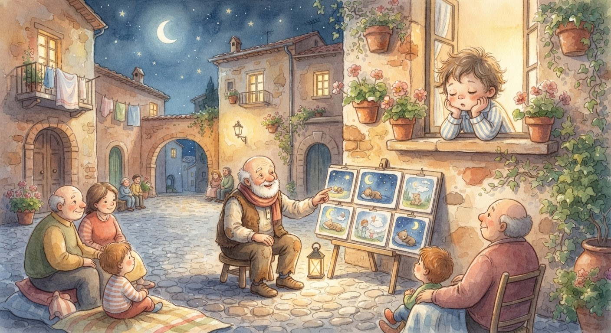
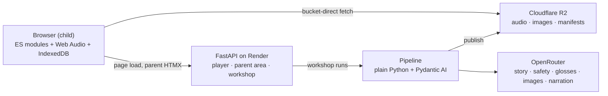

# Cantastorie

> Bedtime stories your child steers, in the languages your family speaks. Told aloud, painted in watercolor, and approved by you before a single word reaches little ears.

[](https://github.com/darth-dodo/cantastorie/actions/workflows/ci.yml)
[](https://codecov.io/gh/darth-dodo/cantastorie)
[](https://github.com/astral-sh/ruff)
[](https://mypy-lang.org/)
[](https://www.python.org/downloads/)
[](https://fastapi.tiangolo.com)
[](https://developers.cloudflare.com/r2/)
[](https://claude.ai)

The Italian *cantastorie* stood in the piazza, sang a tale, and pointed at painted boards. This app is that craft, revived carefully: one warm narrator voice, soft watercolor pages, and a child's finger choosing the path — with a parent as the piazza's gatekeeper, seeing and hearing every word, picture, and sound before any child meets it.



---

## The Problem

Pre-readers cannot use story apps built on text, and screen apps built on taps train the wrong appetite at bedtime. Multilingual families juggle one-language apps with robotic voices in the smaller languages. And parents have no way to fully preview generated content before their child meets it.

Cantastorie is built on one belief: **a bedtime app should wind a child down.** Voice carries the story, pictures carry the choices, and nothing on screen asks a pre-reader to read.

---

## How It Works

### Two Taps to a Story

A tap wakes the shelf, which greets the child aloud — *"Ciao! Quale storia ascoltiamo oggi?"* Tap a cover, *"Si parte!"*, and page one begins. At most two taps and four seconds stand between opening the app and hearing a story. Watercolor pages turn themselves when the narration ends; one large play-pause button is the only control, and pausing resumes from the exact position.

### Child-Steered Branches

At fixed branch points the page dims behind two picture cards with spoken labels. The child taps one and the story follows — agency without reading. A child who drifts off mid-choice still gets a complete, gentle ending: after a spoken nudge and a short wait, the first option auto-continues. Replayability lives in the branches — the boat story again, then the other ending.

### One Warm Narrator

The target is a single warm narrator identity across every story and language, like the piazza storyteller of old. Launch narration is generated by **Gemini TTS** (via OpenRouter) with one house voice pinned across every language; **family voice cloning** runs on **Voxtral via the Mistral API**, and **Deepgram** supplies word timings and the fallback voice bench now that ElevenLabs is retired. The trade-offs are recorded in [ADR-004](docs/adr/ADR-004-narration-deepgram-voxtral.md) and [ADR-008](docs/adr/ADR-008-narration-gemini-defaults-mistral-cloning.md). Every child-facing prompt is recorded per language — zero required text in child mode.

### Watercolor Boards

Soft watercolor, warm palette, rounded characters, nothing frightening — bedtime, not Saturday cartoons. Images carry no text and nothing scary. Every story's final page lands on comfort or sleepiness.

### The Parent Gate

Everything grown-up sits behind a small, low-contrast corner of the shelf. The gate is a three-second hold followed by a two-integer addition on a keypad — no PIN, freshly random each time. Five failures lock it for five minutes, and the lockout survives reloads. Behind it: language settings, reading mode, and export/import (with the dashboard and review queue arriving in Phase 2).

### The Workshop

Behind a separate operator secret, `/workshop` is where stories are born: start a generation run, watch each pipeline step's progress, inspect the staged story (text, audio, images), and publish to R2 when it's right. Runs execute in-process and survive restarts — the pipeline's filesystem checkpoints double as the resume mechanism, so a mid-run reboot re-buys zero API calls. The design is settled in [ADR-005](docs/adr/ADR-005-workshop-area.md).

### Reading Mode, Optional

For reading-along parents and emerging readers, an optional text panel shows the current page with karaoke word highlighting and tap-word English glosses drawn from a precomputed gloss map — no network call. It is parent-enabled and off by default; the core experience never requires reading.

### Five Languages

Italian and Spanish are the flagships — deepest content, first through every quality gate. English, Greek, and German ride along. Stories are authored natively per language, never translated: an Italian story reaches for *biscotti della nonna*, a Spanish one for *magdalenas*.

### Truly Private, Parent-Approved

No child accounts, no tracking, no analytics. The child player is account-free — progress lives in the browser (IndexedDB) and exports to a file; nothing about the child ever leaves the device. A parent signs in via Clerk (magic link or OAuth) only to request and review stories — no Clerk script or cookie touches any child path. And every story passes a machine safety gate *and* a parent's eyes and ears before it reaches a shelf — a model mistake needs a human mistake on top of it to reach a child.

---

## For Developers

Cantastorie is one FastAPI app with three faces: a vanilla-JS child player, a server-rendered parent area, and an operator workshop (`/workshop`) for in-app story authoring and review. A plain-Python authoring pipeline runs in the same repo, either from the CLI or in-process via the workshop. The stack mirrors the sibling project [habla-hermano](https://github.com/darth-dodo/habla-hermano); the reasoning behind each choice is in [ADR-001](docs/adr/ADR-001-technology-stack.md).

### Tech Stack

| Layer | Technology | Why |
|-------|-----------|-----|
| **Backend** | FastAPI | Async, Pydantic validation, HTMX-friendly SSR — hermano-proven |
| **Player UI** | Vanilla ES modules + Web Audio API | Full-screen, audio-driven, FSM-managed; crossfades that work on iOS |
| **Parent UI** | Jinja2 + HTMX + Tailwind | Server-driven UI, minimal JS |
| **Pipeline** | Plain Python + Pydantic AI | Typed step functions, filesystem checkpoints, no graph framework |
| **LLMs, images & narration** | OpenRouter | One gateway, per-step model choice; narration on Gemini 3.1 Flash TTS, word timings via Deepgram (ElevenLabs retired — [ADR-008](docs/adr/ADR-008-narration-gemini-defaults-mistral-cloning.md)) |
| **Asset storage** | Cloudflare R2 | Zero egress fees, access logs off, bucket-direct playback |
| **Hosting** | Render (Docker, `render.yaml`) | Hermano's deploy precedent |
| **Child persistence** | IndexedDB | Progress, settings, lockout, family token — nothing server-side |
| **Testing** | pytest + Vitest + Playwright | Providers mocked in unit tests; child flows in a real browser |

### System Overview

One FastAPI app serves a static shell; everything the child experiences after page load happens in the browser, talking only to Cloudflare R2 and IndexedDB. The authoring pipeline runs either as a CLI or in-process via the workshop, sharing the same step functions. The app and the pipeline share only `src/config.py` and the `story.json` contract.



For the code as built — module map, player and audio state machines, and the seams between them — see [docs/system-overview.md](docs/system-overview.md). For the settled design and its rationale, see [docs/architecture.md](docs/architecture.md).

### Project Structure

```
src/
├── config.py            Settings shared by app and pipeline (R2, keys, per-step models)
├── api/                 FastAPI app factory, player route, parent area, workshop
├── pipeline/            Authoring pipeline: typed steps, cache, providers, models
│   └── steps/           write · safety · revise · gloss · narrate · illustrate · assemble
├── workshop/            In-app authoring: run manager, run records, resume-on-boot
├── templates/           Jinja2 (parent area + player shell + workshop)
└── static/
    ├── js/              Vanilla ES modules: fsm, audio engine, playback, screens, storage
    └── css/             Player watercolor CSS; parent Tailwind

content/                 Pipeline working folders (gitignored)
staging/                 Staged stories for operator review
tests/                   pytest + Vitest + Playwright
docs/                    product.md, architecture.md, system-overview.md, setup.md, adr/
```

### Quick Start

Requires [uv](https://docs.astral.sh/uv/), Node.js 20+, and Python 3.12 (uv installs it automatically).

```bash
make install        # uv sync + npm install
make install-hooks  # pre-commit hooks (lint, format, types, secrets, commit style)
make dev            # run the FastAPI app at http://localhost:8000
make dev-css        # watch and compile Tailwind CSS (run alongside make dev)
make test           # all tests (pytest + Vitest)
make check          # lint + format check + strict mypy
make help           # list every target
```

Copy `.env.example` to `.env` for pipeline work. **Only `OPENROUTER_API_KEY` is needed to run the default pipeline end to end** — story, safety, glosses, images, and narration all run through OpenRouter. ElevenLabs is retired ([ADR-004](docs/adr/ADR-004-narration-deepgram-voxtral.md)). Two pipeline-only keys are the bounded exceptions: `DEEPGRAM_API_KEY` for the word-timing pass (OpenRouter does not carry the Deepgram models) and `MISTRAL_API_KEY` for voice cloning only ([ADR-008](docs/adr/ADR-008-narration-gemini-defaults-mistral-cloning.md)). The player needs no keys at story time.

Commit messages follow [Conventional Commits](https://www.conventionalcommits.org/), enforced by commitizen via pre-commit. Every PR runs lint, format check, strict mypy, pytest, Vitest, a Bandit security scan, a Tailwind compile, and a Docker build ([ci.yml](.github/workflows/ci.yml)). Deployment targets Render via [render.yaml](render.yaml); the Cloudflare R2 bucket and Render setup are documented in [docs/setup.md](docs/setup.md).

### Status

The authoring pipeline is built end to end — write, safety gate, bounded revise, gloss, narrate (Gemini 3.1 Flash TTS via OpenRouter, [ADR-008](docs/adr/ADR-008-narration-gemini-defaults-mistral-cloning.md)), illustrate (character sheet → pages → cover), assemble, stage, and publish to R2 — with content-addressed caching so unchanged inputs cost zero API calls. The child player is built: a mobile-first FSM with Web Audio playback, auto page turns, crossfades, and IndexedDB state. The operator workshop at `/workshop` runs the pipeline in-process with step-level progress, staged review, and publish — all behind a single env-var secret, with resume-on-boot for interrupted runs ([ADR-005](docs/adr/ADR-005-workshop-area.md)). Published stories are live on R2 with bucket-direct playback.

What's next: the Gemini TTS bake-off to finalize per-language voices (AI-366, [ADR-008](docs/adr/ADR-008-narration-gemini-defaults-mistral-cloning.md)), parent-face pack requests and the review queue (Phase 2), branching stories, and the family-voice narration feature ([ADR-006](docs/adr/ADR-006-family-voice-narration.md), Proposed).

---

## Documentation

- [Product Specification](docs/product.md) — vision, behaviors, content rules, decision log
- [Architecture](docs/architecture.md) — the FastAPI app, the Web Audio player, the authoring pipeline, and narration
- [System Overview](docs/system-overview.md) — the code as built: module map, state machines, and seams
- [Setup & Deploy](docs/setup.md) — R2 bucket, CORS, and the Render blueprint
- [Architecture Decision Records](docs/adr/) — settled decisions:
  - [ADR-001: Technology Stack](docs/adr/ADR-001-technology-stack.md) — FastAPI, vanilla JS, plain-Python pipeline, OpenRouter, R2, Render
  - [ADR-002: Narration Provider](docs/adr/ADR-002-narration-provider.md) — Voxtral via OpenRouter (superseded by ADR-004)
  - [ADR-003: Parent Authentication via Clerk](docs/adr/ADR-003-parent-authentication-clerk.md) — accepted
  - [ADR-004: Narration — Voxtral + Deepgram, ElevenLabs Retired](docs/adr/ADR-004-narration-deepgram-voxtral.md) — amended by ADR-008
  - [ADR-005: Workshop Area](docs/adr/ADR-005-workshop-area.md) — in-app authoring with in-process pipeline runs
  - [ADR-006: Nonna Narrates](docs/adr/ADR-006-family-voice-narration.md) — family voice cloning, proposed
  - [ADR-007: LangSmith Observability](docs/adr/ADR-007-langsmith-observability.md) — app-wide tracing
  - [ADR-008: Gemini TTS Defaults, Mistral Cloning](docs/adr/ADR-008-narration-gemini-defaults-mistral-cloning.md) — default voices on Gemini via OpenRouter; cloning scoped to Voxtral on the Mistral API

---

## License

MIT — see [LICENSE](LICENSE).
