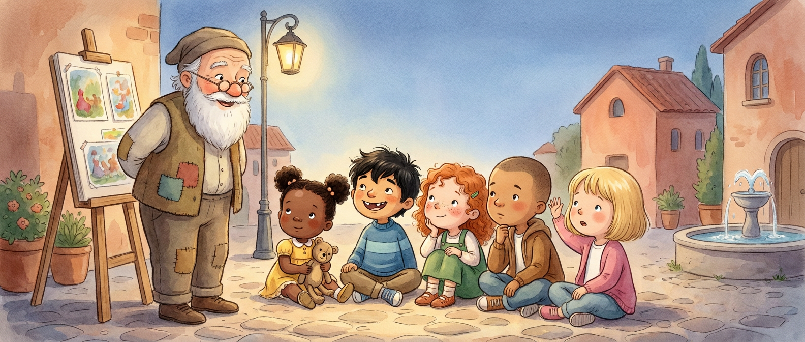
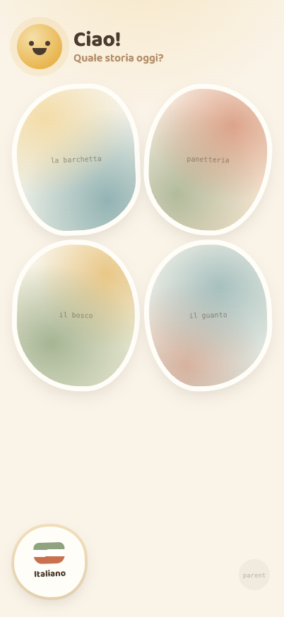
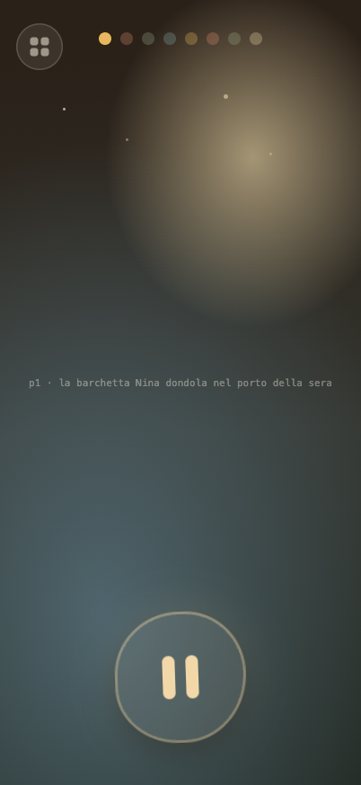
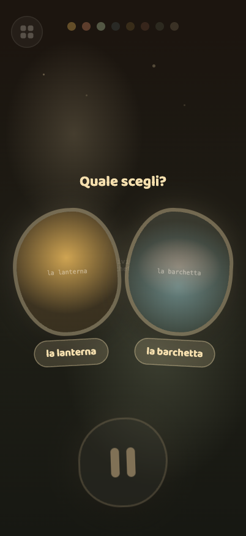
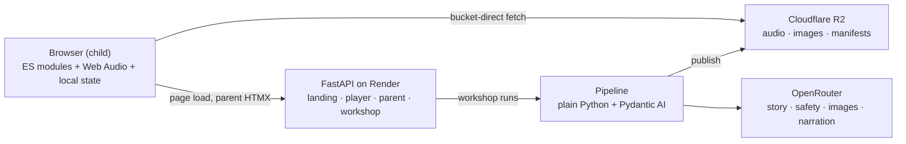

# Cantastorie

> **Bedtime stories your child steers, in the languages your family speaks.**

<p align="center">
  <a href="https://cantastorie.onrender.com">
    
  </a>
</p>

<p align="center">
  <a href="https://github.com/darth-dodo/cantastorie/actions/workflows/ci.yml"></a>
  <a href="https://codecov.io/gh/darth-dodo/cantastorie"></a>
  
  
  
  
</p>

---

Told aloud, painted in watercolor, and approved by you before a single word reaches little ears. Cantastorie is a bedtime story app for pre-readers: voice carries the story, pictures carry the choices, and nothing on screen asks a child to read.

Whether your family speaks Italian, Spanish, English, Greek, German, Bulgarian, or Russian — every story is authored natively, narrated in one warm voice, and painted in soft watercolor, with a parent as the gatekeeper who sees and hears everything first.

---

## The Cantastorie

<p align="center">
  
</p>

The Italian *cantastorie* stood in the piazza, sang a tale, and pointed at painted boards. This app is that craft, revived: **one warm narrator identity** across every story and language, pointing at watercolor boards like the storyteller of old.

> *"Ciao! Quale storia ascoltiamo oggi?"*

A tap wakes the shelf and it greets your child aloud. Tap a cover, and page one begins.

---

## How It Works

### 1. Two Taps to a Story
A tap wakes the shelf and it greets your child aloud. Tap a cover, and page one begins. At most two taps and four seconds stand between opening the app and hearing a story. Watercolor pages turn themselves when the narration ends.

### 2. Choices Are Pictures
At a branch, the page dims behind two watercolor cards with spoken labels. A finger picks the path — agency without reading. A child who drifts off mid-choice still gets a complete, gentle ending.

### 3. One Warm Narrator
A single storyteller voice across every story and language. Every child-facing prompt is recorded per language — zero required text in child mode.

### 4. Parent-Approved
Every story passes a machine safety gate *and* a parent's eyes and ears before it reaches a shelf. A model mistake would need a human mistake on top of it to reach a child.

---

## Features

| Feature | Description |
|---------|-------------|
| **Voice-first player** | Full-bleed watercolor pages, auto page-turns, gentle crossfades, exact-position resume |
| **Picture-choice branching** | Tap a card and the story follows that arm to its own ending — replay for the other |
| **One warm narrator** | A single pinned voice across every language; every prompt spoken, no required text |
| **Seven languages** | Italian & Spanish flagship; English, Greek, German, Bulgarian, Russian — authored natively, never translated |
| **Private family shelves** | Each family's approved packs publish to a private overlay only their child sees |
| **Truly private** | No child accounts, no tracking; nothing about the child ever leaves the device |
| **Parent-approved** | A machine safety gate plus a parent's review before any story reaches a shelf |

---

## Screenshots

<p align="center">
  
  
  
</p>

<p align="center">
  <em>Pick a story • Listen along • Choose the path</em>
</p>

---

## Try It Now

**[cantastorie.onrender.com](https://cantastorie.onrender.com)**

No child accounts, no sign-up for the story. Just tap a cover and listen.

---

## For Developers

<details>
<summary><strong>Tech Stack & Architecture</strong></summary>

### Tech Stack

| Layer | Technology | Why |
|-------|-----------|-----|
| **Backend** | FastAPI | Async, Pydantic validation, HTMX-friendly SSR |
| **Player UI** | Vanilla ES modules + Web Audio API | Full-screen, audio-driven, FSM-managed; crossfades that work on iOS |
| **Parent UI** | Jinja2 + HTMX + Tailwind | Server-driven UI, minimal JS |
| **Pipeline** | Plain Python + Pydantic AI | Typed step functions, filesystem checkpoints, no graph framework |
| **LLMs, images & narration** | OpenRouter | One gateway; narration on Gemini 3.1 Flash TTS, word timings via Deepgram ([ADR-008](docs/adr/ADR-008-narration-gemini-defaults-mistral-cloning.md)) |
| **Asset storage** | Cloudflare R2 | Zero egress, access logs off, bucket-direct playback |
| **Hosting** | Render (Docker, `render.yaml`) | |

### System Overview

One FastAPI app serves a static shell; everything the child experiences after page load happens in the browser, talking only to Cloudflare R2 and local storage. The authoring pipeline runs either as a CLI or in-process via the workshop, sharing the same step functions.


```mermaid
graph LR
    B["Browser (child)<br/>ES modules + Web Audio + local state"]
    R2["Cloudflare R2<br/>audio · images · manifests"]
    F["FastAPI on Render<br/>landing · player · parent · workshop"]
    P["Pipeline<br/>plain Python + Pydantic AI"]
    OR["OpenRouter<br/>story · safety · images · narration"]

    B -- "bucket-direct fetch" --> R2
    B -- "page load, parent HTMX" --> F
    F -- "workshop runs" --> P
    P -- "publish" --> R2
    P --> OR
```

The authoring pipeline is a batch job, not an agent: **write → safety gate → revise → narrate → illustrate → assemble → publish**, with content-addressed caching so unchanged inputs cost zero API calls.

### Codebase Health

| Metric | Value |
|--------|-------|
| **Coverage** | Python ~92%, JS ~76% (Codecov) |
| **Type checking** | Strict mypy |
| **Linting** | Ruff + pre-commit hooks |
| **Tests** | pytest · Vitest · Playwright (child flows in a real browser) |

### Quick Start

Requires [uv](https://docs.astral.sh/uv/), Node.js 20+, and Python 3.12 (uv installs it automatically).

```bash
git clone https://github.com/darth-dodo/cantastorie.git
cd cantastorie

cp .env.example .env
# Only OPENROUTER_API_KEY is needed to run the default pipeline end to end

make install        # uv sync + npm install
make dev            # run the FastAPI app at http://localhost:8000
```

The player needs no keys at story time. Two pipeline-only exceptions: `DEEPGRAM_API_KEY` (word timings) and `MISTRAL_API_KEY` (voice cloning only). ElevenLabs is retired ([ADR-004](docs/adr/ADR-004-narration-deepgram-voxtral.md)).

### Documentation

- [Product Specification](docs/product.md) — vision, behaviors, content rules, decision log
- [Architecture](docs/architecture.md) — the FastAPI app, the Web Audio player, the pipeline, and narration
- [System Overview](docs/system-overview.md) — the code as built: module map, state machines, seams
- [Setup & Deploy](docs/setup.md) — R2 bucket, CORS, and the Render blueprint
- [Architecture Decision Records](docs/adr/) — settled decisions and their rationale

</details>

<details>
<summary><strong>Development Commands</strong></summary>

| Command | Description |
|---------|-------------|
| `make install` | Install dependencies (uv + npm) |
| `make dev` | Run the FastAPI app at http://localhost:8000 |
| `make dev-css` | Watch and compile Tailwind CSS |
| `make test` | Run all tests (pytest + Vitest) |
| `make check` | Lint + format check + strict mypy |
| `make help` | List every target |

Commit messages follow [Conventional Commits](https://www.conventionalcommits.org/), enforced by commitizen. Every PR runs lint, format check, strict mypy, pytest, Vitest, a security scan, a Tailwind compile, and a Docker build.

</details>

---

## License

MIT License — see [LICENSE](LICENSE) for details.

---

<p align="center">
  <strong>Built with</strong><br/>
  <a href="https://fastapi.tiangolo.com">FastAPI</a> •
  Web Audio API •
  <a href="https://openrouter.ai">OpenRouter</a> •
  <a href="https://tailwindcss.com">Tailwind CSS</a> •
  <a href="https://developers.cloudflare.com/r2/">Cloudflare R2</a>
</p>

<p align="center">
  <a href="https://cantastorie.onrender.com"><strong>Try it Live →</strong></a>
</p>
