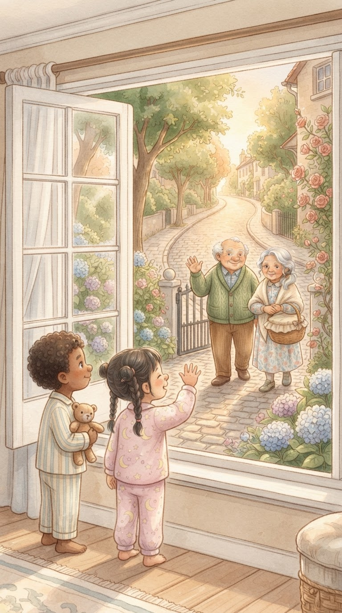
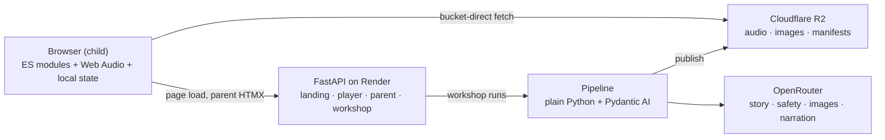

# Cantastorie

> Bedtime stories your child steers, in the languages your family speaks. Told aloud, painted in watercolor, and approved by you before a single word reaches little ears.

[](https://github.com/darth-dodo/cantastorie/actions/workflows/ci.yml)
[](https://codecov.io/gh/darth-dodo/cantastorie)
[](https://github.com/astral-sh/ruff)
[](https://mypy-lang.org/)
[](https://www.python.org/downloads/)
[](https://fastapi.tiangolo.com)
[](https://developers.cloudflare.com/r2/)

Cantastorie is a bedtime story app for pre-readers: voice carries the story, pictures carry the choices, and nothing on screen asks a child to read. Each story is authored natively per language, narrated in one warm voice, and painted in soft watercolor — with a parent as the gatekeeper who sees and hears everything before any child does.

**Live:** [cantastorie.onrender.com](https://cantastorie.onrender.com)


---

## How It Works

- **Two taps to a story.** A tap wakes the shelf and it greets the child aloud; a cover tap starts page one. Watercolor pages turn themselves when narration ends.
- **Choices are pictures.** At a branch the page dims behind two watercolor cards with spoken labels; a tap follows that arm to its own ending. A child who drifts off mid-choice still gets a complete, gentle ending.
- **One warm narrator.** A single pinned voice across every story and language; every child-facing prompt is recorded per language, so nothing requires reading.
- **Parent-approved.** Every story passes a machine safety gate *and* a parent's review before it reaches a shelf. The child player is account-free — nothing about the child leaves the device.

Seven languages are in scope (Italian and Spanish flagship; English, Greek, German, Bulgarian, Russian), authored natively, never translated.

---

## Stories

Every story is painted by the authoring pipeline in one consistent watercolor style — warm, rounded, nothing frightening. A sample of covers from the live shelf:

<p align="center">
  
  
  
  
</p>

---

## For Developers

One FastAPI app with three faces — a vanilla-JS child player, a server-rendered parent area (`/parent`, Clerk sign-in), and an operator workshop (`/workshop`) for in-app authoring — plus a plain-Python authoring pipeline that runs from the CLI or in-process via the workshop. The stack mirrors the sibling project [habla-hermano](https://github.com/darth-dodo/habla-hermano); the reasoning behind each choice is in the [ADRs](docs/adr/).

### Tech Stack

| Layer | Technology | Why |
|-------|-----------|-----|
| **Backend** | FastAPI | Async, Pydantic validation, HTMX-friendly SSR |
| **Player UI** | Vanilla ES modules + Web Audio API | Full-screen, audio-driven, FSM-managed; gain-node crossfades that work on iOS |
| **Parent UI** | Jinja2 + HTMX + Tailwind | Server-driven UI, minimal JS |
| **Pipeline** | Plain Python + Pydantic AI | Typed step functions, filesystem checkpoints, no graph framework |
| **LLMs, images & narration** | OpenRouter | One gateway; narration on Gemini 3.1 Flash TTS, word timings via Deepgram ([ADR-008](docs/adr/ADR-008-narration-gemini-defaults-mistral-cloning.md)) |
| **Asset storage** | Cloudflare R2 | Zero egress, access logs off, bucket-direct playback |
| **Hosting** | Render (Docker, `render.yaml`) | Hermano's deploy precedent |
| **Testing** | pytest + Vitest + Playwright | Providers mocked in unit tests; child flows in a real browser |

### System Overview

The server is a static-file waiter for the child: after page load, everything the child experiences happens in the browser, talking only to Cloudflare R2 (bucket-direct assets) and local storage — no cookies, no server calls carrying child data. The app and the pipeline share only `src/config.py` and the `story.json` contract.


```mermaid
graph LR
    B["Browser (child)<br/>ES modules + Web Audio + local state"]
    R2["Cloudflare R2<br/>audio · images · manifests"]
    F["FastAPI on Render<br/>landing · player · parent · workshop"]
    P["Pipeline<br/>plain Python + Pydantic AI"]
    OR["OpenRouter<br/>story · safety · images · narration"]

    B -- "bucket-direct fetch" --> R2
    B -- "page load, parent HTMX" --> F
    F -- "workshop runs" --> P
    P -- "publish" --> R2
    P --> OR
```

The authoring pipeline is a batch job, not an agent — **write → safety gate → revise → narrate → illustrate → assemble → publish** — with content-addressed caching, so unchanged inputs cost zero API calls. Default narration runs on the same OpenRouter key as the rest of the pipeline; word timings come from a Deepgram pass and family voice cloning from Voxtral via the Mistral API. ElevenLabs is retired ([ADR-004](docs/adr/ADR-004-narration-deepgram-voxtral.md), [ADR-008](docs/adr/ADR-008-narration-gemini-defaults-mistral-cloning.md)).

For the code as built — module map, player and audio state machines, and the seams — see [docs/system-overview.md](docs/system-overview.md).

### Project Structure

```
src/
├── config.py            Settings shared by app and pipeline (R2, keys, per-step models)
├── api/                 FastAPI app factory, landing, player, parent area, workshop
├── pipeline/            Authoring pipeline: typed steps, cache, providers, models
│   └── steps/           write · safety · revise · narrate · illustrate · assemble
├── workshop/            In-app authoring: run manager, run records, resume-on-boot
├── templates/           Jinja2 (landing + parent area + player shell + workshop)
└── static/
    ├── js/              Vanilla ES modules: fsm, audio engine, playback, screens, storage
    └── css/             Player watercolor CSS; landing + parent Tailwind

tests/                   pytest + Vitest + Playwright
docs/                    product.md, architecture.md, system-overview.md, setup.md, adr/
```

### Quick Start

Requires [uv](https://docs.astral.sh/uv/), Node.js 20+, and Python 3.12 (uv installs it automatically).

```bash
make install        # uv sync + npm install
make install-hooks  # pre-commit hooks (lint, format, types, secrets, commit style)
make dev            # run the FastAPI app at http://localhost:8000
make dev-css        # watch and compile Tailwind CSS (run alongside make dev)
make test           # all tests (pytest + Vitest)
make check          # lint + format check + strict mypy
make help           # list every target
```

Copy `.env.example` to `.env` for pipeline work. **Only `OPENROUTER_API_KEY` is needed to run the default pipeline end to end.** Two pipeline-only exceptions: `DEEPGRAM_API_KEY` (word-timing pass) and `MISTRAL_API_KEY` (voice cloning only). The player needs no keys at story time. Test coverage — Python ~92%, JS ~76% — uploads to [Codecov](https://codecov.io/gh/darth-dodo/cantastorie) on every run.

### Documentation

- [Product Specification](docs/product.md) — vision, behaviors, content rules, decision log
- [Architecture](docs/architecture.md) — the FastAPI app, the Web Audio player, the pipeline, and narration
- [System Overview](docs/system-overview.md) — the code as built: module map, state machines, and seams
- [Setup & Deploy](docs/setup.md) — R2 bucket, CORS, and the Render blueprint
- [Architecture Decision Records](docs/adr/) — settled decisions and their rationale

---

## License

MIT — see [LICENSE](LICENSE).
