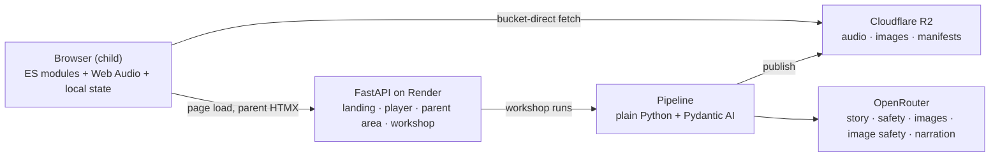

# Cantastorie

> Bedtime stories your child steers, in the languages your family speaks. Told aloud, painted in watercolor, and approved by you before a single word reaches little ears.

[](https://github.com/darth-dodo/cantastorie/actions/workflows/ci.yml)
[](https://codecov.io/gh/darth-dodo/cantastorie)
[](https://github.com/astral-sh/ruff)
[](https://mypy-lang.org/)
[](https://www.python.org/downloads/)
[](https://fastapi.tiangolo.com)
[](https://developers.cloudflare.com/r2/)
[](https://claude.ai)

**Live**: [cantastorie.onrender.com](https://cantastorie.onrender.com)

The Italian *cantastorie* stood in the piazza, sang a tale, and pointed at painted boards. This app is that craft, revived carefully: one warm narrator voice, soft watercolor pages, and a child's finger choosing the path — with a parent as the piazza's gatekeeper, seeing and hearing every word, picture, and sound before any child meets it.


---

## The Problem

Pre-readers cannot use story apps built on text, and screen apps built on taps train the wrong appetite at bedtime. Multilingual families juggle one-language apps with robotic voices in the smaller languages. And parents have no way to fully preview generated content before their child meets it.

Cantastorie is built on one belief: **a bedtime app should wind a child down.** Voice carries the story, pictures carry the choices, and nothing on screen asks a pre-reader to read.

---

## How It Works

### Two Taps to a Story

A tap wakes the shelf, which greets the child aloud — *"Ciao! Quale storia ascoltiamo oggi?"* Tap a cover, *"Si parte!"*, and page one begins. At most two taps and four seconds stand between opening the app and hearing a story. Watercolor pages turn themselves when the narration ends; a large play-pause button is flanked by prev/next page buttons, and pausing resumes from the exact position.

### Child-Steered Branches

At the branch point the page dims behind two picture cards with spoken labels. The child taps one and the story follows that arm to its own ending — agency without reading. Today the overlay waits for that tap. The planned idle nudge (a spoken prompt after 30 seconds) and auto-continue on the first option, so a child who drifts off mid-choice still gets a complete ending, are not built yet (AI-370). Replayability lives in the branches — the boat story again, then the other ending.

### One Warm Narrator

The target is a single warm narrator identity across every story and language, like the piazza storyteller of old. Launch narration is generated by **Gemini TTS** (via OpenRouter) with one house voice pinned across every language; **family voice cloning** runs on **Voxtral via the Mistral API**, and **Deepgram** is planned for word timings and as the fallback voice bench now that ElevenLabs is retired. Cloning and the Deepgram timing pass are not built yet. The trade-offs are recorded in [ADR-004](docs/adr/ADR-004-narration-deepgram-voxtral.md) and [ADR-008](docs/adr/ADR-008-narration-gemini-defaults-mistral-cloning.md). Every child-facing prompt is recorded per language — zero required text in child mode.

### Watercolor Boards

Soft watercolor, warm palette, rounded characters, nothing frightening — bedtime, not Saturday cartoons. Images carry no text and nothing scary. Every story's final page lands on comfort or sleepiness.

### The Parent Gate

Today a simple stand-in gate guards the way to the parent area. In the shelf's settings sheet, the grown-ups row asks for a sum (`7 + 6`) with three answer buttons. The right answer opens `/parent`, which has its own sign-in. Language, light/dusk, and read-with-me settings sit in the same sheet, ungated.

The designed gate is planned: a three-second hold followed by a two-integer addition on a keypad, with no PIN and a fresh random sum each time. Five failures lock it for five minutes, and the lockout survives reloads. Reading mode and export/import will sit behind it.

### The Workshop

Behind Clerk operator sign-in, `/workshop` is where stories are born: start a generation run, watch each pipeline step's progress, inspect the staged story (text, audio, images), and publish to R2 when it's right. The operator can also see and delete any family's private story from the library (moderation only, never promotion to the shared shelf). Runs execute in-process, one at a time, and survive restarts: stale runs are retired at boot, interrupted ones are re-entered, and the pipeline's content-addressed checkpoints mean a resumed run pays only for steps it hadn't finished. The design is settled in [ADR-005](docs/adr/ADR-005-workshop-area.md).

### Reading Mode, Optional (planned)

For reading-along parents and emerging readers, an optional text panel will show the current page with karaoke word highlighting and tap-word English glosses drawn from a precomputed gloss map — no network call. It is parent-enabled and off by default; the core experience never requires reading. The pipeline's word-timing (Deepgram) and gloss steps are planned for this slice; neither exists in the code yet.

### Eight Languages

Italian and Spanish are the flagships — deepest content, first through every quality gate. English, Greek, German, Bulgarian, Russian, and Marathi ride along. Stories are authored natively per language, never translated: an Italian story reaches for *biscotti della nonna*, a Spanish one for *magdalenas*.

### Truly Private, Parent-Approved

No child accounts, no tracking, no analytics. The child player is account-free — progress and settings live in the browser's localStorage and the family token in IndexedDB, and progress will export to a file; nothing about the child ever leaves the device. A parent signs in via Clerk (magic link or OAuth) only for grown-up things — at `/parent` they request stories (one per run), follow each run, and review the finished story's every page, picture and sound before approving it to their family's private shelf — and no Clerk script or cookie touches any child path. And every story passes a machine safety gate *and* a parent's eyes and ears before it reaches a shelf — a model mistake needs a human mistake on top of it to reach a child.

---

## For Developers

Cantastorie is one FastAPI app with three faces: a vanilla-JS child player, a server-rendered parent area (`/parent` — Clerk sign-in, story requests with daily run caps, one story per run, per-family run status, and review-then-approve to the family's private shelf), and an operator workshop (`/workshop`, behind Clerk operator sign-in) for in-app story authoring and review. A plain-Python authoring pipeline runs in the same repo, either from the CLI or in-process via the workshop. The stack mirrors the sibling project [habla-hermano](https://github.com/darth-dodo/habla-hermano); the reasoning behind each choice is in [ADR-001](docs/adr/ADR-001-technology-stack.md).

### Tech Stack

| Layer | Technology | Why |
|-------|-----------|-----|
| **Backend** | FastAPI | Async, Pydantic validation, HTMX-friendly SSR — hermano-proven |
| **Player UI** | Vanilla ES modules + Web Audio API | Full-screen, audio-driven, FSM-managed; crossfades that work on iOS |
| **Parent UI** | Jinja2 + HTMX + Tailwind | Server-driven UI, minimal JS |
| **Pipeline** | Plain Python + Pydantic AI | Typed step functions, filesystem checkpoints, no graph framework |
| **LLMs, images & narration** | OpenRouter | One gateway, per-step model choice; narration on Gemini 3.1 Flash TTS; word timings via Deepgram are planned (ElevenLabs retired — [ADR-008](docs/adr/ADR-008-narration-gemini-defaults-mistral-cloning.md)) |
| **Asset storage** | Cloudflare R2 | Zero egress fees, access logs off, bucket-direct playback |
| **Hosting** | Render (Docker, `render.yaml`) | Hermano's deploy precedent |
| **Child persistence** | localStorage + IndexedDB | Progress and settings in localStorage, the family token in IndexedDB — nothing server-side |
| **Testing** | pytest + Vitest + Playwright | Providers mocked in unit tests; child flows in a real browser |

### System Overview

One FastAPI app serves a static shell; everything the child experiences after page load happens in the browser, talking only to Cloudflare R2 and local storage. The authoring pipeline runs either as a CLI or in-process via the workshop, sharing the same step functions. The app and the pipeline share only `src/config.py` and the `story.json` contract.


```mermaid
graph LR
    B["Browser (child)<br/>ES modules + Web Audio + local state"]
    R2["Cloudflare R2<br/>audio · images · manifests"]
    F["FastAPI on Render<br/>landing · player · parent area · workshop"]
    P["Pipeline<br/>plain Python + Pydantic AI"]
    OR["OpenRouter<br/>story · safety · images · image safety · narration"]

    B -- "bucket-direct fetch" --> R2
    B -- "page load, parent HTMX" --> F
    F -- "workshop runs" --> P
    P -- "publish" --> R2
    P --> OR
```

For the code as built — module map, player and audio state machines, and the seams between them — see [docs/system-overview.md](docs/system-overview.md). For the settled design and its rationale, see [docs/architecture.md](docs/architecture.md).

### Project Structure

```
src/
├── config.py            Settings shared by app and pipeline (R2, keys, per-step models)
├── api/                 FastAPI app factory, landing page (/), player (/play), parent area, workshop
├── pipeline/            Authoring pipeline: typed steps, cache, providers, models
│   └── steps/           write · safety · revise · narrate · illustrate · image safety · assemble (gloss planned)
├── workshop/            In-app authoring: run manager, run records, resume-on-boot
├── templates/           Jinja2 (landing page + parent area + player shell + workshop)
└── static/
    ├── js/              Vanilla ES modules: fsm, audio engine, playback, screens, storage
    └── css/             Player watercolor CSS; parent Tailwind

content/                 Pipeline working folders (gitignored)
staging/                 Local spoken-prompt output (stories stage to the private R2 pending bucket)
tests/                   pytest + Vitest + Playwright
docs/                    product.md, architecture.md, system-overview.md, setup.md, adr/
```

### Quick Start

Requires [uv](https://docs.astral.sh/uv/), Node.js 20+, and Python 3.12 (uv installs it automatically).

```bash
make install        # uv sync + npm install
make install-hooks  # pre-commit hooks (lint, format, types, secrets, commit style)
make dev            # run the FastAPI app at http://localhost:8000
make dev-css        # watch and compile Tailwind CSS (run alongside make dev)
make test           # all tests (pytest + Vitest)
make check          # lint + format check + strict mypy
make help           # list every target
```

Copy `.env.example` to `.env` for pipeline work. **Only `OPENROUTER_API_KEY` is needed to run the default pipeline end to end** — story, safety, images, image safety, and narration all run through OpenRouter. ElevenLabs is retired ([ADR-004](docs/adr/ADR-004-narration-deepgram-voxtral.md)). `DEEPGRAM_API_KEY` (the planned word-timing pass) and `MISTRAL_API_KEY` (voice cloning, [ADR-008](docs/adr/ADR-008-narration-gemini-defaults-mistral-cloning.md)) are future keys; nothing in `src/` reads them yet. The deployed web service runs generation in-process, so it needs the OpenRouter key plus the R2 and Clerk settings ([docs/setup.md](docs/setup.md)). The player needs no keys at story time.

Commit messages follow [Conventional Commits](https://www.conventionalcommits.org/), enforced by commitizen via pre-commit. Every PR runs lint, format check, strict mypy, pytest, Vitest, the Playwright e2e suite, a Bandit security scan, a Tailwind compile, and a Docker build ([ci.yml](.github/workflows/ci.yml)). Test coverage — Python **92%**, JS **76%** — uploads to [Codecov](https://codecov.io/gh/darth-dodo/cantastorie) on every run. Deployment targets Render via [render.yaml](render.yaml); the Cloudflare R2 bucket and Render setup are documented in [docs/setup.md](docs/setup.md).

### Status

The authoring pipeline is built end to end — write, safety gate, bounded revise, narrate (Gemini 3.1 Flash TTS via OpenRouter, [ADR-008](docs/adr/ADR-008-narration-gemini-defaults-mistral-cloning.md)), illustrate (character sheet → pages → cover), image safety (a cross-family vision judge with bounded redraws, [ADR-011](docs/adr/ADR-011-image-safety-vision-judge.md)), assemble, stage, and publish to R2 — with content-addressed caching so unchanged inputs cost zero API calls, and bounded retries on transient provider errors that never re-send a request that may already be billing. The gloss step is planned with reading mode and not built yet. The child player is built: a mobile-first FSM with Web Audio playback, auto page turns, crossfades, and resume-from-exact-position state persisted in the browser. Branching stories work end to end — the pipeline authors a shared opening, one picture-choice point, and two arms (each with watercolor choice cards and spoken labels), and the player follows the tapped arm to its own ending, with the chosen path persisted so resume replays it (the idle nudge and auto-continue are not built yet, AI-370). The operator workshop at `/workshop` runs the pipeline in-process with step-level progress, staged review, and publish — behind Clerk operator sign-in, with resume-on-boot for interrupted runs ([ADR-005](docs/adr/ADR-005-workshop-area.md)). The parent area at `/parent` is live: Clerk sign-in, story requests (one story per run) under daily run caps, per-family run tracking, and review-then-approve to the family's private shelf, with approval bound to the exact staged bytes the parent reviewed ([ADR-003](docs/adr/ADR-003-parent-authentication-clerk.md)). Published stories are live on R2 with bucket-direct playback.

What's next: the Gemini TTS bake-off to finalize per-language voices (AI-366, [ADR-008](docs/adr/ADR-008-narration-gemini-defaults-mistral-cloning.md)), the choice nudge and auto-continue (AI-370), the designed parent gate, and the family-voice narration feature ([ADR-006](docs/adr/ADR-006-family-voice-narration.md), Proposed).

---

## Documentation

- [Product Specification](docs/product.md) — vision, behaviors, content rules, decision log
- [Architecture](docs/architecture.md) — the FastAPI app, the Web Audio player, the authoring pipeline, and narration
- [System Overview](docs/system-overview.md) — the code as built: module map, state machines, and seams
- [Architecture Whiteboard](docs/whiteboards/architecture.md) — salient features and a six-module walkthrough with diagrams and line-level code links
- [Setup & Deploy](docs/setup.md) — R2 bucket, CORS, and the Render blueprint
- [Architecture Decision Records](docs/adr/) — settled decisions:
  - [ADR-001: Technology Stack](docs/adr/ADR-001-technology-stack.md) — FastAPI, vanilla JS, plain-Python pipeline, OpenRouter, R2, Render
  - [ADR-002: Narration Provider](docs/adr/ADR-002-narration-provider.md) — Voxtral via OpenRouter (superseded by ADR-004)
  - [ADR-003: Parent Authentication via Clerk](docs/adr/ADR-003-parent-authentication-clerk.md) — accepted
  - [ADR-004: Narration — Voxtral + Deepgram, ElevenLabs Retired](docs/adr/ADR-004-narration-deepgram-voxtral.md) — amended by ADR-008
  - [ADR-005: Workshop Area](docs/adr/ADR-005-workshop-area.md) — in-app authoring with in-process pipeline runs
  - [ADR-006: Nonna Narrates](docs/adr/ADR-006-family-voice-narration.md) — family voice cloning, proposed
  - [ADR-007: LangSmith Observability](docs/adr/ADR-007-langsmith-observability.md) — app-wide tracing
  - [ADR-008: Gemini TTS Defaults, Mistral Cloning](docs/adr/ADR-008-narration-gemini-defaults-mistral-cloning.md) — default voices on Gemini via OpenRouter; cloning scoped to Voxtral on the Mistral API
  - [ADR-009: Sentry Error Monitoring](docs/adr/ADR-009-sentry-error-monitoring.md) — server-side exception reporting, errors only, no child data
  - [ADR-010: Audio Wake and Stall Recovery](docs/adr/ADR-010-audio-wake-and-stall-recovery.md) — re-unlock audio on every activation; a stall watchdog turns frozen narration into the retry state
  - [ADR-011: Image Safety via a Cross-Family Vision Judge](docs/adr/ADR-011-image-safety-vision-judge.md) — every rendered image judged; bounded redraws, then reject

---

## License

MIT — see [LICENSE](LICENSE).
