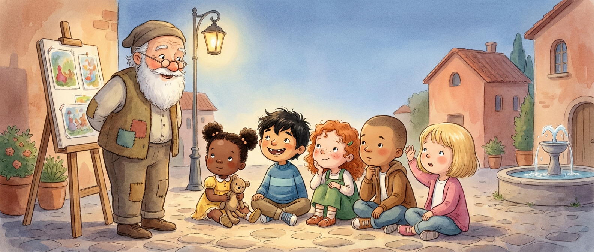

# Cantastorie

> Bedtime stories your child steers, in the languages your family speaks. Told aloud, painted in watercolor, and approved by you before a single word reaches little ears.

[](https://github.com/darth-dodo/cantastorie/actions/workflows/ci.yml)
[](https://codecov.io/gh/darth-dodo/cantastorie)
[](https://github.com/astral-sh/ruff)
[](https://mypy-lang.org/)
[](https://www.python.org/downloads/)
[](https://fastapi.tiangolo.com)
[](https://developers.cloudflare.com/r2/)
[](https://claude.ai)

### 🌙 [Try it live → cantastorie.onrender.com](https://cantastorie.onrender.com)



---

## Once upon a time, in a piazza…

The Italian *cantastorie* stood in the town square, sang a tale, and pointed at painted boards while the children leaned in.

Cantastorie brings that craft to bedtime: **one warm narrator voice, soft watercolor pages, and a small finger choosing where the story goes.** A parent sits in the storyteller's place as gatekeeper, and sees and hears every word, picture and sound before any child does.

## Why it exists

Bedtime apps usually get one of three things wrong:

- **They ask pre-readers to read.** Menus, buttons and captions all assume a child who can read the words.
- **They wind children up, not down.** Bright, tap-hungry screens train the wrong appetite at 8 p.m.
- **They leave multilingual families behind.** Families end up juggling apps that each speak one language, with robotic voices in the smaller ones, and no way to preview what an AI made before it reaches their child.

Cantastorie is built on one belief: **a bedtime app should wind a child down.** Voice carries the story, pictures carry the choices, and nothing on screen asks a pre-reader to read.

---

## What it feels like

### 👆 Two taps to a story
A tap wakes the shelf, and it greets your child aloud: *"Ciao! Quale storia ascoltiamo oggi?"* Tap a cover and the story begins. Pages turn on their own as the narration ends, with a slow, gentle crossfade between them.

### 🌿 Your child steers
At the story's turning point the page dims and two watercolor cards appear: a lantern or a rowboat? Each card says its name aloud, and your child taps one. The story follows that path to its own ending. Tomorrow night, the other one.

### 🎨 Watercolor, not cartoons
Soft palettes, rounded characters, nothing frightening, no text in the pictures. Every image is checked by a separate AI judge before it can reach the shelf, and every story ends on comfort or sleepiness.

### 🗣️ Eight languages, written natively
Italian, Spanish, English, Greek, German, Bulgarian, Russian and Marathi. Stories are *authored* in each language rather than translated, so an Italian story reaches for *biscotti della nonna* and a Spanish one for *magdalenas*.

### 🐦 Built for real bedtimes
Wi-Fi drops and tablets go to sleep. Cantastorie loads the whole story before page one, remembers exactly where your child stopped (including which path they chose), and if the sound ever stalls, a sleeping bird waits for one tap to carry on.

### 🌆 Dusk mode
Pages default to a warm dusk palette, or switch on their own from 7 p.m. to 7 a.m.

---

## The grown-up side

### ✍️ Ask for a story
Sign in, pick a theme (*the sleepy sea, first snow, a grandparent visit…*), a language, an optional idea of your own, and whether the story should branch. Cantastorie writes it, checks it, narrates it and paints it while you watch its progress.

### 👀 You approve every word
Before anything reaches your child, you see every page, hear every line and look at every picture on one screen. Only the version you reviewed can be approved. If anything changed afterwards, Cantastorie asks you to look again.

### 🔒 Your family's private shelf
Approved stories land on your family's own shelf, alongside the shared library, and reach only your child.

### 🛡️ Safe twice over
Every story passes an AI safety check run by a *different* model from the one that wrote it, against eight bedtime rules: the mildest peril only, kindness resolves things, no brands, no romance, nothing real… Then it passes **your** eyes and ears. A model mistake would need a human mistake on top of it to reach a child.

---

## Private by design

- **No child accounts, no cookies, no tracking, no analytics.**
- Your child's progress and settings stay in the browser on their device.
- Stories stream straight from storage. Nothing about your child ever passes through our server.
- Error reporting is server-side only, with no data from the child's device.

---

## What's next

- 🎙️ **Nonna narrates.** Stories read in a grandparent's own cloned voice ([proposal](docs/adr/ADR-006-family-voice-narration.md)).
- 📖 **Reading mode.** Karaoke-style word highlighting and tap-a-word translations for emerging readers.
- 💤 **Sleepy choices.** A gentle spoken nudge if a choice sits untouched, then the story carries on by itself, so a child who drifts off still gets a whole story.
- 🔐 **The full parent gate.** A press-and-hold plus a quick sum, with a lockout after repeated wrong answers.
- 📚 **The launch library.** A curated shelf of stories in every language, once the narrator's voice is finalized.

---

## Under the hood

A deliberately small stack: one app, one bucket, one AI gateway.

| | |
|---|---|
| **App** | One FastAPI service serving the landing page, the child player, the parent area and the operator workshop |
| **Player** | Vanilla JavaScript with the Web Audio API, so crossfades also work on iOS. No framework, no bundler |
| **Story factory** | A plain-Python pipeline: write → safety check → revise → narrate → illustrate → image check → assemble. Every step is cached, so nothing is paid for twice |
| **AI** | OpenRouter for writing, judging, illustration and narration (Gemini TTS), all on one key |
| **Storage** | Cloudflare R2. The player fetches straight from the bucket, and asset files never change once published, so browsers can cache them forever |
| **Auth** | Clerk, for grown-ups only. The child's side has no sign-in at all |
| **Quality** | pytest, Vitest and Playwright on every pull request, plus strict typing, linting and a security scan |

**Read more:**

- 🗺️ [Architecture whiteboard](docs/whiteboards/architecture.md): the system module by module, with diagrams and links to the code
- 🏛️ [Architecture](docs/architecture.md): the design decisions and the reasons behind them
- 📋 [Product spec](docs/product.md): behaviors, content rules and spoken prompts
- 🧭 [Decision records](docs/adr/): every major choice, its alternatives and its trade-offs
- 🚀 [Setup and deploy](docs/setup.md)

### Run it locally

Requires [uv](https://docs.astral.sh/uv/) and Node.js 20+.

```bash
make install   # Python + JS dependencies
make dev       # http://localhost:8000
make test      # pytest + Vitest
```

Story generation needs an `OPENROUTER_API_KEY` in `.env` (copy `.env.example`). The player needs no keys at all.

---

## Built with

Cantastorie is a sibling of [habla-hermano](https://github.com/darth-dodo/habla-hermano) and was built in collaboration with [Claude](https://claude.ai).

## License

MIT — see [LICENSE](LICENSE).
