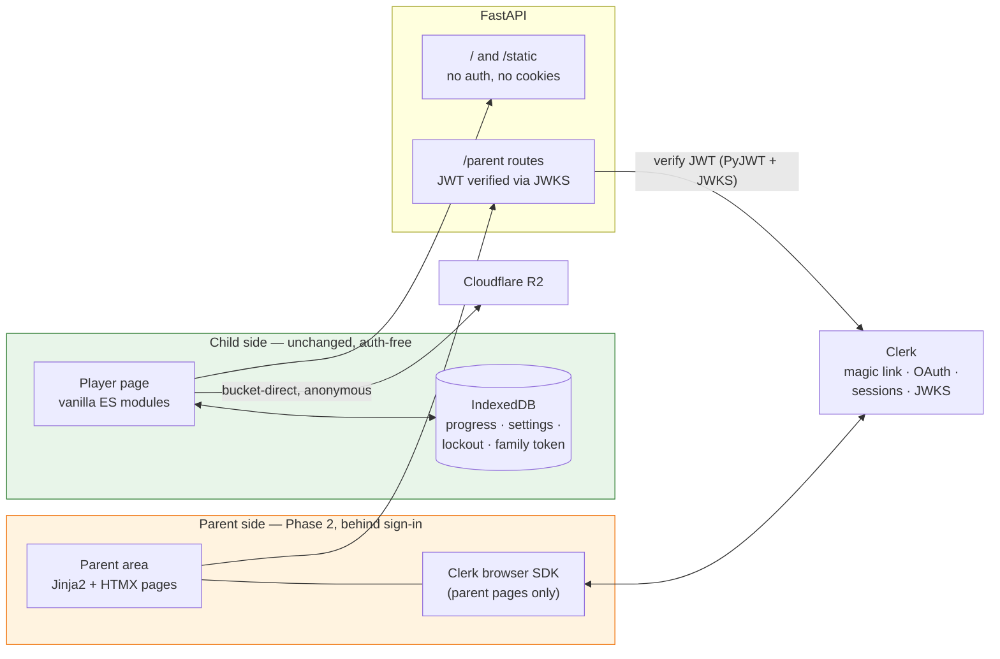
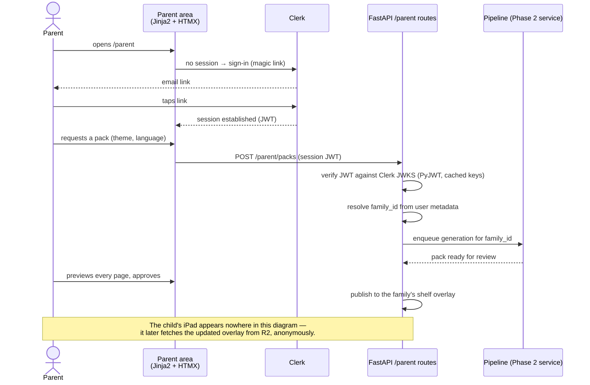

# ADR-003: Parent Authentication via Clerk

**Date**: 2026-07-11
**Status**: Accepted (2026-07-12)
**Context**: Choosing how families are identified and authenticated for Phase 2's parent-side features
**Decider(s)**: Project Owner

---

## Summary

Phase 2's parent features (pack requests, the review queue, approve/reject, per-family publishing) require the server to know **which family** it is talking to — something the current design deliberately avoids. This ADR proposes **Clerk as the authentication provider for the parent area only**: parents sign in (magic link or OAuth) to request and review stories, with FastAPI verifying Clerk session JWTs on `/parent` API routes. **The child experience remains account-free and unchanged**: the player page loads no Clerk script, sets no cookies, and child state stays in IndexedDB only.

This proposal **revises two settled positions** and says so explicitly: the tenancy decision (a random local family token as the only family identifier) and the absolutism of the "no accounts" privacy pillar. On acceptance, the pillar's wording changes from "no accounts" to "**no child accounts — nothing about the child ever leaves the device; a parent signs in only to request and review stories**." `docs/product.md`, `docs/architecture.md`, the README, and the `settled-architecture` skill are amended together in the acceptance commit; none are touched while this is Proposed.

---

## Resolved Decisions (Acceptance Amendment — 2026-07-12)

The following decisions were resolved during the design brainstorm (2026-07-12) and are now part of this ADR. The full design is in `docs/superpowers/specs/2026-07-12-clerk-parent-auth-family-tenancy-design.md`.

### Family model

**One parent account = one family.** The family token lives in that Clerk user's `public_metadata`. Multi-parent support is deferred; export/import remains the escape hatch.

### Approve target

Approved packs publish to `published/families/{family_token}/…` plus a **family overlay manifest** (`published/families/{family_token}/{lang}/manifest.json`) — never the shared shelf. The child player merges the overlay anonymously if IndexedDB holds a family token.

### Same-device linking

Parent signs in at `/parent` on the child device; same origin ⇒ the family token is written directly into the player's IndexedDB `family` store. No QR codes, no deep links, no cross-device ceremony. A parent subdomain was rejected because it kills same-origin IndexedDB linking.

### Refined cookie guarantee (revision)

**Revises the original "sets no cookies" wording.** The player page loads no third-party script, sets no cookies, and story-time R2 fetches carry no credentials. A signed-in parent's Clerk session cookie existing on the shared origin is **parent data**, not a child-privacy pillar violation — "nothing about the child leaves the browser" remains true. The guard test is refined accordingly: (a) the player module graph loads no Clerk/third-party script, (b) story-time fetches carry no credentials, (c) the player sets no cookies. The blanket "zero cookies in the browser context" assertion is replaced because a signed-in parent on a shared device legitimately breaks it.

### Token rotation procedure

The family token appears in public-bucket URLs; unguessable but leakable (history, screenshots). Rotation procedure: mint a new token in Clerk metadata → republish the overlay under the new prefix (content-addressed cache makes this cheap) → delete the old prefix → parent re-visits `/parent` on the child device once to relink IndexedDB. No button yet; the schema must not assume the token is immutable.

### Account deletion policy

Deleting the Clerk account unlinks the identity and **purges the family prefix** (pending and published) — consistent with ADR-005's GDPR Art. 17 posture. Implemented as a documented manual/script procedure now, webhook automation later.

### Pre-acceptance verifications

Recorded as confirmed during implementation: EU data residency posture; free-tier limits vs expected family counts; session-token custom-claim syntax; Clerk bot protection enabled on sign-up (sign-up now guards a wallet).

### Implementation order

1. Acceptance commit (docs only — this amendment)
2. Config + `require_parent` + JWKS verification, with pytest seam tests
3. Mint-or-link + session-claim template (Clerk dashboard config recorded in `docs/setup.md`)
4. `/parent` routes: sign-in, request form, my-packs list (run cap enforced)
5. Review queue + approve → family publish + overlay manifest + audit extension
6. Player overlay merge + connect-this-device + CSP + refined guard test
7. Playwright end-to-end with Clerk test mode

Each step lands independently deployable; the child player changes only at step 6.

### The Boundary in One Picture



Everything green ships exactly as it does today. Clerk appears only inside the orange boundary; the automated guard test asserts the green side loads no Clerk script and writes no cookie.

---

## Problem Statement

### The Challenge

Phase 1 needs no identity at all: the shelf is bundled content plus a token-keyed overlay, and everything personal lives in the child's browser. Phase 2 changes the shape of the system — parents request packs, preview generated stories, approve or reject them, and approved packs publish to *their family's* shelf overlay. Each of those verbs needs a durable, recoverable answer to "which family?", including from the parent's own phone or laptop, which is not the child's iPad.

The current answer — a random family token living in IndexedDB — was chosen for Phase 1's shape and has known limits as a sole identifier:

- **Unrecoverable**: clearing browser data or losing the device orphans the family's published packs.
- **Single-device**: the token lives where it was minted; the Phase 2 review flow naturally happens on a different device than the child's.
- **Unrevocable and unaccountable**: generation endpoints (which cost real money per request) would be gated by a bearer token that cannot be rotated, recovered, or attributed.

### Why This Matters

- **Privacy is a product pillar, not a feature.** "No accounts, no tracking" appears in the README's promise and `docs/product.md`. Any identity mechanism must leave the child's side of that promise fully intact — and the wording of the parent's side must change honestly rather than quietly.
- **Generation costs money.** Pack requests hit OpenRouter and TTS providers. An unauthenticated or unattributable generation endpoint is an abuse vector aimed at the project's wallet — the per-family kill switch in the product spec presumes families can be told apart reliably.
- **A solo maintainer should not own password security for a children's product.** Credential storage, reset flows, session fixation, and rate limiting are exactly the code a one-person project should buy, not write.

### Success Criteria

- [x] Parents can sign in from any device and see their family's packs, requests, and review queue *(design accepted; implementation follows the 7-step plan)*
- [x] The child player page ships **zero third-party JavaScript and zero cookies** — verified by an automated test, not by intention *(guard test refined: player loads no Clerk script; story-time fetches carry no credentials; player sets no cookies)*
- [x] Child progress, settings, lockout, and the shelf overlay key never leave the browser
- [x] Generation endpoints reject unauthenticated requests; every pack request is attributable to a family
- [x] Losing a device no longer orphans a family's published packs
- [x] The only family PII held server-side is the parent's sign-in identifier (email or OAuth subject)

---

## Context

### Current State

- **Parent gate ≠ authentication.** The existing gate (three-second hold plus a two-integer addition) is child-proofing: it keeps a four-year-old out of settings. It authenticates nobody and was never meant to.
- **Tenancy today**: a random local family token in IndexedDB keys the family's shelf overlay (locked in `docs/product.md`'s decision log for Phase 1). This ADR does not remove the token — it proposes anchoring it to a recoverable parent identity in Phase 2.
- **No server-side state exists yet.** The FastAPI app serves the shell and static assets; Phase 2 introduces the first per-family server state regardless of the auth choice. What holds that state (and where) is a separate decision this ADR deliberately does not make.

### Requirements

**Functional**:

- Sign-in suitable for tired parents: magic link or OAuth, no password to remember
- Session verification inside FastAPI (Jinja2 + HTMX pages and JSON endpoints under `/parent`)
- A stable family identifier that survives device loss and works from multiple parent devices

**Non-Functional**:

- **Privacy**: no auth surface on any child-facing path; minimal PII (a sign-in identifier, nothing else); EU-resident families are the primary audience
- **Effort**: parent-area auth must stay a small fraction of Phase 2, on a solo-maintainer budget
- **Stack fit**: no frontend framework — whatever runs in the browser must work from vanilla JS or plain server-rendered pages

---

## Options Considered

### Option A: Family token only (status quo, extended to Phase 2)

**Description**: Keep the random local token as the sole identifier. Pack requests and the review queue are keyed by the token; parents "sign in" by possessing the browser that minted it (or by manually copying the token between devices, export/import style).

**Pros**:

- **Purest privacy story**: literally no accounts, no PII server-side; the current README sentence stays true word for word.
- **Zero new vendors, zero new code surface** for auth itself.

**Cons**:

- **Unrecoverable and single-device** — the two properties Phase 2's flows need most (see Problem Statement).
- **Uncontrollable generation spend**: a bearer token with no rotation, recovery, or attribution gating endpoints that cost money per call.
- **Manual token transfer** between devices is exactly the kind of fiddly ceremony the product exists to avoid.

**Risks**:

- A lost iPad quietly orphans everything a family approved; support burden lands on the maintainer with no tools to help.

**Estimated Effort**: None now; a growing operational tax forever.

---

### Option B: Clerk, parent area only (proposed)

**Description**: Clerk handles parent sign-up/sign-in (email magic link, optionally Google/Apple OAuth) and session management. The parent area's pages load Clerk's browser SDK (works from a plain `<script>` tag; no React required for the hosted/drop-in components). FastAPI verifies Clerk session JWTs on `/parent` routes against Clerk's published JWKS — standard JWT verification with PyJWT, no vendor SDK required server-side. The family token becomes server-linked metadata on the Clerk user, making the family identity recoverable and multi-device.

**Pros**:

- **Buys the dangerous code**: credential handling, magic-link delivery, session security, MFA, and abuse protection are Clerk's product, not this repo's code.
- **Fits the no-framework constraint**: JWT verification server-side is dependency-light; the browser side is confined to parent pages that are server-rendered anyway.
- **Magic-link UX** matches the audience — a parent on a phone at 21:30.
- **Free tier** comfortably covers a family-scale app (about 10k monthly active users as of 2026-07 — *unverified, confirm current pricing*).

**Cons**:

- **A third party now processes parent PII** (email, sign-in metadata). The privacy pillar's wording must change, and Clerk becomes a data processor to disclose.
- **External dependency on the auth path**: a Clerk outage locks parents out of the review queue (the child player is unaffected by design).
- **EU data residency is unverified**: where Clerk stores user records and whether an EU region can be pinned must be confirmed before acceptance.

**Risks**:

- **Scope creep onto child paths**: a future convenience ("just check the session on the shelf…") would silently break the pillar. Mitigation: an automated test asserts the player page and its imports contain no Clerk script and no cookie use; the `settled-architecture` skill gains a red-flag line.
- **Vendor migration later** means re-onboarding parents (password-less, so no credential export problem) and re-linking family metadata — moderate, not catastrophic.

**Estimated Effort**: Low-to-moderate: Clerk app config, one FastAPI dependency for JWT verification, sign-in page wiring in the parent area, family-token linking.

---

### Option C: Supabase Auth (the hermano precedent)

**Description**: habla-hermano authenticates with Supabase (GoTrue) and stores state in Supabase Postgres. Reusing it here would follow the sibling-project pattern this repo leans on elsewhere.

**Pros**:

- **Proven in the sibling project**, including FastAPI-side JWT verification — patterns could be ported nearly verbatim.
- **Bundles the database question**: Phase 2 needs per-family server state somewhere; Supabase answers auth and storage together.

**Cons**:

- **Decides more than this ADR should**: adopting Supabase is a platform choice (database, hosting coupling) smuggled inside an auth decision. Cantastorie's Phase 2 storage decision hasn't been made.
- **Heavier integration surface** than "verify a JWT": the hermano codebase carries notable Supabase-specific plumbing.
- Auth UX (email+password by default) is a worse fit for the audience than magic links unless additionally configured.

**Risks**:

- Platform lock-in decided by default rather than deliberately.

**Estimated Effort**: Moderate; mostly porting, but drags the storage decision forward prematurely.

---

### Option D: Self-hosted auth (FastAPI + signed sessions + magic links)

**Description**: Hand-rolled password-less auth: the app emails magic links (via a transactional email vendor), sets its own signed session cookies (`itsdangerous`, as hermano does for cookie signing), and stores parent records in whatever Phase 2 database arrives.

**Pros**:

- **Smallest PII surface conceptually** — one email column in a database the project already controls; no third-party processor beyond the email sender.
- No new vendor on the serving path.

**Cons**:

- **The maintainer owns auth security** for a children's product: token expiry, replay, session fixation, rate limiting, deliverability — permanent review burden, not one-time cost.
- **Still needs a vendor** (transactional email), so "no third parties" isn't actually achieved.
- Slowest option to a working review queue.

**Risks**:

- Security mistakes in exactly the component chosen to be boring; email deliverability problems become sign-in outages the maintainer debugs alone.

**Estimated Effort**: Highest of the four, ongoing.

---

## Comparison Matrix

Weights reflect this product's priorities: the child-side privacy pillar is non-negotiable (all options keep it; the differentiators are below), and maintainer security burden outweighs vendor purity for a solo project.

| Criterion | Weight | A: Token only | B: Clerk | C: Supabase | D: Self-hosted |
|-----------|--------|---------------|----------|-------------|----------------|
| Recoverable, multi-device family identity | 25% | 1 | 5 | 5 | 4 |
| Security burden kept off the maintainer | 25% | 3 | 5 | 4 | 1 |
| Parent PII surface / privacy story | 20% | 5 | 3 | 3 | 4 |
| Effort to a working Phase 2 | 15% | 2 | 4 | 3 | 2 |
| Stack fit (no framework, decision scope stays narrow) | 15% | 5 | 4 | 2 | 4 |
| **Weighted total** | | **3.1** | **4.3** | **3.6** | **2.9** |

---

## Decision

### Chosen Option

**Option B: Clerk, strictly scoped to the parent area** — proposed for acceptance.

**Rationale**: Phase 2's flows need a recoverable family identity, and the two options that provide one cheaply (B, C) differ mainly in how much they decide. Clerk decides only authentication; Supabase would decide the platform. Self-hosting puts the most security-sensitive code of the whole system on the person with the least review capacity. The token-only status quo fails the flows Phase 2 exists to deliver.

**Key Factors**:

- The child experience is untouched — this is the line that makes the change acceptable at all.
- Magic-link sign-in matches the real user (a parent, on a phone, at night).
- Server-side integration is a standard JWT verification dependency, consistent with the no-heavy-SDK instinct in the pipeline's provider layer.

**Trade-offs Accepted**:

- A parent's email becomes the one piece of family PII that leaves the household, held by a disclosed third-party processor.
- The README/product privacy wording loses its cleanest sentence and gains a more precise one.
- A vendor sits on the parent sign-in path (never on the story path).

### How a Parent Request Flows



---

## Consequences

### Positive Outcomes

- Families survive device loss; approving a pack on a laptop and playing it on the iPad becomes the natural flow.
- Generation endpoints get attributable, revocable access — the per-family kill switch has something real to switch.
- Zero auth-security code in this repo.

### Negative Outcomes

- Privacy copy in README and `docs/product.md` must be reworked (child/parent split), and the tenancy decision-log entry amended — an honest weakening of the headline promise.
- A Clerk outage blocks pack review (not story playback).
- One more vendor in the disclosure list; EU residency posture inherited from Clerk.

### Risks and Mitigation

| Risk | Mitigation |
|------|------------|
| Clerk assets creep onto child paths | Automated test: the player route's HTML and its module graph contain no Clerk script, no cookie writes; red-flag line added to the `settled-architecture` skill |
| EU data residency inadequate | Verify before acceptance; if Clerk cannot satisfy it, Option D's shape (magic links + signed sessions) is the fallback |
| Vendor migration later | Keep the family identifier in our own metadata (Clerk stores it, doesn't define it); server-side verification is standard JWT — swappable |

---

## Implementation Plan

Phase 2 work, gated on this ADR flipping to Accepted — **now Accepted (2026-07-12)**. The full 7-step implementation order is in the [Resolved Decisions](#resolved-decisions-acceptance-amendment--2026-07-12) section above. The original phased plan:

1. **Acceptance commit (docs only)**: amend `docs/product.md` (privacy pillar wording, tenancy entry), `docs/architecture.md` (parent area section + stack table row), README privacy copy, and the `settled-architecture` skill (settled row + red flag). Flip this ADR to Accepted. ✅ Done
2. **Clerk setup**: application config (magic link + optional OAuth), EU residency confirmed and recorded here.
3. **Server verification**: a FastAPI dependency verifying Clerk session JWTs via JWKS (PyJWT; no vendor SDK), applied to `/parent` routes only.
4. **Family linking**: mint-or-link the family token as user metadata at first sign-in; export/import remains the child-device escape hatch.

   ```mermaid
   flowchart TD
       S["Parent signs in (first time)"] --> Q{"Family token in<br/>user metadata?"}
       Q -- yes --> Use["Use it — same shelf overlay<br/>from any device"]
       Q -- no --> Q2{"Parent pastes a token from<br/>an existing child device?<br/>(export/import)"}
       Q2 -- yes --> Link["Link that token to the account —<br/>existing shelf adopted, nothing orphaned"]
       Q2 -- no --> Mint["Mint a fresh token,<br/>store as user metadata"]
       Use & Link & Mint --> Done["Token recoverable via sign-in;<br/>device loss no longer orphans packs"]
   ```
5. **Guard test**: the zero-third-party-JS/zero-cookie assertion on the player page enters the Vitest/Playwright suites alongside the feature.

**Rollback plan**: while unaccepted, delete nothing — this document is the only artifact. Post-acceptance, the parent area degrades to token-only read access behind a flag; the child player never depended on any of it.

---

## Validation

- [x] EU data-residency posture confirmed and recorded (pre-acceptance)
- [x] Free-tier limits re-checked against expected family counts (pre-acceptance)
- [ ] Player page ships zero Clerk JS and zero cookies (automated, post-implementation)
- [ ] Parent sign-in → pack request → review → publish walked end to end in Playwright
- [ ] JWT verification unit-tested at the transport seam, keyless, like the pipeline's provider tests

---

## Related Decisions

- [ADR-001](ADR-001-technology-stack.md) — the stack this must fit (FastAPI, no frontend framework, vanilla parent pages with HTMX)
- `docs/product.md` decision log — Phase 1 tenancy (family token); amended, not deleted, on acceptance
- The Phase 2 **server-side storage** decision — deliberately out of scope here; a future ADR

## References

**Code**:

- `src/api/` — the app the `/parent` router and JWT dependency land in
- `src/pipeline/providers.py` — the transport-boundary secret-handling pattern the JWT dependency should mirror

**External**:

- Clerk: backend JWT verification via JWKS; browser SDK usable without React (*integration specifics unverified against current Clerk docs — confirm during implementation*)
- habla-hermano — Supabase auth precedent evaluated as Option C

## Metadata

- **ADR Number**: 003
- **Created**: 2026-07-11
- **Tags**: authentication, privacy, parent-area, phase-2, vendor, clerk
