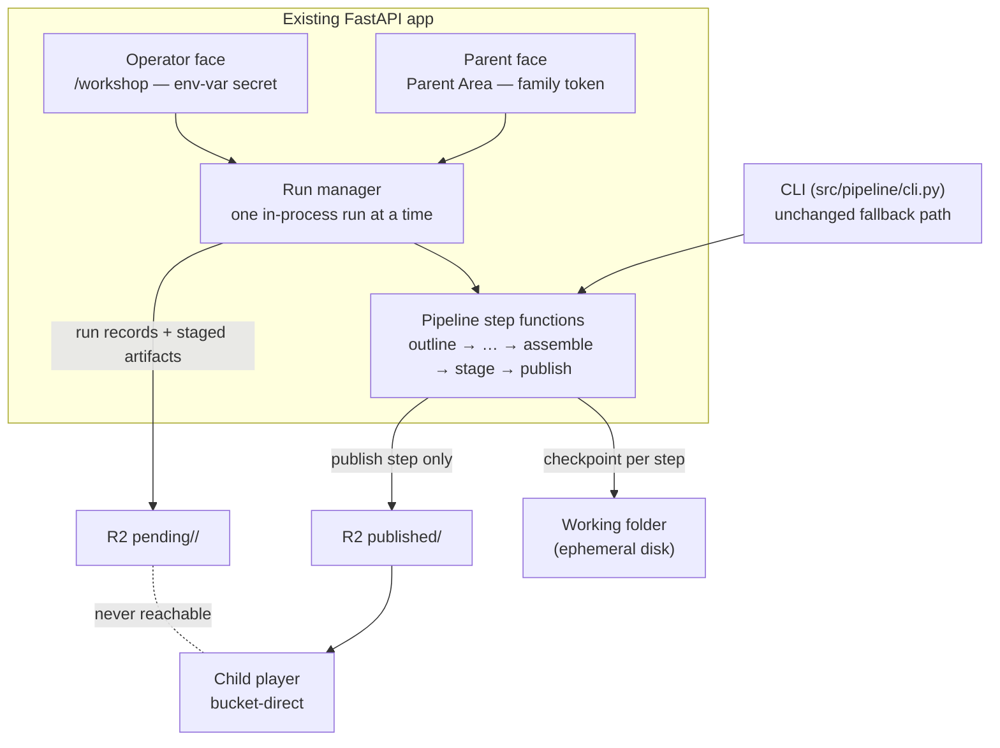
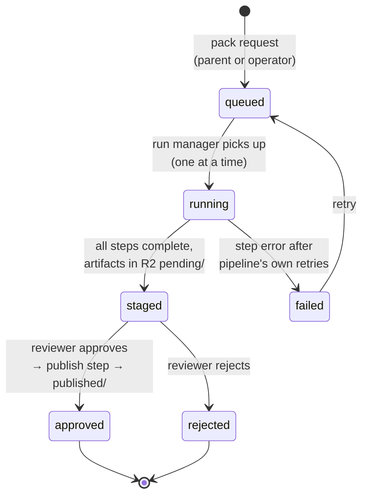
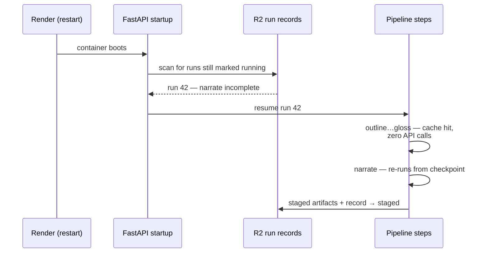

# ADR-003: The Workshop Area — In-App Authoring Surface with In-Process Pipeline Runs

**Date**: 2026-07-11
**Status**: Accepted
**Context**: Establishing where the authoring workshop lives, who reaches it, and how pipeline runs execute when triggered from the web
**Decider(s)**: Project Owner

---

## Summary

Cantastorie gets a **workshop area**: a single authoring surface inside the **existing FastAPI app**, with two faces over one backend — an **operator face** at `/workshop` (start runs, watch progress, inspect staged stories, publish) and a **parent face** inside the existing Parent Area (request a pack, review results, approve or reject). Both are server-rendered **Jinja2 + HTMX + Tailwind**, the settled parent-area pattern. Pipeline runs execute **in-process** as a background task wrapping the pipeline's existing step functions, one run at a time; the pipeline's filesystem checkpointing doubles as the progress and resume mechanism. Because Render's disk is ephemeral, **run records and staged artifacts persist to R2** under a pending prefix keyed by family token, and the app resumes incomplete runs on startup. Access needs no accounts: the operator face requires a single env-var secret; the parent face uses the family token that already keys packs. The alternatives — operator-local CLI generation behind a deployed request queue, and a separate worker service — were rejected for human-in-the-loop latency and for infrastructure the volume does not justify, respectively.

---

## Problem Statement

### The Challenge

Today the pipeline runs only from the operator's terminal (`src/pipeline/cli.py`), and staged stories are reviewed by opening a local folder. Phase 2 of the product requires **pack requests and review** ([product.md](../product.md)): a parent requests 1–3 stories on a theme from her phone, previews every word, image, and sound, and approves or rejects — with no operator terminal in sight. That forces three connected decisions: **where** the authoring surface lives, **how** long-running generation (LLM + TTS + image calls, minutes per story) executes when triggered from a web request, and **how** operator and parent access are separated in a system that has no accounts by design.

### Why This Matters

- **Parent review is the product's safety spine**: "the parent sees everything first" is a defining constraint. The review surface must be reachable from a parent's phone, not a developer's laptop.
- **Long jobs on a web service is the costly-to-reverse choice**: bolting a queue and worker on later, or unwinding one that was never needed, both reshape deployment and code structure.
- **No accounts is settled**: the privacy architecture forbids server-side identity. Whatever separates the operator from parents must not introduce one.
- **The pipeline's design is an asset here**: ADR-001 chose filesystem checkpoints over a graph framework. The workshop either leans on that or duplicates it.

### Success Criteria

- [ ] A parent can request a pack and review the result entirely from her phone
- [ ] The operator can start, watch, and publish a run without a terminal
- [ ] A mid-run service restart loses no paid work (resume re-buys zero API calls)
- [ ] No unapproved asset is reachable from child mode (audit script stays green)
- [ ] No new frontend framework, build tool, or hosted service is introduced
- [ ] No accounts: operator secret and family token remain the only access mechanisms

---

## Context

### Current State

- `src/pipeline/` holds the step functions (outline → write → safety gate → gloss → narrate → illustrate → assemble → stage → publish), invoked by `cli.py`; every step persists its artifact to the story's working folder the moment it is produced (ADR-001).
- `src/api/main.py` is the one FastAPI app, deployed on Render via Docker (`render.yaml`). Render's container disk is ephemeral across deploys and restarts.
- The Parent Area design (gate, settings, export/import) is server-rendered Jinja2 + HTMX + Tailwind; Phase 2 adds the dashboard and review queue "in front of the same pipeline step functions" ([architecture.md](../architecture.md#the-parent-area)).
- Published content lives in R2; only the publish step writes to `published/`; pending content is keyed to the requesting family and unreachable from child mode ([product.md](../product.md), privacy architecture).

### Requirements

**Functional Requirements**:

- Parents request packs (theme + language + count) and review/approve/reject results from a browser
- The operator starts runs, watches step-level progress, inspects staged stories, and publishes
- Runs survive restarts and resume without repeating completed steps

**Non-Functional Requirements**:

- **Settled stack**: one FastAPI app; Jinja2 + HTMX + Tailwind for non-child surfaces; plain-Python pipeline (see `settled-architecture` skill and ADR-001)
- **Privacy**: no accounts; keys stay in pipeline/service environments; zero unapproved assets child-reachable
- **Scale honesty**: single-family volume at launch — packs of 1–3 stories, runs measured in minutes, rarely concurrent
- **Cost**: no standing infrastructure beyond the existing Render service and R2 bucket

---

## Options Considered

### Option A: In-app workshop, in-process background runs

**Description**: Workshop routes live in the existing FastAPI app. A pack request creates a durable run record; a run manager executes the pipeline's step functions as an in-process asyncio background task, one run at a time (pending records form a simple queue — no job framework). HTMX polls a progress fragment that reads the run's checkpoint state. Run records and staged artifacts persist to R2 under a pending prefix keyed by family token; on startup the app scans for incomplete runs and resumes them.

**Pros**:

- **One app, one deploy** — matches the settled "one FastAPI app" decision exactly; no new service, secret store, or billing line
- **Checkpoints do double duty**: ADR-001's filesystem checkpointing becomes the progress API and the resume mechanism for free; a restart re-buys nothing thanks to content-addressed caching
- **Shortest path for parents**: request → generation starts immediately → review when done, no operator in the loop for execution
- **Step functions reused as-is**: the CLI and the workshop call the same functions; neither is a fork of the other

**Cons**:

- **Long jobs share the web process**: generation competes with request handling for the event loop and CPU (mitigated by the pipeline being I/O-bound API calls, and by single-run concurrency)
- **Single instance assumption**: the in-process queue assumes one service instance; horizontal scaling would break run ownership (acceptable — nothing in the product needs more than one instance)

**Risks**:

- A Render restart mid-step loses that step's partial work (bounded: one step's API spend, resumed from the last checkpoint)
- Event-loop starvation if a step blocks synchronously — step functions must stay async or run in a thread executor

**Estimated Effort**: Medium — run manager, R2-backed run records, progress fragments, resume-on-boot; no new infrastructure. (Unverified until sliced.)

### Option B: Deployed request/review, operator-local generation

**Description**: Parents request and review packs in the deployed app, but generation stays what it is today: a CLI run on the operator's machine that pulls pending requests, runs the pipeline locally, and publishes results for review.

**Pros**:

- **Zero execution changes**: the web service never runs a long job; the pipeline code does not move
- **Smallest key surface**: the OpenRouter key never needs to exist on Render

**Cons**:

- **The operator is a human queue**: a parent's Tuesday-night request waits until the operator runs the CLI — directly against the Phase 2 flow where the pipeline responds to requests
- **Two half-workshops**: request/review state lives in the cloud, execution state on a laptop; reconciling them is its own protocol
- **Doesn't scale past the household**: any second family makes the latency embarrassing

**Risks**:

- Request/execution state drift between the deployed app and the operator machine
- Operator availability becomes a product dependency

**Estimated Effort**: Low-Medium — request/review UI plus a CLI "pull requests" mode; the reconciliation protocol is the hidden cost. (Unverified until sliced.)

### Option C: Separate worker service with a queue

**Description**: A dedicated Render background worker consumes pack requests from a queue (hosted Redis or a polled table) and runs the pipeline in isolation from the web service.

**Pros**:

- **Proper isolation**: web latency never affected by generation; worker restarts are invisible to the app
- **Standard shape**: the well-trodden pattern for background jobs

**Cons**:

- **New standing infrastructure**: a second service and a queue, each with cost, config, and deploy surface — for a workload of a few runs per week
- **Contradicts the pipeline's own reasoning**: ADR-001 rejected a graph framework because the pipeline is "honestly a `for` loop"; a queue-and-worker topology re-adds ceremony one level up
- **Key duplication**: the OpenRouter key now lives in two services

**Risks**:

- Infrastructure maintenance dwarfs the code it serves at this volume
- Queue semantics (visibility, retries, dead letters) become bugs to own

**Estimated Effort**: High — worker service, queue, shared config, two deploys. (Unverified until sliced.)

---

## Comparison Matrix

| Criterion | Weight | Option A: In-app runs | Option B: Operator-local | Option C: Worker service |
|-----------|--------|----------------------|--------------------------|--------------------------|
| Fit with settled stack (one app, no new infra) | 25% | 5 | 4 | 2 |
| Parent experience (request → review latency) | 25% | 5 | 2 | 5 |
| Failure handling / durability | 20% | 4 | 3 | 5 |
| Operational simplicity | 15% | 4 | 3 | 2 |
| Cost (standing + effort) | 15% | 4 | 5 | 2 |
| **Weighted score** | | **4.5** | **3.3** | **3.4** |

Scores 1–5, higher is better. Weights reflect that the settled stack and the Phase 2 parent flow are the defining constraints; durability matters but is already mitigated by checkpointing.

---

## Decision

### Chosen Option: A — In-app workshop with in-process background runs

**Rationale**: The workshop's hardest problem — surviving restarts without losing paid work — is already solved by the pipeline's checkpoint design; Option A is the only option that *reuses* that solution rather than working around it (B splits state across machines, C rebuilds durability in a queue). It is also the only option that satisfies both defining constraints at once: the settled one-app stack and the Phase 2 flow where a parent's request starts generation without an operator in the loop.

**Key Factors**:

1. **ADR-001's checkpointing turns a liability into the mechanism**: in-process runs are normally fragile; here a restart resumes from the last completed step at zero API cost, and the same checkpoint files are the progress display.
2. **Volume honesty**: packs of 1–3 stories for one family do not justify a queue, a worker, or a second service.
3. **One backend, two faces**: operator and parent needs differ in access, not machinery — run manager, staging store, and publish step are shared.

### Run Lifecycle

A service restart is not a state: an interrupted `running` run stays `running` in its R2 record, and resume-on-boot re-enters it at the last completed checkpoint.

**Trade-offs Accepted**:

- Generation shares the web process; a blocking step could stall request handling (kept safe by async step functions / thread executor and single-run concurrency)
- The design assumes a single service instance; horizontal scaling would require revisiting run ownership (no product need foreseen)
- A restart mid-step forfeits that step's partial API spend (bounded and rare)

---

## Consequences

### Positive Outcomes

- Phase 2's pack request and review flow has an architectural home reachable from a parent's phone
- The operator retires the terminal-and-folder workflow without the CLI being removed — both call the same step functions
- No new service, framework, queue, or key location; the deploy story is unchanged
- Run state, staging, and publish all live behind one module boundary, testable without a browser

### Negative Outcomes

- `src/api/` grows a run manager and workshop routes — the app is no longer "player page + gate" thin
- R2 gains a pending prefix and run-record objects that the audit script must learn to distinguish from published content
- In-process execution sets a precedent that must be consciously revisited if volume ever grows past the household

### Risks and Mitigation

| Risk | Mitigation |
|------|------------|
| Blocking step starves the event loop | Step functions stay async (they are API-bound); any CPU-bound work runs in a thread executor; one run at a time |
| Restart mid-step loses partial work | Resume-on-boot from the last checkpoint; content-addressed cache re-buys nothing completed |
| Pending content leaks into child mode | Only the publish step writes to `published/`; the audit script verifies every manifest entry and flags anything else |
| Run records drift from artifact state | Run record is derived from checkpoint files where possible, not a parallel source of truth |

---

## Implementation Plan

**Phase 1 — Run manager and operator face**: run-record schema (persisted to R2), run manager wrapping the existing step functions, `/workshop` routes behind the env-var secret, HTMX progress fragments, resume-on-boot.

**Phase 2 — Staging and publish from the browser**: staged-story inspection (text, per-page audio, image strip) and the publish action calling the existing publish step.

**Phase 3 — Parent face**: pack request form and review queue in the Parent Area, keyed by family token, approve/reject/regenerate-with-cap in front of the same backend.

Exact slicing is decided in `docs/plans/` per slice; this ADR fixes the architecture, not the schedule.

**Rollback plan**: the CLI path remains fully functional throughout — if in-process execution proves unworkable, the workshop's request/review surfaces stay and execution falls back to Option B (operator-pulled runs) without schema changes, since run records live in R2 either way.

---

## Validation

- Pytest on run-manager state transitions (`queued → running → staged → approved | rejected`, plus `failed`) and on resume-on-boot with a simulated interrupted run
- A deliberate mid-run service restart on Render must resume without repeated API calls (verified against provider usage logs)
- The audit script run against a bucket containing pending content must report zero child-reachable unapproved assets
- Parent-face flows exercised in Playwright once the review queue ships

---

## Related Decisions

- [ADR-001: Foundational Technology Stack](ADR-001-technology-stack.md) — the one-app shape, the no-framework pipeline, and the filesystem checkpointing this design leans on
- [ADR-002: Narration Provider](ADR-002-narration-provider.md) — the narrate step the workshop invokes unchanged
- [architecture.md — The Parent Area](../architecture.md#the-parent-area) — the rendering pattern the workshop faces adopt
- [product.md — Pack requests & review](../product.md) — the Phase 2 behavior this architecture serves

---

## References

**Code**:

- `src/pipeline/cli.py` — today's operator entry point; remains the fallback path
- `src/pipeline/generate.py`, `src/pipeline/publish.py`, `src/pipeline/cache.py` — the step functions and content-addressed cache the run manager wraps
- `src/api/main.py` — the FastAPI app the workshop routes join
- `render.yaml`, `Dockerfile` — the unchanged deploy story

**External**:

- [Render: disks and ephemeral filesystem](https://render.com/docs/disks) — why run records persist to R2
- [FastAPI background tasks / asyncio tasks](https://fastapi.tiangolo.com/tutorial/background-tasks/) — the in-process execution primitive

---

## Metadata

- **ADR Number**: 003
- **Created**: 2026-07-11
- **Tags**: workshop, authoring, pipeline, parent-area, execution-model, render, r2
