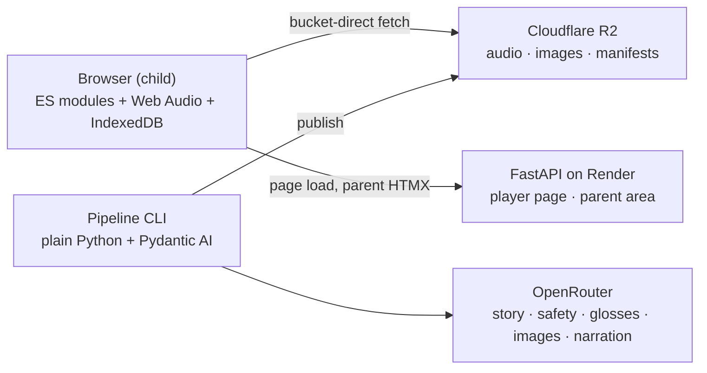
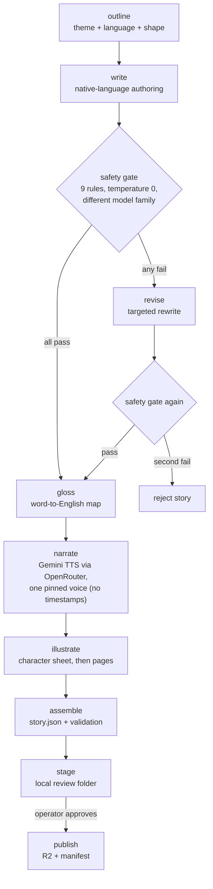

# Cantastorie — Technical Architecture

> One FastAPI app, a Web Audio player, and a plain-Python authoring pipeline — the piazza, the boards, and the workshop behind them.

---

## Table of Contents

- [System Overview](#system-overview)
- [Technology Stack](#technology-stack)
- [Project Structure](#project-structure)
- [The Authoring Pipeline](#the-authoring-pipeline)
- [Content Storage](#content-storage)
- [The Player](#the-player)
- [Narration / Audio](#narration--audio)
- [The Parent Area](#the-parent-area)
- [Privacy Architecture](#privacy-architecture)
- [Testing](#testing)
- [Build Slices](#build-slices)
- [Risks and Open Questions](#risks-and-open-questions)
- [Related Documentation](#related-documentation)

---

## System Overview

Cantastorie is one FastAPI application with three faces:

- **The child player** — served by FastAPI as a lean full-screen page; at story time it talks only to Cloudflare R2 (manifests, audio, images) and IndexedDB. No cookies, no server calls carrying child data, ever. The server is a static-file waiter here.
- **The parent area** — server-rendered Jinja2 + HTMX behind the parent gate. Small in Phase 1 (settings, export/import); the dashboard and review queue arrive in Phase 2.
- **The factory** — a plain-Python authoring pipeline in the same codebase, run as a local CLI in Phase 1. Phase 2 puts FastAPI routes in front of the same step functions.



**Key design decisions:**

- **One deployment, hermano-style** — a single FastAPI app serves everything; the factory routes simply don't exist until Phase 2
- **Bucket-direct playback** — story bytes never pass through the app server; the player fetches immutable assets straight from R2
- **Plain Python pipeline** — the filesystem working folder is the checkpoint store; no graph framework (see [The Authoring Pipeline](#the-authoring-pipeline))
- **Web Audio, not `<audio>` tags** — iOS makes media-element volume read-only, which would kill the mandated gentle crossfades; decoded buffers + gain nodes work everywhere
- **Everything precomputed** — narration, images, and glosses are generated at authoring time; a played story costs zero API calls
- **One key, one gateway (default path)** — default narration runs through OpenRouter too (Gemini TTS — see [Narration / Audio](#narration--audio), [ADR-004](adr/ADR-004-narration-deepgram-voxtral.md), and [ADR-008](adr/ADR-008-narration-gemini-defaults-mistral-cloning.md)), so the default pipeline needs only the OpenRouter key end to end; the word-timing pass (Deepgram STT) and the voice-cloning path (Voxtral via the Mistral API) are the two bounded, flagged exceptions

---

## Technology Stack

| Component | Technology | Why |
|-----------|------------|-----|
| Backend | FastAPI | Hermano-proven; async, Pydantic validation, HTMX-friendly SSR |
| Parent UI | Jinja2 + HTMX + Tailwind | Server-driven UI, minimal JS — hermano's pattern |
| Player UI | Vanilla ES modules + Web Audio API | Full-screen audio-driven experience; FSM-managed states; crossfades that work on iOS |
| Pipeline | Plain Python + Pydantic AI | Typed step functions; validated structured outputs (safety verdicts as models), retries, per-step model config via OpenRouter |
| LLMs, images & narration | OpenRouter | One gateway, per-step model choice — a different model family for the safety judge than the writer, and narration TTS on the same key (see [Narration / Audio](#narration--audio)) |
| Narration | Gemini 3.1 Flash TTS via OpenRouter (defaults, one pinned house voice); Voxtral voice profiles via the Mistral API (cloning only); Deepgram for word timings and the fallback voice bench | Gemini covers 70+ languages under the existing OpenRouter key (Voxtral's OpenRouter roster is English/French only, with no cloning parameter); word timings come from a Deepgram STT pass over the narrated audio; Deepgram Aura is the fallback bench for `it`/`es`/`de` — see [ADR-004](adr/ADR-004-narration-deepgram-voxtral.md) as amended by [ADR-008](adr/ADR-008-narration-gemini-defaults-mistral-cloning.md) |
| Asset storage | Cloudflare R2 | Zero egress fees, access logs off, public bucket for published content |
| App hosting | Render | Hermano's render.yaml precedent |
| Parent authentication | Clerk (parent area only; [ADR-003](adr/ADR-003-parent-authentication-clerk.md)) | Magic-link / OAuth sign-in; JWT verified via JWKS (PyJWT, no vendor SDK); the child player stays account-free |
| Child persistence | IndexedDB | Progress, settings, lockout, family token — nothing server-side |
| Testing | pytest + Vitest + Playwright | Providers mocked in unit tests; child flows verified in a real browser |

**One key to run the default pipeline: `OPENROUTER_API_KEY`.** With default narration on Gemini TTS via OpenRouter ([ADR-008](adr/ADR-008-narration-gemini-defaults-mistral-cloning.md)), the whole default pipeline — story, safety, glosses, images, and narration — runs on the single OpenRouter key. ElevenLabs is retired ([ADR-004](adr/ADR-004-narration-deepgram-voxtral.md)). Two bounded, flagged exceptions exist: the word-timing pass uses a pipeline-only `DEEPGRAM_API_KEY` (OpenRouter does not carry the Deepgram models — verified at AI-391), and voice cloning ([ADR-006](adr/ADR-006-family-voice-narration.md)) uses `MISTRAL_API_KEY` for Voxtral voice profiles — that single capability and no other code path. Keys live only in the pipeline environment (and later the Phase 2 service) — never in the browser, never needed at story time.

---

## Project Structure

```
src/
├── config.py               Settings (R2 bucket, provider keys, model choices per step)
├── api/
│   ├── main.py             FastAPI app factory, middleware
│   └── routes/
│       ├── player.py       GET / — the child player page
│       └── parent.py       Parent area: gate, settings, export/import
├── pipeline/
│   ├── cli.py              Typer CLI: generate, review, publish, audit
│   ├── steps/
│   │   ├── write.py        Native-language story authoring (strong model)
│   │   ├── safety.py       Per-rule verdicts, different model family, temperature 0
│   │   ├── revise.py       Bounded revise loop (two failed revisions → reject)
│   │   ├── gloss.py        Word-to-English gloss maps (cheap model)
│   │   ├── narrate.py      Gemini TTS via OpenRouter (timings via Deepgram STT at slice 6)
│   │   ├── illustrate.py   Character sheet first, then pages against it
│   │   └── assemble.py     story.json assembly + validation
│   ├── cache.py            Content-addressed artifact cache
│   ├── models.py           Pydantic: Story, Page, Choice, SafetyVerdict, GlossMap
│   └── publish.py          R2 upload, manifest update, immutable naming
├── templates/              Jinja2 (parent area + player shell)
└── static/
    ├── js/
    │   ├── fsm.js          Finite state machine (ported from hermano)
    │   ├── audio-engine.js AudioContext owner: unlock, play, crossfade, resume
    │   ├── shelf.js        Cover grid, language chip, prompt playback
    │   ├── player.js       Page display, turn logic, progress dots
    │   ├── choice.js       Choice overlay, idle nudge, auto-continue timers
    │   ├── prefetch.js     Whole-story prefetch on cover tap
    │   └── storage.js      IndexedDB: progress, settings, lockout, token
    └── css/                Player: hand-crafted watercolor CSS; parent: Tailwind

content/                    Pipeline working folders (gitignored)
tests/                      pytest + Vitest + Playwright
docs/                       This file, product.md, plans/
```

---

## The Authoring Pipeline

A batch job, not an agent: linear steps, one bounded loop, artifacts on disk. Each step is a typed function; Pydantic AI handles the LLM calls through OpenRouter with validated structured outputs.



### Why no framework

The pipeline persists every step's artifact to the story's working folder the moment it's produced — that *is* checkpointing, with the filesystem as the state store. A failure at *illustrate* never re-buys *narrate*. Given that, a graph runtime adds ceremony around what is honestly a `for` loop with one bounded retry. (LangGraph earns its keep in hermano because that graph runs per chat message with conversational state and token streaming — a different problem shape.)

### Content-addressed caching

Every generated artifact is keyed by a hash of its inputs:

| Artifact | Cache key inputs |
|----------|-----------------|
| Narration audio | page text + voice ID + model/settings |
| Page image | page text + character sheet hash + style prompt + model |
| Character sheet | story summary + style prompt + model |
| Gloss map | story text + model |

Editing page 5's text and re-running regenerates page 5's audio and image — nothing else. Re-running an unchanged story costs zero API calls.

### Model roles (via OpenRouter)

| Step | Model class | Note |
|------|-------------|------|
| Write / revise | Strong authoring model | Content rules embedded in the prompt; authored natively per language, never translated |
| Safety gate | **Different family** than the writer, temperature 0 | A shared writer/judge blind spot is the failure mode that matters; cross-family judging is one config line |
| Glosses | Cheap fast model | Mechanical contextual mapping |
| Narrate | TTS model (Gemini 3.1 Flash TTS; exact OpenRouter id verified at T0 and pinned in env) | One house voice across all languages, pinned at the AI-366 bake-off; `mp3` output; no timestamps (see [Narration / Audio](#narration--audio)) |
| Illustrate | Image-capable model | Character sheet fed as reference to every page — chaining page-to-page compounds drift |

Exact model IDs live in `config.py`, chosen and re-benchmarked freely since OpenRouter makes them a string swap — narration included, now that it runs on the same gateway.

### Spoken prompts as first-class assets

The ten spoken prompts are first-class pipeline assets (generated, reviewed, published per language), not an afterthought — slice 1 already needs the shelf greeting and story start. They are narrated through the same `narrate` step and provider as story pages.

Page timings, by contrast, are **not** produced day one: the narration provider returns audio without word timestamps, so `story.json` page timings stay empty until reading mode reconstructs them via the Deepgram STT pass. See [Narration / Audio](#narration--audio) for the trade-off and the path back to timings.

---

## Content Storage

### R2 layout

```
published/
├── it/manifest.json          ← short TTL, the only volatile file
├── es/manifest.json
├── ...
├── stories/{story-id}/
│   ├── story.json            text, structure, choice graph, timings, glosses
│   ├── p1.{hash}.mp3         immutable, cache-forever
│   ├── p1.{hash}.webp
│   └── ...
└── prompts/{lang}/{name}.{hash}.mp3
```

**Immutable assets, volatile manifests.** Asset filenames embed a content hash → browsers cache them forever. Only manifests are fetched fresh (short TTL). "Approve publishes within 60 seconds" then never fights a cache, and repeat bedtimes of a favorite story hit the local cache for everything but one tiny JSON file.

Phase 2 adds a private `pending/` prefix (separate credentials, never listed in any manifest) for generated-but-unapproved packs, plus token-keyed family overlay manifests.

### Serving

The player fetches published assets bucket-direct: the web service injects `ASSET_BASE` (the bucket's public URL plus the `/published` prefix) into the shell, and the player appends `/{lang}/manifest.json`. The bucket has **public read, access logs off, and CORS scoped to the player origin** (`deploy/r2-cors.json`) — nothing about the child ever leaves the browser, so there is nothing to log. Deploy steps and verification live in [`docs/setup.md`](setup.md).

### IndexedDB (the child's side)

| Store | Contents |
|-------|----------|
| `progress` | Per story: current page, audio position, finished flag |
| `settings` | Enabled languages, active language, reading mode |
| `gate` | Failure count, lockout-until timestamp (survives reloads) |
| `family` | The family token (created at first parent-gate entry; meaningful from slice 7) |

---

## The Player

Vanilla ES modules around a small finite state machine (hermano's `fsm.js`, ported):

```
shelf → story-loading → playing ⇄ paused
                        playing → page-turn → playing
                        playing → choice → (tap | nudge | auto) → playing
                        playing → audio-error → (tap retries) → playing
                        playing → ended → (replay | shelf | goodnight)
```

### The audio engine

One module owns a single `AudioContext`. Everything else asks it to play things.

- **Unlock on first gesture.** Browsers block sound before a user gesture. The first tap anywhere on the shelf resumes the AudioContext and plays the shelf greeting — the two-tap budget absorbs it (first tap wakes and greets, cover tap starts the story).
- **Crossfades via gain nodes.** Two sources overlapping with gain ramps — works on iOS where media-element volume is read-only.
- **Exact-position resume** from buffer offsets, persisted to IndexedDB on pause and page turn.
- **Priority ducking**: prompt playback (nudges, confirmations) and narration never overlap.

### Whole-story prefetch

On cover tap, the player fetches every page's audio and image for the story (a few MB on home wifi) before and during page 1. Both branch options preload before each choice point, because children tap instantly. Mid-story network failures become nearly impossible — which is what "bucket-direct playback is already resilient" means in practice. The audio-retry and offline states remain for the truly bad night.

---

## Narration / Audio

Narration is the app's spine — one warm narrator identity carries every story and every spoken prompt across five languages. There are two halves to it: **generation** at authoring time (a pipeline step) and **playback** at story time (the Web Audio engine in [The Player](#the-player)). Because every asset is precomputed and served bucket-direct, playback costs **zero API calls** and no provider key ever reaches the browser.

### Provider: Gemini TTS defaults via OpenRouter; Voxtral cloning via Mistral; Deepgram alongside

Default narration for all shelf content is generated through **Gemini 3.1 Flash TTS** on OpenRouter's OpenAI-compatible speech endpoint — **one house voice**, selected from Gemini's roster at the AI-366 bake-off and pinned across every language ([ADR-008](adr/ADR-008-narration-gemini-defaults-mistral-cloning.md)). **Voice cloning** (the family voices of [ADR-006](adr/ADR-006-family-voice-narration.md), and any bespoke narrator identity) runs exclusively through **Voxtral voice profiles on the Mistral API** — `MISTRAL_API_KEY` exists for that single capability and is used by no other code path. **Deepgram** keeps its two supporting roles from [ADR-004](adr/ADR-004-narration-deepgram-voxtral.md): its STT (Nova family) reconstructs word timings from the narrated audio, and its Aura presets are the fallback voice bench for `it`, `es`, and `de` (including the English–Spanish codeswitching voices for mixed-language households).

| Aspect | Detail |
|--------|--------|
| Endpoint | OpenRouter `POST /api/v1/audio/speech`, OpenAI-compatible |
| Request | `{ model, input, voice, response_format }` — `voice` is the single pinned house voice, `response_format` is `mp3` |
| Response | Raw audio bytes — **no word or character timestamps** |
| Model id | Lives in env; the exact OpenRouter id is **verified at T0** (speech models are absent from the public `/models` listing); any forced rename lands as a SPEC-DEVIATION note |
| Delivery steering | Gemini's inline audio tags (e.g. `[whispers]`) — the writer emits them only when the target synthesis model is Gemini, stripped otherwise |
| Provenance | Gemini TTS output carries SynthID watermarking |
| Key | The existing `OPENROUTER_API_KEY` for defaults; `MISTRAL_API_KEY` only for cloning |

**Why Gemini for defaults (and why Voxtral left the default path).** Field testing showed OpenRouter exposes only **English and French** preset voices for Voxtral Mini TTS and **no cloning parameter**, while Mistral's model card supports nine languages via its own API. Deepgram Aura offers strong presets but no cloning and no Greek. Gemini 3.1 Flash TTS covers **70+ languages** including (**unverified**) Greek, with 200+ inline audio tags and SynthID watermarking — so it takes the default path under the existing OpenRouter key, and Voxtral's remit narrows to the one thing only its native API offers: voice cloning. The preview-model risk is accepted with eyes open: synthesized audio is stored, so model churn threatens regeneration, not playback ([ADR-008](adr/ADR-008-narration-gemini-defaults-mistral-cloning.md)).

**Why not ElevenLabs (the original choice).** The narration was originally settled on ElevenLabs multilingual_v2 for its native character-level timestamps, proven warmth, and single multilingual voice. The OpenRouter path costs roughly **10× less**. ElevenLabs is **retired entirely** ([ADR-004](adr/ADR-004-narration-deepgram-voxtral.md)): its timestamp role passed to the Deepgram STT transcription pass, its fallback-voice role to Deepgram Aura. It remains the documented un-retirement option if cloning on Mistral disappoints ([ADR-008](adr/ADR-008-narration-gemini-defaults-mistral-cloning.md)), alongside Cartesia (unevaluated) and local Chatterbox; re-adding it would take a superseding ADR.

### The timestamp trade-off (timestamps paused)

The `/audio/speech` endpoint returns audio without timings, so the earlier "timestamps from day one" design is **paused**. `story.json` page timings stay empty until **reading mode (slice 6)**, the first feature that needs them, reconstructs them via a **Deepgram STT transcription pass**: the narrated audio runs through Deepgram (Nova family), whose transcripts carry word-level start/end times as a first-class output. Timing the whole launch library this way is expected to cost well under a dollar, and — because the pass works on *any* narrator's audio — a future voice change never orphans reading mode (the ADR-008 narrator swap is the first dividend of that decision).

This is acceptable now because **slice 1 does not use timings at all**, and reading mode already **downgrades missing timings to sentence-level highlighting** rather than failing. Alignment quality on synthetic speech is validated at AI-366; it is recorded as a risk in [Risks and Open Questions](#risks-and-open-questions).

### Open questions, validated at AI-366

Four narration properties are **unproven** and are resolved at issue AI-366 (the first Italian story — the designed "validate narration warmth" gate), re-scoped by [ADR-008](adr/ADR-008-narration-gemini-defaults-mistral-cloning.md) to a Gemini-roster-vs-Aura-bench bake-off that also pins the house voice:

- **Warmth for bedtime** — not yet validated for any candidate; warmth is core to the product, and with ElevenLabs retired, every horse in this race is unproven.
- **Cross-language voice consistency** — an **explicit bake-off criterion**: one Gemini voice is pinned as the house narrator across every language, and it must sound like one storyteller in all of them; the per-language Aura bench is the fallback shape if it does not.
- **Greek support** — Gemini lists 70+ languages including Greek, but its Greek is **unverified** and gated on a listening test; MAI-Voice-2 via OpenRouter is the named fallback, and failing both, the Greek shelf launches later rather than worse. The Deepgram timing pass's Greek support is likewise unconfirmed.
- **Timing alignment quality** — Deepgram STT word timings on synthetic narration must be validated against karaoke-highlighting quality.

### Playback

Playback mechanics live in [The Player → The audio engine](#the-audio-engine): a single `AudioContext`, decoded-buffer narration and prompt channels that never overlap, gain-node crossfades for gentle page turns, and exact-position resume. The narration provider produces `mp3`/`pcm` bytes; the audio engine decodes and schedules them. The two halves meet only at the audio file — swapping the narration provider does not touch the player.

---

## The Parent Area

Hermano's server-rendered pattern: Jinja2 + HTMX + Tailwind.

- **The gate** is client-side theater with real persistence: 3-second hold (pointer events + fill animation), then a two-integer addition on a keypad. Failures and the 5-minute lockout live in IndexedDB, so a reload doesn't reset them. There is no PIN — the addition is freshly random each time.
- **Settings**: language multi-select, reading mode toggle.
- **Export/import**: the export file (schema pinned in slice 7) round-trips progress, settings, and the family token; invalid imports change nothing and name the failing field.
- **Parent authentication (Phase 2)**: parents sign in via **Clerk** (magic link / OAuth) at `/parent` — see [ADR-003](adr/ADR-003-parent-authentication-clerk.md) (Accepted). FastAPI verifies Clerk session JWTs via JWKS (PyJWT, no vendor SDK). One parent account = one family; the family token lives in Clerk `public_metadata`. Approved packs publish to `published/families/{family_token}/…` + a family overlay manifest. The child player stays account-free — no Clerk script, no cookies on any child path.
- **Phase 2** adds the dashboard (unpublish toggles, kill switch) and the review queue (full text, per-page audio, image strip, approve / reject / regenerate-with-cap) in front of the same pipeline step functions.

---

## Privacy Architecture

| Guarantee | Mechanism |
|-----------|-----------|
| Nothing about the child leaves the browser | Story-time traffic is bucket-direct asset fetches only; no cookies; no server-side state; R2 access logs disabled |
| No child accounts | The child player is account-free; a parent signs in via Clerk (ADR-003) only to request and review stories — the child path carries no Clerk script or cookie |
| No child accounts | The child player is account-free; a parent signs in via Clerk (ADR-003) only to request and review stories — the child path carries no Clerk script or cookie |
| Zero unapproved assets reachable | Only the publish step writes to `published/`; the audit script (slice 5, then CI) verifies every manifest entry resolves to approved content and nothing else is listed |
| Keys never reach the browser | The OpenRouter key (and the pipeline-only Deepgram and Mistral keys — timing pass and voice cloning respectively) exist only in pipeline/service environments |

---

## Testing

| Layer | Tool | What's covered |
|-------|------|----------------|
| Pipeline | pytest | Step functions with providers mocked (hermano's fixture pattern); cache-key behavior; safety-gate routing (pass / revise / reject); assembly validation |
| API | pytest | Player page, parent routes, export/import validation |
| Player modules | Vitest | FSM transitions, audio-engine state, storage round-trips, prefetch logic, choice timers |
| Child flows | Playwright | Two taps to narration, page turns, choice overlay, retry state, resume offer, gate lockout |
| Safety | Audit script in CI | Zero unapproved assets reachable from any manifest |

The content rules (page counts, word counts, sentence caps) are enforced twice: as pipeline validation in `assemble` and as pytest assertions against every published `story.json`.

---

## Build Slices

Each slice ends with a child hearing something new; the pipeline grows exactly what the slice needs. Full narrative in [product.md](product.md).

| Slice | Player gains | Pipeline gains |
|-------|--------------|----------------|
| 1 — One story plays | Shelf (one cover), playback, auto page turns, end screen | CLI core: write → safety → narrate → illustrate → publish; one Italian story (no timings — slice 1 does not use them) |
| 2 — Survives real life | Retry & offline states, IndexedDB progress, resume, goodnight sign-off | — |
| 3 — The story branches | Choice overlay, nudge, auto-continue | Branching topology, choice-card images |
| 4 — Grown-ups arrive | Gate, settings, first-run rule, language chip | Second language (Spanish); all ten prompts per enabled language |
| 5 — The full shelf | Empty-shelf state | Batch runs; 19 stories × 5 languages; audit script |
| 6 — Reading mode | Text panel, karaoke, gloss bubbles | Gloss step; word timings reconstructed here via the Deepgram STT transcription pass (see [Narration / Audio](#narration--audio)), since narration ships without them |
| 7 — Portability | Export/import UI | Export schema pinned (family token included) |

---

## Risks and Open Questions

| Item | Status |
|------|--------|
| **Safari storage eviction** — ~7 days of non-use can wipe IndexedDB for non-installed sites (progress, settings, eventually the token) | Accepted; export/import is the designed backstop; "add to home screen" guidance is a cheap future mitigation |
| **Render cold starts** — can eat the 4-second budget on first open | **Decided (slice 1): paid always-on.** A bedtime app is opened fresh daily, so the free tier's 15-min idle spin-down makes nearly every first open a ~50s cold boot. Render Starter (always-on, ~$7/mo) is set in `render.yaml`. Story assets are bucket-direct from R2, so only the static shell depends on the instance staying warm. |
| **Kill-switch scope** (family vs. operator-global) | Deferred to Phase 2 design |
| **Pending-bucket auth & pack-request rate limiting** | Deferred to Phase 2 design |
| **Export file schema** | Pinned in slice 7, not before |
| **Narration warmth & voice consistency** (Gemini / Aura bench) | Unproven for all candidates; validated at AI-366 (first Italian story) via the [ADR-008](adr/ADR-008-narration-gemini-defaults-mistral-cloning.md) bake-off — Gemini's roster vs the Deepgram Aura bench, pinning one house voice with cross-language consistency as an explicit criterion — before the library is built |
| **Deferred narration timestamps** | The narrator returns no timings, so `story.json` page timings stay empty until reading mode (slice 6) reconstructs them via the Deepgram STT transcription pass (well under a dollar for the launch library). Slice 1 does not use timings, so nothing is blocked now; reading mode downgrades missing/poor timings to sentence-level highlighting |
| **Deepgram carriage on OpenRouter** | Verified at implementation (AI-391): OpenRouter does not carry Deepgram STT or Aura TTS models. The timing pass uses a pipeline-only `DEEPGRAM_API_KEY` (a bounded, flagged exception to one-key, used only at authoring time by the slice 6 timing step) |
| **Gemini TTS is a preview model in the default path** | Accepted with eyes open ([ADR-008](adr/ADR-008-narration-gemini-defaults-mistral-cloning.md)): synthesized audio is stored, so model churn threatens regeneration, not playback; the model id lives in env, its exact OpenRouter id and token-based audio pricing are verified at T0, and any forced rename lands as a SPEC-DEVIATION note |
| **Greek narration support** (Gemini / Deepgram) | Unverified — Gemini's language list includes Greek but its quality is gated on a listening test (MAI-Voice-2 via OpenRouter is the named fallback; failing both, the Greek shelf launches later rather than worse), and Deepgram's Greek STT support is likewise unconfirmed; confirm narration *and* timing support before any Greek content |

---

## Related Documentation

| Doc | Content |
|-----|---------|
| [Product Spec](product.md) | Vision, behaviors, content rules, spoken prompts, decision log |
| [System Overview](system-overview.md) | The code as built: module map, state machines, and seams |
| [Setup & Deploy](setup.md) | R2 bucket, CORS, and the Render blueprint |
| [ADR-001](adr/ADR-001-technology-stack.md) | Foundational technology stack (why this shape) |
| [ADR-004](adr/ADR-004-narration-deepgram-voxtral.md) | Narration — Voxtral TTS plus Deepgram; ElevenLabs retired (supersedes [ADR-002](adr/ADR-002-narration-provider.md); amended by ADR-008) |
| [ADR-003](adr/ADR-003-parent-authentication-clerk.md) | Parent Authentication via Clerk (Accepted — Phase 2 parent area auth) |
| [ADR-006](adr/ADR-006-family-voice-narration.md) | Nonna Narrates — family voice narration (Proposed) |
| [ADR-008](adr/ADR-008-narration-gemini-defaults-mistral-cloning.md) | Default voices on Gemini TTS via OpenRouter; cloning scoped to Voxtral on the Mistral API |
| [Architecture Decision Records](adr/) | The full ADR index |
| Implementation Plans | `docs/plans/` *(created per slice)* |
