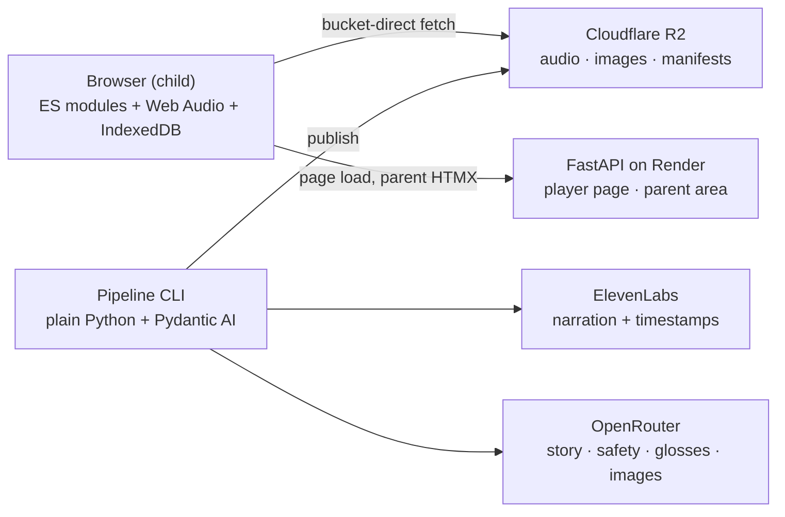
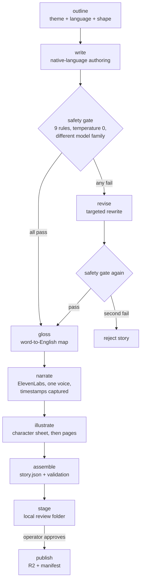

# Cantastorie — Technical Architecture

> One FastAPI app, a Web Audio player, and a plain-Python authoring pipeline — the piazza, the boards, and the workshop behind them.

---

## Table of Contents

- [System Overview](#system-overview)
- [Technology Stack](#technology-stack)
- [Project Structure](#project-structure)
- [The Authoring Pipeline](#the-authoring-pipeline)
- [Content Storage](#content-storage)
- [The Player](#the-player)
- [The Parent Area](#the-parent-area)
- [Privacy Architecture](#privacy-architecture)
- [Testing](#testing)
- [Build Slices](#build-slices)
- [Risks and Open Questions](#risks-and-open-questions)
- [Related Documentation](#related-documentation)

---

## System Overview

Cantastorie is one FastAPI application with three faces:

- **The child player** — served by FastAPI as a lean full-screen page; at story time it talks only to Cloudflare R2 (manifests, audio, images) and IndexedDB. No cookies, no server calls carrying child data, ever. The server is a static-file waiter here.
- **The parent area** — server-rendered Jinja2 + HTMX behind the parent gate. Small in Phase 1 (settings, export/import); the dashboard and review queue arrive in Phase 2.
- **The factory** — a plain-Python authoring pipeline in the same codebase, run as a local CLI in Phase 1. Phase 2 puts FastAPI routes in front of the same step functions.



**Key design decisions:**

- **One deployment, hermano-style** — a single FastAPI app serves everything; the factory routes simply don't exist until Phase 2
- **Bucket-direct playback** — story bytes never pass through the app server; the player fetches immutable assets straight from R2
- **Plain Python pipeline** — the filesystem working folder is the checkpoint store; no graph framework (see [The Authoring Pipeline](#the-authoring-pipeline))
- **Web Audio, not `<audio>` tags** — iOS makes media-element volume read-only, which would kill the mandated gentle crossfades; decoded buffers + gain nodes work everywhere
- **Everything precomputed** — narration, timestamps, images, and glosses are generated at authoring time; a played story costs zero API calls

---

## Technology Stack

| Component | Technology | Why |
|-----------|------------|-----|
| Backend | FastAPI | Hermano-proven; async, Pydantic validation, HTMX-friendly SSR |
| Parent UI | Jinja2 + HTMX + Tailwind | Server-driven UI, minimal JS — hermano's pattern |
| Player UI | Vanilla ES modules + Web Audio API | Full-screen audio-driven experience; FSM-managed states; crossfades that work on iOS |
| Pipeline | Plain Python + Pydantic AI | Typed step functions; validated structured outputs (safety verdicts as models), retries, per-step model config via OpenRouter |
| LLMs & images | OpenRouter | One gateway, per-step model choice — including a different model family for the safety judge than the story writer |
| Narration | ElevenLabs | One voice identity across all five languages; character-level timestamps captured with every call |
| Asset storage | Cloudflare R2 | Zero egress fees, access logs off, public bucket for published content |
| App hosting | Render | Hermano's render.yaml precedent |
| Child persistence | IndexedDB | Progress, settings, lockout, family token — nothing server-side |
| Testing | pytest + Vitest + Playwright | Providers mocked in unit tests; child flows verified in a real browser |

Two API keys total: ElevenLabs and OpenRouter. Both live only in the pipeline environment (and later the Phase 2 service) — never in the browser, never needed at story time.

---

## Project Structure

```
src/
├── config.py               Settings (R2 bucket, provider keys, model choices per step)
├── api/
│   ├── main.py             FastAPI app factory, middleware
│   └── routes/
│       ├── player.py       GET / — the child player page
│       └── parent.py       Parent area: gate, settings, export/import
├── pipeline/
│   ├── cli.py              Typer CLI: generate, review, publish, audit
│   ├── steps/
│   │   ├── write.py        Native-language story authoring (strong model)
│   │   ├── safety.py       Per-rule verdicts, different model family, temperature 0
│   │   ├── revise.py       Bounded revise loop (two failed revisions → reject)
│   │   ├── gloss.py        Word-to-English gloss maps (cheap model)
│   │   ├── narrate.py      ElevenLabs TTS + timestamp capture
│   │   ├── illustrate.py   Character sheet first, then pages against it
│   │   └── assemble.py     story.json assembly + validation
│   ├── cache.py            Content-addressed artifact cache
│   ├── models.py           Pydantic: Story, Page, Choice, SafetyVerdict, GlossMap
│   └── publish.py          R2 upload, manifest update, immutable naming
├── templates/              Jinja2 (parent area + player shell)
└── static/
    ├── js/
    │   ├── fsm.js          Finite state machine (ported from hermano)
    │   ├── audio-engine.js AudioContext owner: unlock, play, crossfade, resume
    │   ├── shelf.js        Cover grid, language chip, prompt playback
    │   ├── player.js       Page display, turn logic, progress dots
    │   ├── choice.js       Choice overlay, idle nudge, auto-continue timers
    │   ├── prefetch.js     Whole-story prefetch on cover tap
    │   └── storage.js      IndexedDB: progress, settings, lockout, token
    └── css/                Player: hand-crafted watercolor CSS; parent: Tailwind

content/                    Pipeline working folders (gitignored)
tests/                      pytest + Vitest + Playwright
docs/                       This file, product.md, plans/
```

---

## The Authoring Pipeline

A batch job, not an agent: linear steps, one bounded loop, artifacts on disk. Each step is a typed function; Pydantic AI handles the LLM calls through OpenRouter with validated structured outputs.



### Why no framework

The pipeline persists every step's artifact to the story's working folder the moment it's produced — that *is* checkpointing, with the filesystem as the state store. A failure at *illustrate* never re-buys *narrate*. Given that, a graph runtime adds ceremony around what is honestly a `for` loop with one bounded retry. (LangGraph earns its keep in hermano because that graph runs per chat message with conversational state and token streaming — a different problem shape.)

### Content-addressed caching

Every generated artifact is keyed by a hash of its inputs:

| Artifact | Cache key inputs |
|----------|-----------------|
| Narration audio + timestamps | page text + voice ID + model/settings |
| Page image | page text + character sheet hash + style prompt + model |
| Character sheet | story summary + style prompt + model |
| Gloss map | story text + model |

Editing page 5's text and re-running regenerates page 5's audio and image — nothing else. Re-running an unchanged story costs zero API calls.

### Model roles (via OpenRouter)

| Step | Model class | Note |
|------|-------------|------|
| Write / revise | Strong authoring model | Content rules embedded in the prompt; authored natively per language, never translated |
| Safety gate | **Different family** than the writer, temperature 0 | A shared writer/judge blind spot is the failure mode that matters; cross-family judging is one config line |
| Glosses | Cheap fast model | Mechanical contextual mapping |
| Illustrate | Image-capable model | Character sheet fed as reference to every page — chaining page-to-page compounds drift |

Exact model IDs live in `config.py`, chosen and re-benchmarked freely since OpenRouter makes them a string swap.

### Timestamps and utterances from day one

- ElevenLabs returns character-level timestamps with every TTS call. They're stored in `story.json` from slice 1 even though karaoke highlighting ships in slice 6 — discarding them would mean regenerating all narration later at double cost.
- The ten spoken prompts are first-class pipeline assets (generated, reviewed, published per language), not an afterthought — slice 1 already needs the shelf greeting and story start.

---

## Content Storage

### R2 layout

```
published/
├── it/manifest.json          ← short TTL, the only volatile file
├── es/manifest.json
├── ...
├── stories/{story-id}/
│   ├── story.json            text, structure, choice graph, timings, glosses
│   ├── p1.{hash}.mp3         immutable, cache-forever
│   ├── p1.{hash}.webp
│   └── ...
└── prompts/{lang}/{name}.{hash}.mp3
```

**Immutable assets, volatile manifests.** Asset filenames embed a content hash → browsers cache them forever. Only manifests are fetched fresh (short TTL). "Approve publishes within 60 seconds" then never fights a cache, and repeat bedtimes of a favorite story hit the local cache for everything but one tiny JSON file.

Phase 2 adds a private `pending/` prefix (separate credentials, never listed in any manifest) for generated-but-unapproved packs, plus token-keyed family overlay manifests.

### Serving

The player fetches published assets bucket-direct: the web service injects `ASSET_BASE` (the bucket's public URL plus the `/published` prefix) into the shell, and the player appends `/{lang}/manifest.json`. The bucket has **public read, access logs off, and CORS scoped to the player origin** (`deploy/r2-cors.json`) — nothing about the child ever leaves the browser, so there is nothing to log. Deploy steps and verification live in [`docs/setup.md`](setup.md).

### IndexedDB (the child's side)

| Store | Contents |
|-------|----------|
| `progress` | Per story: current page, audio position, finished flag |
| `settings` | Enabled languages, active language, reading mode |
| `gate` | Failure count, lockout-until timestamp (survives reloads) |
| `family` | The family token (created at first parent-gate entry; meaningful from slice 7) |

---

## The Player

Vanilla ES modules around a small finite state machine (hermano's `fsm.js`, ported):

```
shelf → story-loading → playing ⇄ paused
                        playing → page-turn → playing
                        playing → choice → (tap | nudge | auto) → playing
                        playing → audio-error → (tap retries) → playing
                        playing → ended → (replay | shelf | goodnight)
```

### The audio engine

One module owns a single `AudioContext`. Everything else asks it to play things.

- **Unlock on first gesture.** Browsers block sound before a user gesture. The first tap anywhere on the shelf resumes the AudioContext and plays the shelf greeting — the two-tap budget absorbs it (first tap wakes and greets, cover tap starts the story).
- **Crossfades via gain nodes.** Two sources overlapping with gain ramps — works on iOS where media-element volume is read-only.
- **Exact-position resume** from buffer offsets, persisted to IndexedDB on pause and page turn.
- **Priority ducking**: prompt playback (nudges, confirmations) and narration never overlap.

### Whole-story prefetch

On cover tap, the player fetches every page's audio and image for the story (a few MB on home wifi) before and during page 1. Both branch options preload before each choice point, because children tap instantly. Mid-story network failures become nearly impossible — which is what "bucket-direct playback is already resilient" means in practice. The audio-retry and offline states remain for the truly bad night.

---

## The Parent Area

Hermano's server-rendered pattern: Jinja2 + HTMX + Tailwind.

- **The gate** is client-side theater with real persistence: 3-second hold (pointer events + fill animation), then a two-integer addition on a keypad. Failures and the 5-minute lockout live in IndexedDB, so a reload doesn't reset them. There is no PIN — the addition is freshly random each time.
- **Settings**: language multi-select, reading mode toggle.
- **Export/import**: the export file (schema pinned in slice 7) round-trips progress, settings, and the family token; invalid imports change nothing and name the failing field.
- **Phase 2** adds the dashboard (unpublish toggles, kill switch) and the review queue (full text, per-page audio, image strip, approve / reject / regenerate-with-cap) in front of the same pipeline step functions.

---

## Privacy Architecture

| Guarantee | Mechanism |
|-----------|-----------|
| Nothing about the child leaves the browser | Story-time traffic is bucket-direct asset fetches only; no cookies; no server-side state; R2 access logs disabled |
| No accounts | The family token is a random capability in IndexedDB, created client-side, carried in export/import |
| Zero unapproved assets reachable | Only the publish step writes to `published/`; the audit script (slice 5, then CI) verifies every manifest entry resolves to approved content and nothing else is listed |
| Keys never reach the browser | ElevenLabs and OpenRouter keys exist only in pipeline/service environments |

---

## Testing

| Layer | Tool | What's covered |
|-------|------|----------------|
| Pipeline | pytest | Step functions with providers mocked (hermano's fixture pattern); cache-key behavior; safety-gate routing (pass / revise / reject); assembly validation |
| API | pytest | Player page, parent routes, export/import validation |
| Player modules | Vitest | FSM transitions, audio-engine state, storage round-trips, prefetch logic, choice timers |
| Child flows | Playwright | Two taps to narration, page turns, choice overlay, retry state, resume offer, gate lockout |
| Safety | Audit script in CI | Zero unapproved assets reachable from any manifest |

The content rules (page counts, word counts, sentence caps) are enforced twice: as pipeline validation in `assemble` and as pytest assertions against every published `story.json`.

---

## Build Slices

Each slice ends with a child hearing something new; the pipeline grows exactly what the slice needs. Full narrative in [product.md](product.md).

| Slice | Player gains | Pipeline gains |
|-------|--------------|----------------|
| 1 — One story plays | Shelf (one cover), playback, auto page turns, end screen | CLI core: write → safety → narrate (+timestamps) → illustrate → publish; one Italian story |
| 2 — Survives real life | Retry & offline states, IndexedDB progress, resume, goodnight sign-off | — |
| 3 — The story branches | Choice overlay, nudge, auto-continue | Branching topology, choice-card images |
| 4 — Grown-ups arrive | Gate, settings, first-run rule, language chip | Second language (Spanish); all ten prompts per enabled language |
| 5 — The full shelf | Empty-shelf state | Batch runs; 19 stories × 5 languages; audit script |
| 6 — Reading mode | Text panel, karaoke, gloss bubbles | Gloss step; timings already banked since slice 1 |
| 7 — Portability | Export/import UI | Export schema pinned (family token included) |

---

## Risks and Open Questions

| Item | Status |
|------|--------|
| **Safari storage eviction** — ~7 days of non-use can wipe IndexedDB for non-installed sites (progress, settings, eventually the token) | Accepted; export/import is the designed backstop; "add to home screen" guidance is a cheap future mitigation |
| **Render cold starts** — can eat the 4-second budget on first open | **Decided (slice 1): paid always-on.** A bedtime app is opened fresh daily, so the free tier's 15-min idle spin-down makes nearly every first open a ~50s cold boot. Render Starter (always-on, ~$7/mo) is set in `render.yaml`. Story assets are bucket-direct from R2, so only the static shell depends on the instance staying warm. |
| **Kill-switch scope** (family vs. operator-global) | Deferred to Phase 2 design |
| **Pending-bucket auth & pack-request rate limiting** | Deferred to Phase 2 design |
| **Export file schema** | Pinned in slice 7, not before |
| **Voice quality in Italian/Greek** | Slice 1/4 explicitly validate narration warmth per language before the library is built |

---

## Related Documentation

| Doc | Content |
|-----|---------|
| [Product Spec](product.md) | Vision, behaviors, content rules, spoken prompts, decision log |
| Implementation Plans | `docs/plans/` *(created per slice)* |
