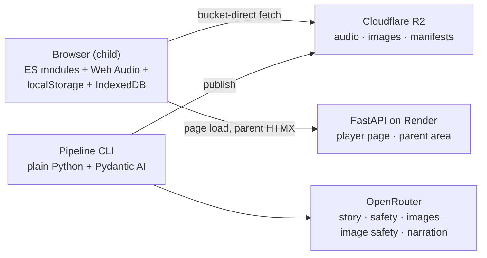
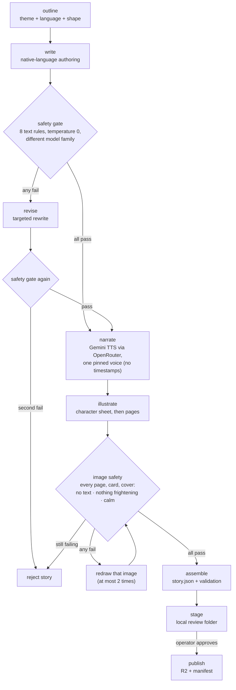

# Cantastorie — Technical Architecture

> One FastAPI app, a Web Audio player, and a plain-Python authoring pipeline — the piazza, the boards, and the workshop behind them.

---

## Table of Contents

- [System Overview](#system-overview)
- [Technology Stack](#technology-stack)
- [Project Structure](#project-structure)
- [The Authoring Pipeline](#the-authoring-pipeline)
- [Content Storage](#content-storage)
- [The Player](#the-player)
- [Narration / Audio](#narration--audio)
- [The Parent Area](#the-parent-area)
- [Privacy Architecture](#privacy-architecture)
- [Testing](#testing)
- [Build Slices](#build-slices)
- [Risks and Open Questions](#risks-and-open-questions)
- [Related Documentation](#related-documentation)

---

## System Overview

Cantastorie is one FastAPI application with three faces, plus a public landing page:

- **The landing page** — a static, server-rendered home at `/` (`src/api/routes/landing.py`, `templates/landing.html`) that explains the product and links to the player and the parent area. Public, Clerk-free, no child data, no server calls.
- **The child player** — served by FastAPI at `/play` as a lean full-screen page; at story time it talks only to Cloudflare R2 (manifests, audio, images) and the browser's own storage (progress and settings in localStorage, the family token in IndexedDB). No cookies, no server calls carrying child data, ever. The server is a static-file waiter here.
- **The parent area** — server-rendered Jinja2 + HTMX behind the parent gate. Small in Phase 1 (settings, export/import); the dashboard and review queue arrive in Phase 2.
- **The factory** — a plain-Python authoring pipeline in the same codebase, run as a local CLI in Phase 1. Phase 2 puts FastAPI routes in front of the same step functions.


```mermaid
graph LR
    B["Browser (child)<br/>ES modules + Web Audio +<br/>localStorage + IndexedDB"]
    R2["Cloudflare R2<br/>audio · images · manifests"]
    F["FastAPI on Render<br/>player page · parent area"]
    P["Pipeline CLI<br/>plain Python + Pydantic AI"]
    OR["OpenRouter<br/>story · safety · images · image safety · narration"]

    B -- "bucket-direct fetch" --> R2
    B -- "page load, parent HTMX" --> F
    P -- "publish" --> R2
    P --> OR
```

**Key design decisions:**

- **One deployment, hermano-style** — a single FastAPI app serves everything; the factory routes simply don't exist until Phase 2
- **Bucket-direct playback** — story bytes never pass through the app server; the player fetches immutable assets straight from R2
- **Plain Python pipeline** — the filesystem working folder is the checkpoint store; no graph framework (see [The Authoring Pipeline](#the-authoring-pipeline))
- **Web Audio, not `<audio>` tags** — iOS makes media-element volume read-only, which would kill the mandated gentle crossfades; decoded buffers + gain nodes work everywhere
- **Everything precomputed** — narration and images are generated at authoring time (glosses will be too, once the planned gloss step ships with reading mode); a played story costs zero API calls
- **One key, one gateway (default path)** — default narration runs through OpenRouter too (Gemini TTS — see [Narration / Audio](#narration--audio), [ADR-004](adr/ADR-004-narration-deepgram-voxtral.md), and [ADR-008](adr/ADR-008-narration-gemini-defaults-mistral-cloning.md)), so the default pipeline needs only the OpenRouter key end to end; the planned word-timing pass (Deepgram STT) and voice-cloning path (Voxtral via the Mistral API) will be the two bounded, flagged exceptions — neither is built yet, so nothing reads their keys today

---

## Technology Stack

| Component | Technology | Why |
|-----------|------------|-----|
| Backend | FastAPI | Hermano-proven; async, Pydantic validation, HTMX-friendly SSR |
| Parent UI | Jinja2 + HTMX + Tailwind | Server-driven UI, minimal JS — hermano's pattern |
| Player UI | Vanilla ES modules + Web Audio API | Full-screen audio-driven experience; FSM-managed states; crossfades that work on iOS |
| Pipeline | Plain Python + Pydantic AI | Typed step functions; validated structured outputs (safety verdicts as models), retries, per-step model config via OpenRouter |
| LLMs, images & narration | OpenRouter | One gateway, per-step model choice — a different model family for the safety judge than the writer, and narration TTS on the same key (see [Narration / Audio](#narration--audio)) |
| Narration | Gemini 3.1 Flash TTS via OpenRouter (defaults, one pinned house voice, `Kore`); Voxtral voice profiles via the Mistral API (cloning only); Deepgram for word timings (planned) | Gemini covers 70+ languages under the existing OpenRouter key (Voxtral's OpenRouter roster is English/French only, with no cloning parameter); word timings will come from a Deepgram STT pass over the narrated audio; the Deepgram Aura fallback bench was retired on 2026-10-10 — see [ADR-004](adr/ADR-004-narration-deepgram-voxtral.md) as amended by [ADR-008](adr/ADR-008-narration-gemini-defaults-mistral-cloning.md) |
| Asset storage | Cloudflare R2 | Zero egress fees, access logs off, public bucket for published content |
| App hosting | Render | Hermano's render.yaml precedent |
| Parent authentication | Clerk (parent area only; [ADR-003](adr/ADR-003-parent-authentication-clerk.md)) | Magic-link / OAuth sign-in; JWT verified via JWKS (PyJWT, no vendor SDK); the child player stays account-free |
| Child persistence | localStorage + IndexedDB | Progress, language and display settings in localStorage; the family token in IndexedDB — nothing server-side |
| Observability | LangSmith tracing ([ADR-007](adr/ADR-007-langsmith-observability.md)); Sentry errors, server-side only ([ADR-009](adr/ADR-009-sentry-error-monitoring.md)) | Traces for LLM/narration/image calls; grouped, release-tagged exceptions for the app, workshop runs, and CLI — inert when unconfigured, no browser SDK |
| Testing | pytest + Vitest + Playwright | Providers mocked in unit tests; child flows verified in a real browser |

**One key to run the default pipeline: `OPENROUTER_API_KEY`.** With default narration on Gemini TTS via OpenRouter ([ADR-008](adr/ADR-008-narration-gemini-defaults-mistral-cloning.md)), the whole default pipeline — story, safety, images, image safety, and narration — runs on the single OpenRouter key. ElevenLabs is retired ([ADR-004](adr/ADR-004-narration-deepgram-voxtral.md)). Two bounded, flagged exceptions are planned but not built, and nothing in `src/` reads their keys today: the word-timing pass will use a pipeline-only `DEEPGRAM_API_KEY` (OpenRouter does not carry the Deepgram models — verified at AI-391), and voice cloning ([ADR-006](adr/ADR-006-family-voice-narration.md)) will use `MISTRAL_API_KEY` for Voxtral voice profiles — that single capability and no other code path. Because parent and operator runs generate in-process, the web service holds the OpenRouter key alongside the R2 and Clerk credentials (list in [setup.md](setup.md)). Keys never reach the browser and are never needed at story time.

---

## Project Structure

```
src/
├── config.py               Settings (R2 bucket, provider keys, model choices per step)
├── api/
│   ├── main.py             FastAPI app factory, middleware
│   ├── auth.py             require_parent / require_parent_candidate — Clerk JWT verification via JWKS
│   ├── clerk.py            Clerk REST client: family-token mint-or-link
│   └── routes/
│       ├── landing.py      GET / — the public landing page
│       ├── player.py       GET /play — the child player shell
│       ├── parent.py       /parent — story requests, run progress, review, approve/reject, provision
│       ├── published.py    /published — R2 content proxy for dev/prod parity
│       ├── workshop.py     /workshop — operator screens: runs, staging, review, publish, library
│       ├── _nav.py         Post-sign-in navigation: each role's home, 303 for the other role
│       └── _templates.py   Shared Jinja2 environment
├── workshop/
│   ├── manager.py          In-process run orchestration (one run at a time), caps, stale-run reaping, boot resume
│   ├── records.py          Durable run records in R2 (pending prefix), ETag-guarded saves
│   └── scope.py            WorkshopScope: operator (shared shelf) vs parent (own family partition)
├── pipeline/
│   ├── cli.py              Typer CLI: generate, publish, publish-prompts, audit
│   ├── generate.py         The linear pipeline: author → narrate → illustrate → image safety → assemble → stage
│   ├── steps/
│   │   ├── write.py        Native-language story authoring (strong model)
│   │   ├── safety.py       Per-rule text verdicts (eight rules), different model family, temperature 0
│   │   ├── revise.py       Bounded revise loop (two failed revisions → reject)
│   │   ├── narrate.py      Gemini TTS via OpenRouter (pcm wrapped to WAV; timings stay empty until slice 6's Deepgram pass)
│   │   ├── illustrate.py   Character sheet first, then pages against it
│   │   ├── image_safety.py Vision judge over every shown image, bounded redraws (ADR-011)
│   │   ├── assemble.py     story.json assembly + validation
│   │   ├── utterance_texts.py  The five spoken-prompt lines per language
│   │   └── (gloss.py)      Planned, not built: word-to-English gloss maps (cheap model), with reading mode
│   ├── cache.py            Content-addressed artifact cache
│   ├── _parallel.py        Bounded thread pool for per-page narration and illustration calls
│   ├── content_rules.py    The nine content rules, shared by write and safety prompts
│   ├── languages.py        Language display names, shared by templates and the player
│   ├── models.py           Pydantic: Story, Page, ChoicePoint, SafetyReport, ImageSafetyReport
│   ├── prompts.py          publish-prompts: narrate and publish a language's spoken prompts
│   ├── providers.py        OpenRouter transport (chat, images, TTS); every model via OpenRouterProvider, so judges' temperature 0 reaches the wire
│   ├── retry.py            Bounded provider retries (429/502/503/504 and connect failures only)
│   └── publish.py          R2 staging + publish, review digest, manifest update, immutable naming, audit
├── observability.py        LangSmith tracing + Sentry error monitoring for pipeline and app
├── templates/              Jinja2: landing.html, index.html (player shell), parent/ and workshop/ screens
└── static/
    ├── js/
    │   ├── fsm.js          Finite state machine (ported from hermano)
    │   ├── audio-engine.js AudioContext owner: unlock, play, crossfade, resume
    │   ├── wake.js          Unlock on every activation + visibilitychange; fires the shelf greeting once
    │   ├── main.js         Composition root: boot, manifest, wiring, render loop
    │   ├── store.js        Player state + transitions
    │   ├── playback.js     Narration drives pages; pause/resume; stall watchdog; branch following
    │   ├── screens.js      DOM for shelf, player, end + overlays (choice, resume, settings, grown-up gate)
    │   ├── story.js        story.json → playable; mock shelf for unpublished covers
    │   ├── prefetch.js     Whole-story prefetch on cover tap
    │   ├── palette-resolve.js  Theme + palette resolution (pure, shared with tests)
    │   ├── palette.js      Sync head script: sets theme + palette before first paint
    │   ├── auth.js         Shared Clerk sign-in/out + HTMX session-lapse recovery (workshop, parent)
    │   ├── workshop.js     Operator-screen behaviors (HTMX companion)
    │   ├── family-adopt.js Writes the family token to IndexedDB
    │   └── storage.js      Progress persistence in localStorage (page + branch choices)
    └── css/                Player: hand-crafted watercolor CSS; workshop: Tailwind

content/                    Pipeline working folders (gitignored)
tests/                      pytest + Vitest + Playwright
docs/                       This file, product.md, plans/
```

---

## The Authoring Pipeline

A batch job, not an agent: linear steps, one bounded loop, artifacts on disk. Each step is a typed function; Pydantic AI handles the LLM calls through OpenRouter with validated structured outputs.


```mermaid
graph TD
    O["outline<br/>theme + language + shape"] --> W["write<br/>native-language authoring"]
    W --> S{"safety gate<br/>8 text rules, temperature 0,<br/>different model family"}
    S -- "all pass" --> N
    S -- "any fail" --> RV["revise<br/>targeted rewrite"]
    RV --> S2{"safety gate again"}
    S2 -- "pass" --> N
    S2 -- "second fail" --> X["reject story"]
    N["narrate<br/>Gemini TTS via OpenRouter,<br/>one pinned voice (no timestamps)"]
    N --> I["illustrate<br/>character sheet, then pages"]
    I --> IS{"image safety<br/>every page, card, cover:<br/>no text · nothing frightening · calm"}
    IS -- "any fail" --> RD["redraw that image<br/>(at most 2 times)"]
    RD --> IS
    IS -- "still failing" --> X
    IS -- "all pass" --> A["assemble<br/>story.json + validation"]
    A --> ST["stage<br/>local review folder"]
    ST -- "operator approves" --> PB["publish<br/>R2 + manifest"]
```

A **gloss** step (word-to-English maps from a cheap model, between the safety gate and narration) is planned for reading mode (slice 6) and is not in the code yet: there is no `steps/gloss.py`, and `generate.py` does not run one. `story.json` already carries an optional `gloss` field, which the dev fixtures fill by hand.

### Why no framework

The pipeline persists every step's artifact to the story's working folder the moment it's produced — that *is* checkpointing, with the filesystem as the state store. A failure at *illustrate* never re-buys *narrate*. Given that, a graph runtime adds ceremony around what is honestly a `for` loop with one bounded retry. (LangGraph earns its keep in hermano because that graph runs per chat message with conversational state and token streaming — a different problem shape.)

### Content-addressed caching

Every generated artifact is keyed by a hash of its inputs:

| Artifact | Cache key inputs |
|----------|-----------------|
| Narration audio | page text + voice ID + model/settings |
| Page image | page text + character sheet hash + style prompt + model |
| Character sheet | story summary + style prompt + model |
| Choice card image | option label + character sheet hash + card prompt + model |
| Choice label audio | option label + voice ID + model/settings |
| Gloss map (planned, with the gloss step) | story text + model |
| Image safety verdict | image bytes (SHA-256) + judge model + temperature + prompt version |

A safety-driven redraw adds a `regeneration` count to that one image's inputs, so it gets a fresh key while every other image stays a cache hit.

Editing page 5's text and re-running regenerates page 5's audio and image — nothing else. Re-running an unchanged story costs zero API calls.

### Model roles (via OpenRouter)

| Step | Model class | Note |
|------|-------------|------|
| Write / revise | Strong authoring model | Content rules embedded in the prompt; authored natively per language, never translated |
| Safety gate | **Different family** than the writer, temperature 0 | A shared writer/judge blind spot is the failure mode that matters; cross-family judging is one config line |
| Image safety | Vision model, **different family** than the image model, temperature 0 | **Calm pictures** judged on the rendered images, not the text ([ADR-011](adr/ADR-011-image-safety-vision-judge.md)); verdicts no text / nothing frightening / calm per page, card and cover; a failure is redrawn at most twice, then the story is rejected. Refused at config load if the families match |
| Glosses (planned) | Cheap fast model | Mechanical contextual mapping; `GLOSS_MODEL` is configured but no step reads it yet |
| Narrate | TTS model (Gemini 3.1 Flash TTS via OpenRouter, `google/gemini-3.1-flash-tts-preview`) | One house voice (`Kore`) across all languages, finalized 2026-10-10; `pcm` output wrapped to WAV (Gemini rejects `mp3`); no timestamps (see [Narration / Audio](#narration--audio)) |
| Illustrate | Image-capable model | Character sheet fed as reference to every page — chaining page-to-page compounds drift |

Exact model IDs live in `config.py`, chosen and re-benchmarked freely since OpenRouter makes them a string swap — narration included, now that it runs on the same gateway.

### Provider retries

Every provider client (text models, both judges, images, narration) sits on one retrying HTTP transport (`pipeline/retry.py`, AI-495); the OpenAI SDK's own retries are off so the two layers cannot multiply. At most three sends per request, retried only on 429/502/503/504 and on connect-phase failures — answers that mean the provider never served the request. A plain 500 or a read timeout is never retried, because the provider may already be generating (and billing) an image or an audio clip. `Retry-After` is honoured up to 30 seconds; otherwise exponential backoff with jitter. Retries are logged as `provider_retry` with method, host, path and status only.

### Spoken prompts as first-class assets

The ten spoken prompts are first-class pipeline assets (generated, reviewed, published per language), not an afterthought — slice 1 already needs the shelf greeting and story start. They are narrated through the same `narrate` step and provider as story pages. Every language in the roster has its lines (`UTTERANCE_TEXTS` in `steps/utterance_texts.py`, five per language today; the Italian, Spanish and English sets are final copy from product.md, the rest machine-drafted, pending native review). A generation run stages only the Italian set; the operator's `cantastorie publish-prompts` command publishes any language's set to `published/prompts/{lang}/` and its manifest (H6, AI-481; runbook in [setup.md](setup.md#spoken-prompts-for-every-language-h6-ai-481)).

Page timings, by contrast, are **not** produced day one: the narration provider returns audio without word timestamps, so `story.json` page timings stay empty until reading mode reconstructs them via the Deepgram STT pass. See [Narration / Audio](#narration--audio) for the trade-off and the path back to timings.

### Branching stories

A `shape` parameter (default `linear`, threaded from the CLI and the workshop form) runs the same pipeline for branching stories. The writer returns a shared opening plus two labelled arms; content validation checks every *heard path* (shared prefix + one arm) against the linear limits, so no single path runs long. Two extra assets are produced per choice: each option's **choice card** is illustrated against the same character sheet as the pages, and each option's **spoken label** is narrated through the same `narrate` step and cache. Assemble hashes both into `story.json` beside the page assets, and a choice page carries no `next_page` — continuations live on its options. One choice point per story at launch; the validation enumerates heard paths generically, so more become a writer change, not a contract change.

---

## Content Storage

### R2 layout

```
published/
├── it/manifest.json          ← short TTL, the only volatile file (shared shelf)
├── es/manifest.json
├── ...
├── stories/{story-id}/        ← shared-shelf (operator, global) assets
│   ├── story.json            text, structure, choice graph, timings, glosses
│   ├── p1.{hash}.mp3         immutable, cache-forever
│   ├── p1.{hash}.webp
│   └── ...
├── prompts/{lang}/{name}.{hash}.mp3
└── families/{family_token}/    ← private overlay (per family, only that child)
    ├── it/manifest.json        the family's own per-language shelf
    ├── stories/{story-id}/     the family's approved-story assets
    └── prompts/{lang}/{name}.{hash}.mp3
```

**Per-language content is plain files.** Each language is its own manifest (`published/{lang}/manifest.json`) and its own prompts (`published/prompts/{lang}/…`), with no bundling or registry layer above them (AI-480, 2026-10-03).

**Immutable assets, volatile manifests.** Asset filenames embed a content hash → browsers cache them forever. Only manifests are fetched fresh (short TTL). "Approve publishes within 60 seconds" then never fights a cache, and repeat bedtimes of a favorite story hit the local cache for everything but one tiny JSON file.

A `pending/` prefix in its **own private bucket** (`R2_PENDING_BUCKET`, never listed in any manifest) holds generated-but-unapproved stories and run records. The public bucket serves every key it holds, so config refuses a live endpoint whose pending bucket is unset or equal to the public one, and the audit fails on any `pending/` object found in the public bucket. **Two publish lanes** share the `published/` bucket: the **shared shelf** (operator, global — `published/stories/…` + `published/{lang}/manifest.json`) and a **family overlay** (private — `published/families/{token}/stories/…` + `published/families/{token}/{lang}/manifest.json`). `publish_story(..., family_token=…)` selects the lane; the family-token prefix is the tenancy boundary and is validated (`^[0-9a-f]{32}$`) before it becomes a key. The lanes never cross and there is no promotion of private → global. The audit (`audit_published_bucket`) enforces this: a manifest may reference only its own lane's assets — a cross-tenant URL is a violation.

### Review binding and publish order

A family can approve only the bytes it reviewed (B2, H1). Rendering the parent review page records a **staged digest** on the run record: SHA-256 over the staged `story.json` plus every staged asset's name and ETag (`publish.staged_digest`). Approve refuses a run that was never reviewed, or whose staged story has changed since. `publish_story(..., expected_digest=…)` then recomputes the digest before copying anything and raises `StagedContentChangedError` with nothing published, which closes the window between the route's check and the copy. Each workshop run's id is folded into its story id as a nonce, so no other run can stage over a reviewed story.

The operator's approve (`/workshop/runs/{id}/approve`) publishes to the shared shelf **without** `expected_digest`: the digest binding guards the family lane only.

Publishing copies, never regenerates. Assets go first, each skipped if its ETag already matches, with `Cache-Control: public, max-age=31536000, immutable`. Then `story.json`, then the language's prompts, and the manifest **last**, with `max-age=60`. So a manifest never lists an asset that is not yet in the bucket. Every manifest write (publish, unpublish, the repair script, publish-prompts) goes through one load–mutate–write path with `IfMatch` on the ETag and up to three attempts. Two concurrent approvals in the same lane therefore cannot drop each other's entry.

### Serving

The player fetches published assets bucket-direct: the web service injects `ASSET_BASE` (the bucket's public URL plus the `/published` prefix) into the shell, and the player appends `/{lang}/manifest.json`. When a `family_token` is present in the child's IndexedDB, the player additionally fetches `/{ASSET_BASE}/families/{token}/{lang}/manifest.json` and merges its stories onto the shared shelf (dedupe by id, shared wins; overlay fetch failure falls back to the shared shelf and never blocks playback). No token → zero overlay requests. The overlay fetch is anonymous and bucket-direct — the child loads no auth SDK and sets no cookies. The bucket has **public read, access logs off, and CORS scoped to the player origin** (`deploy/r2-cors.json`) — nothing about the child ever leaves the browser, so there is nothing to log. Deploy steps and verification live in [`docs/setup.md`](setup.md).

### Browser storage (the child's side)

Progress and settings live in localStorage; only the family token lives in IndexedDB.

| Where | Key / store | Contents |
|-------|-------------|----------|
| localStorage | `cantastorie-shell` | Progress: the current page and the recorded branch choices (`storage.js`; everything else is rebuilt on load) |
| localStorage | `cantastorie-lang`, `cantastorie-theme`, `cantastorie-palette`, `cantastorie-read-with-me` | Active language, light/dusk choice, palette, the read-with-me toggle |
| IndexedDB | database `cantastorie`, store `family` | The family token, seeded by `family-adopt.js` from the signed-in parent page on the same device, and read by `main.js` for the overlay fetch |

The design moves progress, settings and the gate's lockout into IndexedDB beside the token; until then localStorage is the stand-in ([system-overview.md → Current Stand-ins](system-overview.md#current-stand-ins-deliberate-tracked)). The gate's failure count and lockout are not stored anywhere yet because the gate is not built.

---

## The Player

Vanilla ES modules around a small finite state machine (hermano's `fsm.js`, ported):

```
shelf → story-loading → playing ⇄ paused
                        playing → page-turn → playing
                        playing → choice → tap → playing
                        playing → audio-error → (tap retries) → playing
                        playing → ended → (replay | shelf | goodnight)
```

**Choice overlay, as built:** the overlay speaks each option's label and then waits for a tap; there is no time limit. The idle **Choice nudge** (30 seconds) and auto-continue on the first option (10 seconds later) specified in [product.md](product.md#the-picture-choice-pattern) are **not built** (AI-370). Neither is the spoken tap confirmation: the five prompts that exist are listed under [Spoken prompts](#spoken-prompts-as-first-class-assets). The Playwright auto-continue test is skipped until the timers land (`tests/e2e/branching.spec.js`).

### The audio engine

One module owns a single `AudioContext`. Everything else asks it to play things.

- **Unlock on every activation, and on return to view.** Browsers block sound before a user gesture, and mobile browsers can drop a running context back to suspended or (Safari) `interrupted` with no event at all when the tab backgrounds or the device sleeps. `wake.js` re-arms unlock on every activation-triggering event (no `once`) and on a visible `visibilitychange`, so the shelf greeting fires once on the first successful unlock and playback recovers without a reload — the two-tap budget absorbs it (first tap wakes and greets, cover tap starts the story). A narration stall watchdog turns a frozen voice into the sleeping-bird audio-error state instead of dead air. See [ADR-010](adr/ADR-010-audio-wake-and-stall-recovery.md).
- **Crossfades via gain nodes.** Two sources overlapping with gain ramps — works on iOS where media-element volume is read-only.
- **Exact-position resume** from buffer offsets within a session. Across a reload, the page and branch choices persist in localStorage, and the resume offer reopens the story on that page.
- **Priority ducking**: prompt playback (the story-start line, spoken choice labels, the retry and end prompts) and narration never overlap.

### Whole-story prefetch

On cover tap, the player fetches every page's audio and image for the story (a few MB on home wifi) before and during page 1. Both branch options — their pages, choice cards, and spoken labels — preload before the choice point, because children tap instantly. Mid-story network failures become nearly impossible — which is what "bucket-direct playback is already resilient" means in practice. The audio-retry and offline states remain for the truly bad night.

### Branch following

The loaded story exposes `pagesFrom(pageId)`, an ordered walk of one arm. When a child taps a card, the player extends the played path with that arm (`playback.extendPath`) **before** the store advances, so the next page turned is the arm's first page — the store stays a pure index machine and never learns the graph. The chosen option index is recorded in `store.state.choices`, persisted with progress, and replayed on resume so a branched story reopens on the right arm (a republished story whose graph no longer matches simply starts fresh — never a crash).

---

## Narration / Audio

Narration is the app's spine — one warm narrator identity carries every story and every spoken prompt across all ten roster languages. There are two halves to it: **generation** at authoring time (a pipeline step) and **playback** at story time (the Web Audio engine in [The Player](#the-player)). Because every asset is precomputed and served bucket-direct, playback costs **zero API calls** and no provider key ever reaches the browser.

### Provider: Gemini TTS defaults via OpenRouter; Voxtral cloning via Mistral; Deepgram alongside

Default narration for all shelf content is generated through **Gemini 3.1 Flash TTS** on OpenRouter's OpenAI-compatible speech endpoint — **one house voice, Gemini's `Kore`**, pinned across all eight languages and finalized on 2026-10-10 ([ADR-008](adr/ADR-008-narration-gemini-defaults-mistral-cloning.md#outcome-2026-10-10)). **Voice cloning** (the family voices of [ADR-006](adr/ADR-006-family-voice-narration.md), and any bespoke narrator identity) runs exclusively through **Voxtral voice profiles on the Mistral API** — `MISTRAL_API_KEY` exists for that single capability and is used by no other code path. **Deepgram** keeps one supporting role from [ADR-004](adr/ADR-004-narration-deepgram-voxtral.md): its STT (Nova family) will reconstruct word timings from the narrated audio (planned, slice 6). Its Aura presets were the fallback voice bench for `it`, `es` and `de`. That bench was **retired on 2026-10-10** once the Gemini house voice was finalized.

| Aspect | Detail |
|--------|--------|
| Endpoint | OpenRouter `POST /api/v1/audio/speech`, OpenAI-compatible |
| Request | `{ model, input, voice, response_format }` — `voice` is the single pinned house voice (`Kore`, `NARRATION_VOICES` in `config.py`), `response_format` is `pcm` (Gemini rejects `mp3`) |
| Response | Raw PCM, wrapped into a WAV container at the transport boundary and stored as `.wav` — **no word or character timestamps** |
| Model id | `google/gemini-3.1-flash-tts-preview`, pinned in config (verified live; the earlier slug guess cost a debugging round — speech models are absent from the public `/models` listing) |
| Delivery steering | *Planned:* Gemini's inline audio tags (e.g. `[whispers]`) — the writer will emit them only when the target synthesis model is Gemini, stripped otherwise; not yet enforced in the write prompt |
| Provenance | Gemini TTS output carries SynthID watermarking |
| Key | The existing `OPENROUTER_API_KEY` for defaults; `MISTRAL_API_KEY` only for cloning |

**Why Gemini for defaults (and why Voxtral left the default path).** Field testing showed OpenRouter exposes only **English and French** preset voices for Voxtral Mini TTS and **no cloning parameter**, while Mistral's model card supports nine languages via its own API. Deepgram Aura offers strong presets but no cloning and no Greek. Gemini 3.1 Flash TTS covers **70+ languages** including Greek (which passed its listening test), with 200+ inline audio tags and SynthID watermarking — so it takes the default path under the existing OpenRouter key, and Voxtral's remit narrows to the one thing only its native API offers: voice cloning. The preview-model risk is accepted with eyes open: synthesized audio is stored, so model churn threatens regeneration, not playback ([ADR-008](adr/ADR-008-narration-gemini-defaults-mistral-cloning.md)).

**Why not ElevenLabs (the original choice).** The narration was originally settled on ElevenLabs multilingual_v2 for its native character-level timestamps, proven warmth, and single multilingual voice. The OpenRouter path costs roughly **10× less**. ElevenLabs is **retired entirely** ([ADR-004](adr/ADR-004-narration-deepgram-voxtral.md)): its timestamp role passed to the Deepgram STT transcription pass, and its fallback-voice role to Deepgram Aura, which has itself since been retired. It remains the documented un-retirement option if cloning on Mistral disappoints ([ADR-008](adr/ADR-008-narration-gemini-defaults-mistral-cloning.md)), alongside Cartesia (unevaluated) and local Chatterbox; re-adding it would take a superseding ADR.

### The timestamp trade-off (timestamps paused)

The `/audio/speech` endpoint returns audio without timings, so the earlier "timestamps from day one" design is **paused**. `story.json` page timings stay empty until **reading mode (slice 6)**, the first feature that needs them, reconstructs them via a **Deepgram STT transcription pass**: the narrated audio runs through Deepgram (Nova family), whose transcripts carry word-level start/end times as a first-class output. Timing the whole launch library this way is expected to cost well under a dollar, and — because the pass works on *any* narrator's audio — a future voice change never orphans reading mode (the ADR-008 narrator swap is the first dividend of that decision).

This is acceptable now because **slice 1 does not use timings at all**, and reading mode already **downgrades missing timings to sentence-level highlighting** rather than failing. Alignment quality on synthetic speech is still unvalidated; it is recorded as a risk in [Risks and Open Questions](#risks-and-open-questions).

### Narrator verdict (finalized 2026-10-10)

The narration gate that [ADR-008](adr/ADR-008-narration-gemini-defaults-mistral-cloning.md#outcome-2026-10-10) set up (Gemini's roster against the Deepgram Aura bench, plus a Greek listening test) is closed:

- **House voice**: Gemini 3.1 Flash TTS voice **`Kore`**, pinned for all eight languages (`it`, `es`, `en`, `el`, `de`, `bg`, `ru`, `mr`).
- **Warmth and cross-language consistency**: accepted. One storyteller across every language.
- **Greek**: passed the listening test. Greek ships on the house voice, and the MAI-Voice-2 fallback is not needed.
- **Deepgram Aura bench**: retired. There is no longer a per-language fallback voice; a forced change of narrator would now take a new ADR.
- **Still open: timing alignment quality.** Deepgram STT word timings on synthetic narration, including Greek STT support, remain to be validated when reading mode (slice 6) builds the timing pass.
- **Hindi and Japanese** (added 2026-10-10, AI-508) narrate on the same `Kore` voice. The verdict above covered the original eight languages; a listening test for `hi` and `ja` is still to be done.

### Playback

Playback mechanics live in [The Player → The audio engine](#the-audio-engine): a single `AudioContext`, decoded-buffer narration and prompt channels that never overlap, gain-node crossfades for gentle page turns, and exact-position resume. The narration provider produces WAV files (PCM wrapped at generation time); the audio engine decodes and schedules them. The two halves meet only at the audio file — swapping the narration provider does not touch the player.

---

## The Parent Area

Hermano's server-rendered pattern: Jinja2 + HTMX + Tailwind. **Shipped:** the Clerk identity layer (`require_parent` JWT verification via JWKS, `/parent/api/provision` mint-or-link) and the parent pages themselves (AI-411) — a sign-in home, story requests under a daily run cap (each run makes exactly one story, AI-480), and per-run progress polling. Parents review a staged story on one page (every page, picture and sound) and approve or reject it; approval is bound to the reviewed bytes (see [Review binding and publish order](#review-binding-and-publish-order)). Export/import is designed but not yet built.

- **The gate, as built (AI-444)** is a stand-in. The player's settings sheet has a "grown-ups" row that opens a modal asking for the sum `7 + 6` with three answer buttons. A wrong tap shows a message and keeps the modal open; Back or Escape closes it. The correct answer navigates to `/parent`, which has its own Clerk sign-in. There is no hold, no fresh random equation, and no failure count or lockout.
- **The gate, as designed (not yet built)** is client-side theater with real persistence: 3-second hold (pointer events + fill animation), then a two-integer addition on a keypad. Failures and the 5-minute lockout persist locally, so a reload doesn't reset them. There is no PIN — the addition is freshly random each time.
- **Settings** (the player's settings sheet, ungated): language, light/dusk/auto, and the read-with-me toggle. Only the parent-area row sits behind the gate.
- **Export/import (not yet built)**: the export file (schema pinned in slice 7) round-trips progress, settings, and the family token; invalid imports change nothing and name the failing field.
- **Parent authentication**: parents sign in via **Clerk** (magic link / OAuth) — see [ADR-003](adr/ADR-003-parent-authentication-clerk.md) (Accepted, implemented). FastAPI verifies Clerk session JWTs via JWKS (PyJWT, no vendor SDK, async fetch). One parent account = one family; the family token is minted or linked at first sign-in and lives in Clerk `public_metadata`. Approved stories publish to `published/families/{family_token}/…` + a family overlay manifest (a family approving its run's staged story at `/parent/runs/{id}/approve`); the child player merges that overlay onto the shared shelf. The child player stays account-free — no Clerk script, no cookies on any child path.
- **The workshop is Clerk-gated; the parent area is its sibling surface (AI-426, AI-430)**: `/workshop` no longer has an env-var secret. Every request resolves a `WorkshopScope` from the verified JWT (`role`, `family_token`). An **operator** (`public_metadata.role == "operator"`) works globally and publishes to the shared shelf; any other signed-in user is a **parent**, confined to their own `family_token` partition who publishes to their private overlay. The operator can also **see and delete** any family's private story from `/workshop/library` (moderation — never promotion). Parents work in their own `/parent` surface — sign-in, story requests, run tracking, approving a staged story to their private shelf — while operators author in `/workshop`; shared post-sign-in navigation (`src/api/routes/_nav.py`) dispatches each role to its home and 303-redirects the other, so neither role hits a dead end or a redirect loop. With Clerk unconfigured, both areas answer 404. ClerkJS loads on every workshop and parent page to keep the `__session` JWT refreshed for HTMX polling.
- **How runs execute.** A request creates a `RunRecord` (`queued → running → staged → approved | rejected`, with `failed` re-queueable) saved to the private pending bucket under `pending/{family|operator}/runs/`. Saves are conditional on the record's ETag, so concurrent writers raise instead of overwriting each other. Parents are capped at one queued-or-running run and a daily count; the operator is exempt. `RunManager.execute` runs as a FastAPI background task and calls `generate_story` in a worker thread under one `asyncio.Lock`, so **one generation runs at a time per process**. A restart is not a state. At boot the app schedules, without awaiting, a task that first retires runs whose last update is older than the stale threshold, then re-enters the queued and running runs that remain. `/health` answers immediately. The reaper also runs, throttled, from each progress poll. Because of the content-addressed cache, a re-entered run pays only for the steps it had not finished.
- **Phase 2** adds the dashboard (unpublish toggles, kill switch) and the review queue (full text, per-page audio, image strip, approve / reject / regenerate-with-cap) in front of the same pipeline step functions.

---

## Privacy Architecture

| Guarantee | Mechanism |
|-----------|-----------|
| Nothing about the child leaves the browser | Story-time traffic is bucket-direct asset fetches only; no cookies; no server-side state; R2 access logs disabled |
| No child accounts | The child player is account-free; a parent signs in via Clerk (ADR-003) only to request and review stories — the child path carries no Clerk script or cookie |
| Zero unapproved assets reachable | Only the publish step writes to `published/`; the audit script (slice 5, then CI) verifies every manifest entry resolves to approved content and nothing else is listed |
| Error reports carry no child data | Sentry is server-side only (no browser SDK); events omit request bodies, stack-frame locals, IPs, and auth/cookie headers ([ADR-009](adr/ADR-009-sentry-error-monitoring.md)) |
| Keys never reach the browser | The OpenRouter, R2 and Clerk secret keys exist only in the web service and pipeline environments (the planned Deepgram and Mistral keys will follow the same rule) |

---

## Testing

| Layer | Tool | What's covered |
|-------|------|----------------|
| Pipeline | pytest | Step functions with providers mocked (hermano's fixture pattern); cache-key behavior; safety-gate routing (pass / revise / reject); assembly validation |
| API | pytest | Player page, parent routes, export/import validation |
| Player modules | Vitest | FSM transitions, audio-engine state, storage round-trips, prefetch logic, choice timers |
| Child flows | Playwright | Two taps to narration, page turns, choice overlay, retry state, resume offer, the stand-in gate (wrong answer stays, right answer passes; Escape is Back). Auto-continue is specified but skipped until AI-370 |
| Safety | Audit script in CI | Zero unapproved assets reachable from any manifest |

The content rules (page counts, word counts, sentence caps) are enforced twice: as pipeline validation in `assemble` and as pytest assertions against every published `story.json`. Japanese, which has no spaces between words, is measured in characters (spaces and punctuation excluded) against the word limits scaled at 2.5 characters per word (`content_rules.limits_for`, AI-508). The Japanese writer, judge and reviser get those limits restated in characters in their per-call message, so the shared instructions, and every other language's cache keys, are unchanged.

---

## Build Slices

Each slice ends with a child hearing something new; the pipeline grows exactly what the slice needs. Full narrative in [product.md](product.md).

| Slice | Player gains | Pipeline gains |
|-------|--------------|----------------|
| 1 — One story plays | Shelf (one cover), playback, auto page turns, end screen | CLI core: write → safety → narrate → illustrate → publish; one Italian story (no timings — slice 1 does not use them) |
| 2 — Survives real life | Retry & offline states, local progress (localStorage), resume, goodnight sign-off | — |
| 3 — The story branches | Choice overlay with spoken labels (nudge and auto-continue not yet built, AI-370), branch-following (`pagesFrom`/`extendPath`), resume across branches | Branching writer (`shape`), choice-card images, spoken labels |
| 4 — Grown-ups arrive | Gate, settings, first-run rule, language chip | Second language (Spanish); all ten prompts per enabled language |
| 5 — The full shelf | Empty-shelf state | Batch runs; 19 stories × 5 languages; audit script |
| 6 — Reading mode | Text panel, karaoke, gloss bubbles | Gloss step; word timings reconstructed here via the Deepgram STT transcription pass (see [Narration / Audio](#narration--audio)), since narration ships without them |
| 7 — Portability | Export/import UI | Export schema pinned (family token included) |

---

## Risks and Open Questions

| Item | Status |
|------|--------|
| **Safari storage eviction** — ~7 days of non-use can wipe script-writable storage (localStorage and IndexedDB) for non-installed sites: progress, settings, and the family token | Accepted; export/import is the designed backstop; "add to home screen" guidance is a cheap future mitigation |
| **Render cold starts** — can eat the 4-second budget on first open | **Decided (slice 1): paid always-on.** A bedtime app is opened fresh daily, so the free tier's 15-min idle spin-down makes nearly every first open a ~50s cold boot. Render Starter (always-on, ~$7/mo) is set in `render.yaml`. Story assets are bucket-direct from R2, so only the static shell depends on the instance staying warm. |
| **Kill-switch scope** (family vs. operator-global) | Deferred to Phase 2 design |
| **Pending-bucket auth & story-request rate limiting** | Deferred to Phase 2 design |
| **Export file schema** | Pinned in slice 7, not before |
| **Narration warmth & voice consistency** | **Resolved 2026-10-10.** Gemini voice `Kore` accepted as the house narrator for all eight languages; the Deepgram Aura bench is retired ([verdict](#narrator-verdict-finalized-2026-10-10)) |
| **Deferred narration timestamps** | The narrator returns no timings, so `story.json` page timings stay empty until reading mode (slice 6) reconstructs them via the Deepgram STT transcription pass (well under a dollar for the launch library). Slice 1 does not use timings, so nothing is blocked now; reading mode downgrades missing/poor timings to sentence-level highlighting |
| **Deepgram carriage on OpenRouter** | Verified at implementation (AI-391): OpenRouter does not carry Deepgram STT or Aura TTS models. The timing pass uses a pipeline-only `DEEPGRAM_API_KEY` (a bounded, flagged exception to one-key, used only at authoring time by the slice 6 timing step) |
| **Gemini TTS is a preview model in the default path** | Accepted with eyes open ([ADR-008](adr/ADR-008-narration-gemini-defaults-mistral-cloning.md)): synthesized audio is stored, so model churn threatens regeneration, not playback; the model id lives in env, its exact OpenRouter id and token-based audio pricing are verified at T0, and any forced rename lands as a SPEC-DEVIATION note |
| **Greek narration support** (Gemini / Deepgram) | **Narration resolved 2026-10-10:** Greek passed its listening test on the house voice, so the MAI-Voice-2 fallback is not needed. **Timing still open:** Deepgram's Greek STT support is unconfirmed, so check it before reading mode's timing pass runs on Greek |

---

## Related Documentation

| Doc | Content |
|-----|---------|
| [Product Spec](product.md) | Vision, behaviors, content rules, spoken prompts, decision log |
| [System Overview](system-overview.md) | The code as built: module map, state machines, and seams |
| [Architecture Whiteboard](whiteboards/architecture.md) | Module-by-module walkthrough with diagrams and line-level code permalinks, pinned to `35f3b29` |
| [Setup & Deploy](setup.md) | R2 bucket, CORS, and the Render blueprint |
| [ADR-001](adr/ADR-001-technology-stack.md) | Foundational technology stack (why this shape) |
| [ADR-004](adr/ADR-004-narration-deepgram-voxtral.md) | Narration — Voxtral TTS plus Deepgram; ElevenLabs retired (supersedes [ADR-002](adr/ADR-002-narration-provider.md); amended by ADR-008) |
| [ADR-003](adr/ADR-003-parent-authentication-clerk.md) | Parent Authentication via Clerk (Accepted — Phase 2 parent area auth) |
| [ADR-006](adr/ADR-006-family-voice-narration.md) | Nonna Narrates — family voice narration (Proposed) |
| [ADR-008](adr/ADR-008-narration-gemini-defaults-mistral-cloning.md) | Default voices on Gemini TTS via OpenRouter; cloning scoped to Voxtral on the Mistral API |
| [ADR-011](adr/ADR-011-image-safety-vision-judge.md) | Image safety via a cross-family vision judge over every rendered image |
| [Architecture Decision Records](adr/) | The full ADR index |
| Implementation Plans | `docs/plans/` *(created per slice)* |
