# Cantastorie Design System — the sticker-book

> Warm, wobbly, and slow. Bedtime, not Saturday cartoons.

Source of truth: the Claude Design project *Cantastorie design system*
(Foundations + Prototype, locked from explorations 3a + 3b). This document
records how those foundations live in code.

## Where it lives

| Layer | File |
|-------|------|
| Tokens (color, type, motion, shape) | [`src/static/css/tokens.css`](../../src/static/css/tokens.css) |
| Screens & components (child player) | [`src/static/css/player.css`](../../src/static/css/player.css) |
| State machine | [`src/static/js/store.js`](../../src/static/js/store.js) |
| Rendering | [`src/static/js/screens.js`](../../src/static/js/screens.js) |
| Workshop screens (operator) | [`src/static/css/workshop.css`](../../src/static/css/workshop.css) + [`src/templates/workshop/`](../../src/templates/workshop/) |

## The rules, briefly

- **Two modes.** Light (warm cream) and dusk (lamplit charcoal); the shelf
  follows the clock (dusk from 19:00), `?theme=` overrides for development.
  The player itself always lives at dusk — stories are bedtime.
- **Two typefaces only.** Baloo 2 for everything the app says; Literata for
  everything the story says (reading mode, later).
- **The wobble** belongs to the child's world: blob border-radii (42–58% /
  40–60%), tilts ±1.5–3° alternating, sticker rings. Parent UI keeps the
  palette but calms the shapes.
- **Watercolor washes** are 2–3 radial gradients of accent colors over a warm
  base — placeholders until pipeline art lands.
- **Glow, not lightness, at dusk.** Halos of moonlight at 15–25% alpha replace
  bright surfaces.
- **Slow crossfades only** (600–900 ms). Nothing snaps, flashes, or bounces.
- **Beads, never numbers.** Progress is a string of colored beads; the current
  one is bright, the past ones settled, the future ones faint.
- **Child targets ≥ 96 px**; parent UI and reading-mode words ≥ 44 px.

## The user journey

Captured from the running shell (402×874, `make dev` + Playwright):

| | |
|---|---|
| 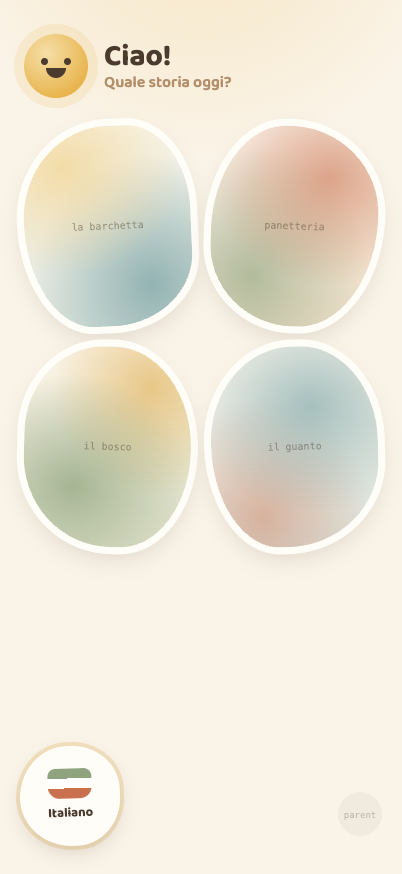 | **1 · The shelf, light.** Sun mascot, spoken greeting caption, four wobbly story covers, the Italiano sticker, and the deliberately quiet parent corner. |
| 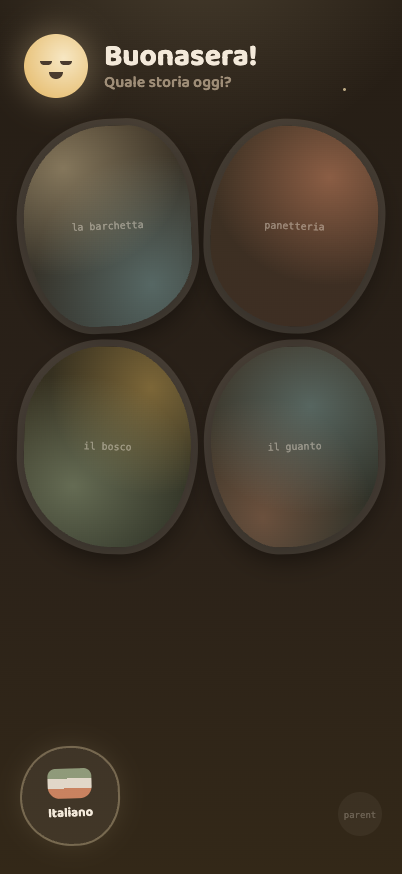 | **2 · The shelf at dusk.** The sleepy moon replaces the sun, stars come out, covers dim to lamplight — same shelf, later hour. |
| 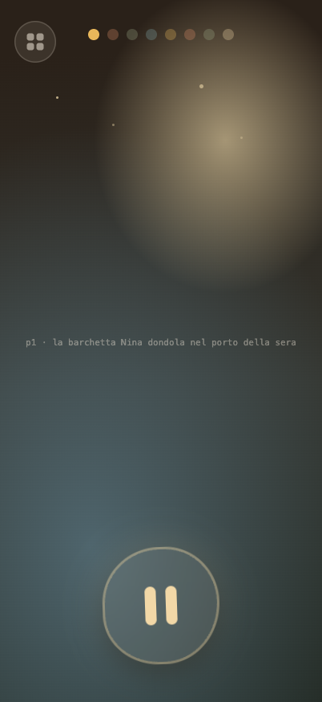 | **3 · A story begins.** Full-bleed watercolor night, bead progress, the exit sticker, and the one and only control: the 140 px play-pause blob. |
| 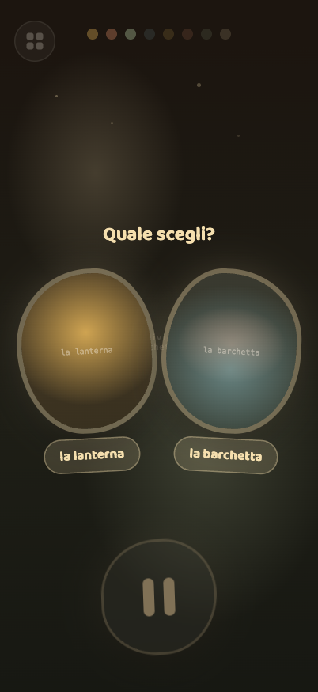 | **4 · The choice.** The page dims; two glowing picture cards with spoken labels. A tap branches the story; a sleeping child auto-continues. |
| 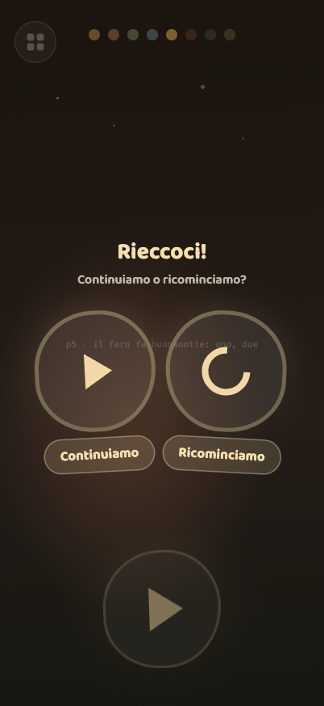 | **5 · Coming back.** An unfinished story asks: continue, or start again? Two pictures, no reading required. |
| 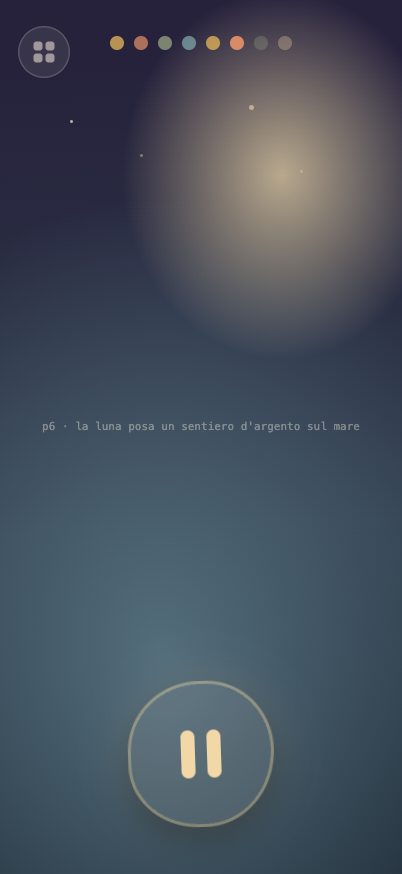 | **6 · Deep in the story.** Each page is its own watercolor wash, crossfaded at 900 ms. |
| 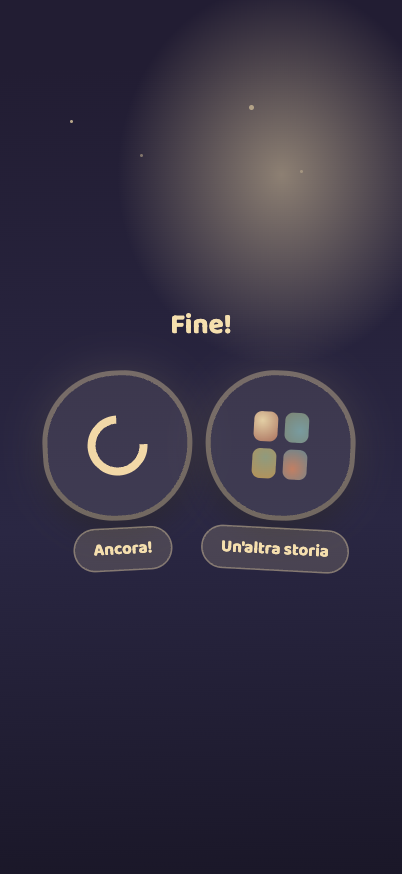 | **7 · Fine!** Replay or another story — and after twenty quiet seconds, a goodnight. |

## What the shell is (and isn't)

This is the **design shell**: real screens, real state machine (page turns,
choice, resume, persistence), with a timer standing in for narration and CSS
washes standing in for pipeline art. The audio engine, real
`story.json`, and spoken prompts replace those stand-ins in Slice 1
(see the Linear project).

## The workshop — the room behind the piazza

The operator face at `/workshop`
([ADR-004](../adr/ADR-004-workshop-area.md), AI-388): sign in with one
secret, start a pipeline run, watch its steps land, review the staged story
page by page, approve & publish. Unlike the shell above this is **real,
shipped code** — server-rendered Jinja2 + HTMX, with a progress fragment
that re-polls itself every 2 s while a run is live.

### As built (first pass, deliberately plain)

`workshop.css` keeps the palette but none of the craft: warm cream
(`#faf6ef`), ink (`#3b332c`), and a workshop green (`#4a7c59`) on
`system-ui` — **not** Baloo 2, no tokens beyond the include, no wobble.
Run states are six pastel chips: `queued` · `running` · `staged` ·
`approved` · `rejected` · `failed`.

### The operator journey

Captured from the running app with real generated stories (402×874):

| | |
|---|---|
| 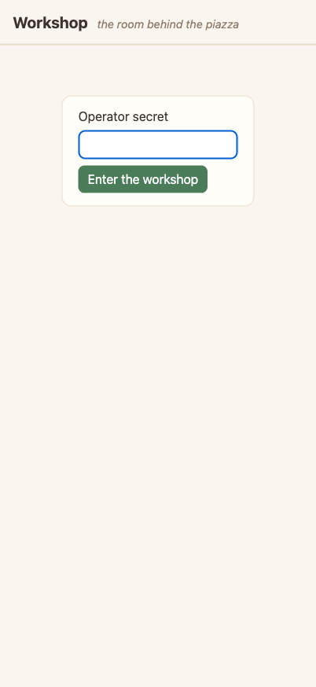 | **8 · The door.** One secret, one button. No accounts — with no secret configured, the workshop answers 404 and does not exist. |
| 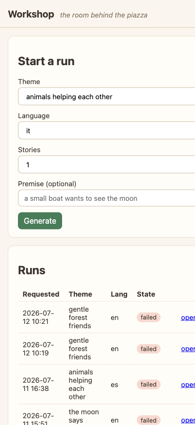 | **9 · The bench.** Start a run (theme, language, count, optional premise) above the run history with state chips. The table already overflows at phone width — a known gap. |
| 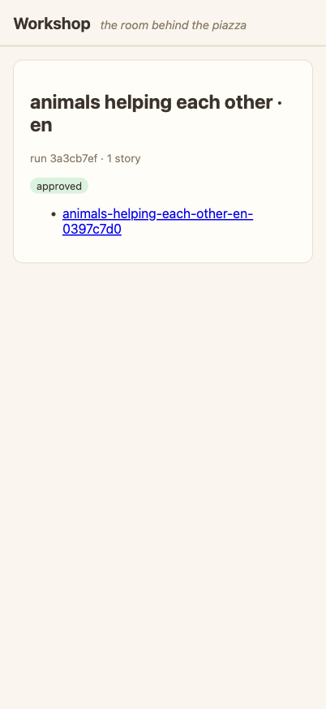 | **10 · A run.** Header, meta line, live state chip; while running, checkpoint steps tick in as a plain list, and a staged run grows an *Approve & publish* button. |
| 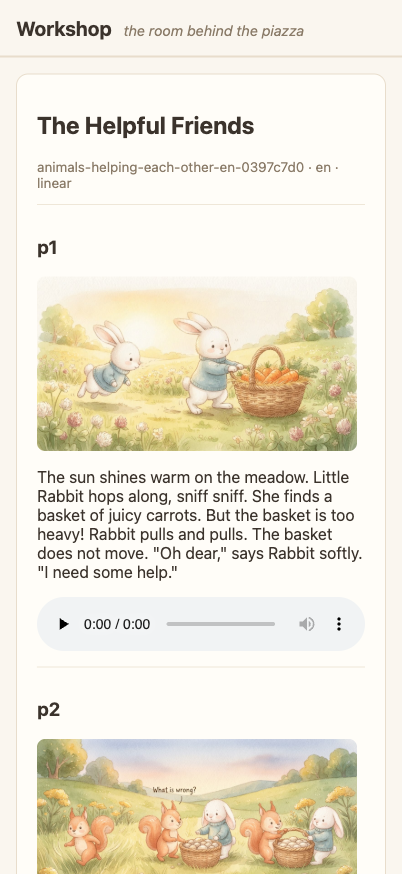 | **11 · The review.** The staged story page by page — illustration, text, native audio controls — the parent-gate promise in operator form: everything is seen before publish. |

### The design brief (for the Claude Design session)

What the workshop needs from the design system, screen by screen:

- **Foundations first.** Baloo 2 for UI text, the token palette, and the
  parent-UI rule from above: keep the warmth, calm the shapes. Targets
  ≥ 44 px (operator, not child).
- **Dashboard.** The runs table needs a phone-first answer (cards or a
  collapsing row) — review happens on a phone after bedtime. The
  start-a-run form and the empty state (*"No runs yet — the shelf is
  waiting for its first story."*) deserve their moment.
- **Run progress.** Today a state chip and a ✓ list. The pipeline has a
  known step order — this wants the bead language from the player:
  settled · bright · faint. One constraint: the fragment outerHTML-swaps
  every 2 s while live, so continuous CSS animations restart on each
  swap — design to that (steady states, not loops).
- **Failed runs.** The error box (`workshop-error`) is the only failure
  styling; failed runs are routine while the pipeline is tuned and deserve
  a calm, legible treatment.
- **Review.** Native `<audio>` controls clash with everything else; page
  cards, image sizing, and the approve action need real design.
- **Constraints.** Server-rendered HTML + HTMX — every design must land as
  plain HTML/CSS (no SPA components). English-only UI. The six run states
  above are the complete state vocabulary.
