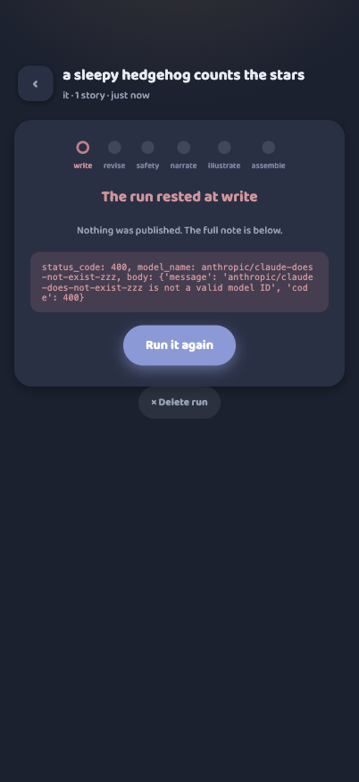

# Cantastorie Design System — the sticker-book

> Warm, wobbly, and slow. Bedtime, not Saturday cartoons.

Source of truth: the Claude Design project *Cantastorie design system*
(Foundations + Prototype, locked from explorations 3a + 3b). This document
records how those foundations live in code.

## Where it lives

| Layer | File |
|-------|------|
| Tokens (color, type, motion, shape) — 4 palettes × 2 modes | [`src/static/css/tokens.css`](../../src/static/css/tokens.css) |
| Palette selection (whole app) | [`src/static/js/palette.js`](../../src/static/js/palette.js) |
| Screens & components (child player) | [`src/static/css/player.css`](../../src/static/css/player.css) |
| State machine | [`src/static/js/store.js`](../../src/static/js/store.js) |
| Rendering | [`src/static/js/screens.js`](../../src/static/js/screens.js) |
| Workshop screens (operator) | [`src/static/css/workshop.css`](../../src/static/css/workshop.css) + [`src/templates/workshop/`](../../src/templates/workshop/) + [`src/static/js/workshop.js`](../../src/static/js/workshop.js) |

## The rules, briefly

- **Four palettes, two modes.** Colour is now a two-axis system (see
  [Palettes](#palettes)): a palette (`indigo` default, plus `warm`, `seaglass`,
  `plum`) crossed with a mode — light and dusk (lamplit). The shelf follows the
  clock (dusk from 19:00); `?palette=` and `?theme=` override for development.
  The player itself always lives at dusk — stories are bedtime.
- **Two typefaces only.** Baloo 2 for everything the app says; Literata for
  everything the story says (reading mode, later).
- **The wobble** belongs to the child's world: blob border-radii (42–58% /
  40–60%), tilts ±1.5–3° alternating, sticker rings. Parent UI keeps the
  palette but calms the shapes.
- **Watercolor washes** are 2–3 radial gradients of accent colors over a warm
  base — placeholders until pipeline art lands.
- **Glow, not lightness, at dusk.** Halos of moonlight at 15–25% alpha replace
  bright surfaces.
- **Slow crossfades only** (600–900 ms). Nothing snaps, flashes, or bounces.
- **Beads, never numbers.** Progress is a string of colored beads; the current
  one is bright, the past ones settled, the future ones faint.
- **Child targets ≥ 96 px**; parent UI and reading-mode words ≥ 44 px.

## Palettes

Colour used to be a single warm cream-and-terracotta look. It is now a
**two-axis system**: a *palette* (the hues) crossed with a *mode* (light or
dusk). Both the child shelf/player and the operator workshop obey it.

| Palette | Name | Feel |
|---------|------|------|
| `indigo` **(default)** | Moonlit indigo | Cool slate and periwinkle — the new house look. |
| `warm` | Warm cream | The original Anthropic-adjacent cream and terracotta. |
| `seaglass` | Sea glass & slate | Muted teal-green over cool stone. |
| `plum` | Plum & lantern | Soft aubergine with a lantern-gold accent. |

**Semantic tokens, not raw hues.** [`tokens.css`](../../src/static/css/tokens.css)
defines one semantic set — `--surface`, `--card`, `--ink`, `--primary`,
`--confirm`, `--accent`, `--info`, `--rest`, and their derived alphas — for
every palette × mode. Screens reference the semantic names; they never hardcode
a hex. Legacy aliases (`--terracotta → --primary`, `--sage → --confirm`,
`--honey → --accent`, `--sea → --info`) let `player.css` and the shelf ride the
system without a rewrite.

**Selection contract.** `<html>` carries `data-palette` and `data-theme`.
A tiny synchronous head script,
[`palette.js`](../../src/static/js/palette.js), sets both before first paint
(no flash):

- **palette** = `?palette=` if valid (and persisted) → else
  `localStorage["cantastorie-palette"]` → else `indigo`.
- **theme** = `?theme=light|dusk` → else dusk when the local hour ≥ 19.

It exposes `window.cantastoriePalette.set(name)` for the switcher UI (the
four-dot row on the workshop bench). No-JS fallback is indigo light.

## The user journey

Captured from the running shell (402×874, `make dev` + Playwright):

| | |
|---|---|
|  | **1 · The shelf, light.** Sun mascot, spoken greeting caption, four wobbly story covers, the Italiano sticker, and the deliberately quiet parent corner. |
|  | **2 · The shelf at dusk.** The sleepy moon replaces the sun, stars come out, covers dim to lamplight — same shelf, later hour. |
|  | **3 · A story begins.** Full-bleed watercolor night, bead progress, the exit sticker, and the one and only control: the 140 px play-pause blob. |
|  | **4 · The choice.** The page dims; two glowing picture cards with spoken labels. A tap branches the story; a sleeping child auto-continues. |
|  | **5 · Coming back.** An unfinished story asks: continue, or start again? Two pictures, no reading required. |
|  | **6 · Deep in the story.** Each page is its own watercolor wash, crossfaded at 900 ms. |
|  | **7 · Fine!** Replay or another story — and after twenty quiet seconds, a goodnight. |

## What the shell is (and isn't)

This is the **design shell**: real screens, real state machine (page turns,
choice, resume, persistence), with a timer standing in for narration and CSS
washes standing in for pipeline art. The audio engine, real
`story.json`, and spoken prompts replace those stand-ins in Slice 1
(see the Linear project).

## The workshop — the room behind the piazza

The operator face at `/workshop`
([ADR-004](../adr/ADR-004-workshop-area.md), AI-388): sign in with one
secret, start a pipeline run, watch its steps land, review the staged story
page by page, approve & publish. Unlike the shell above this is **real,
shipped code** — server-rendered Jinja2 + HTMX, with a progress fragment
that re-polls itself every 2 s while a run is live.

### As built (the sticker-book, AI-395)

The first pass was deliberately plain — palette kept, craft absent. It is now
the design system's own look: Baloo 2 throughout, `tokens.css` semantic colours
(so the workshop re-themes with every palette), and the parent-UI rule — keep
the warmth, calm the shapes. Vanilla `workshop.js` (~100 lines) carries the
three interactions HTMX can't: the stories stepper, the armed two-tap delete,
and the review audio pill. No new dependencies; no SPA.

- **Beads, never numbers.** Run progress is the player's bead language brought
  to the fixed pipeline order — `write · revise · safety · narrate ·
  illustrate · assemble`. Settled beads are sage, the current one is honey at
  24 px with a static halo, future ones faint. Because the progress fragment
  `outerHTML`-swaps every 2 s, the states are *steady* — no looping animation
  that would restart on each swap.
- **Six states, one of them renamed.** The chip vocabulary is `queued`,
  `running`, `staged — review`, `approved`, `rejected`, and `failed` — which
  the operator sees as **`rested`** (a calm terracotta, not an alarm), since
  failures are routine while the pipeline is tuned. Internal state names are
  unchanged.
- **Armed delete, not a browser dialog.** The old `hx-confirm` is replaced by a
  quiet `×` that arms to "Sure?" on first tap and deletes on the second
  (disarms on an outside tap) — the same idiom for per-story deletes on the
  review page. The delete plumbing shipped in #32 is untouched underneath.
- **A phone-first bench.** The runs table that overflowed at phone width is now
  a stack of run cards (title, meta line, state chip, armed `×`); live runs
  hide the delete affordance. Empty state: *"No runs yet — the shelf is waiting
  for its first story."*
- **A real review, no native controls.** Each page is a card — full-bleed
  illustration, Literata story text, and a custom **audio pill** (play/pause
  circle, honey progress track, `m:ss` label over a hidden `<audio>`, one
  playing at a time) instead of clashing native `<audio>` chrome. A sticky
  footer offers *Approve & publish* / *Reject*, shown only while the run is
  staged.
- **The palette switcher** lives quietly at the foot of the bench: four dots,
  the current one ring-highlighted, calling `window.cantastoriePalette.set()`.

### The operator journey

Captured from the running app with seeded runs (402×874, indigo default):

| | |
|---|---|
|  | **8 · The door.** Wordmark over *"the room behind the piazza"*, one secret, one Enter pill. No accounts — with no secret configured, the workshop answers 404 and does not exist. |
|  | **9 · The bench.** The start-a-run card (theme, premise, language, a stories stepper) over the run cards with their state chips and armed delete — and the palette switcher at the foot. |
|  | **10 · A run.** The bead card: six beads on the pipeline's step order with a state headline; while live the fragment re-polls itself every 2 s, and a staged run offers *Review N pages*. |
|  | **11 · Rested.** A failed run rests calmly — a terracotta ring on the step it stopped at, the note in a mono box, and a *Run it again* pill that submits a fresh run. |
|  | **12 · The review.** The staged story page by page — illustration, Literata text, the custom audio pill — with the *Approve & publish* / *Reject* footer: the parent-gate promise in operator form, everything seen before publish. |
