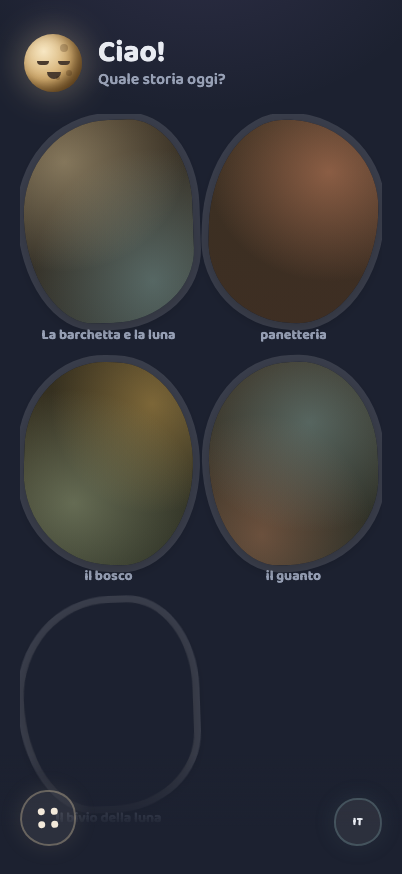
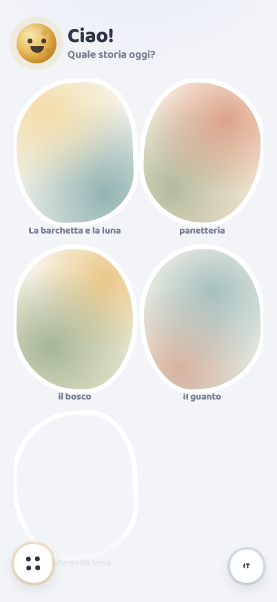
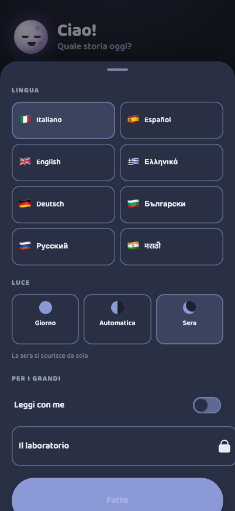
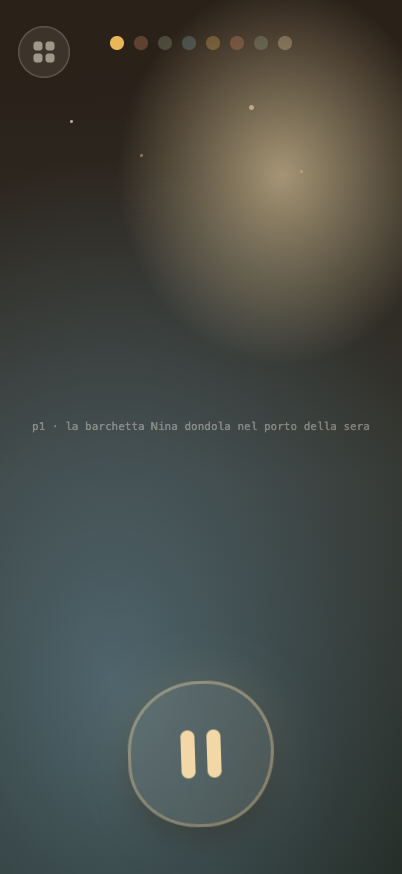
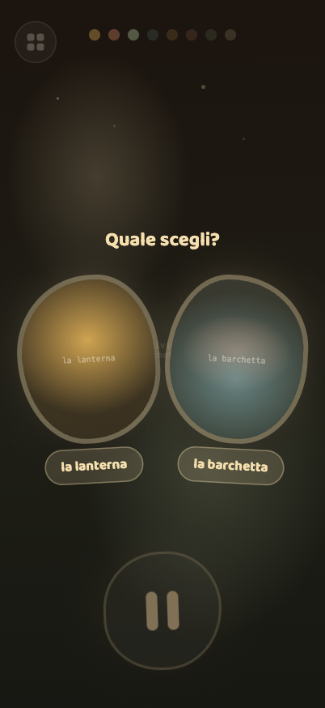
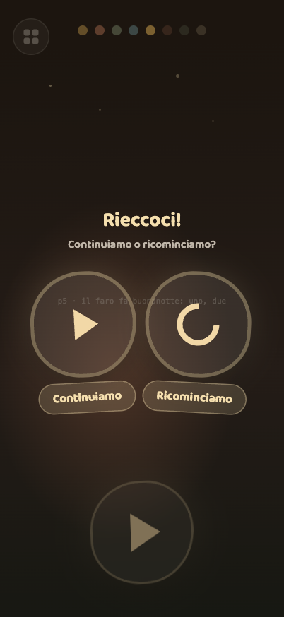
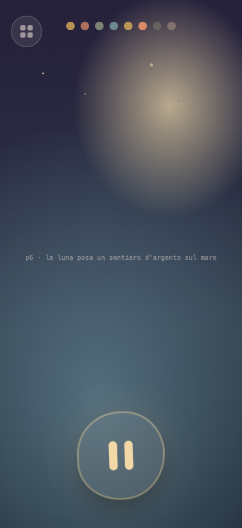
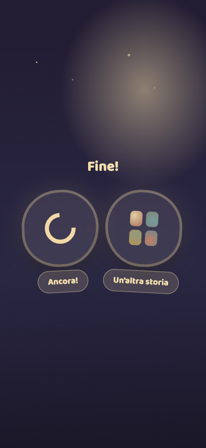
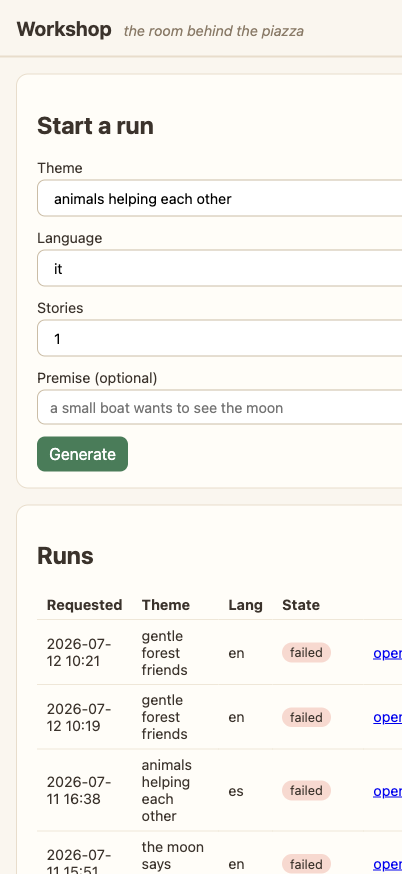
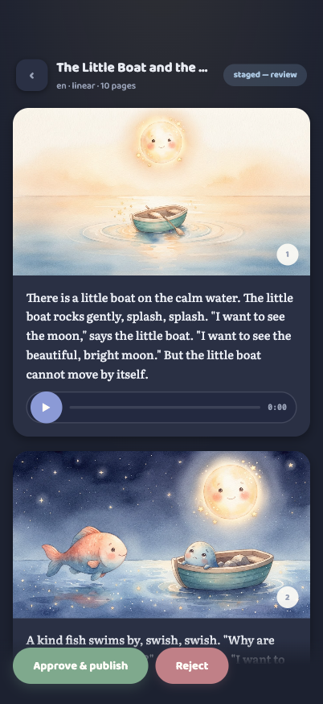

# Cantastorie Design System — the sticker-book

> Wobbly and slow, lit by moonlight. Bedtime, not Saturday cartoons.

Source of truth: the Claude Design project *Cantastorie design system*
(`design_handoff/` — `Cantastorie Foundations.dc.html` and
`Cantastorie Site.dc.html` are interactive references, not code to copy).
This document records how those foundations live in code after the design
overhaul (AI-441, branch `feature/design-overhaul`, 2026-09-13 → 2026-09-27).

## Contents

- [Where it lives](#where-it-lives)
- [The rules, briefly](#the-rules-briefly)
- [Colour: one palette, two modes](#colour-one-palette-two-modes)
- [The child player](#the-child-player)
- [The parent area](#the-parent-area)
- [The workshop](#the-workshop)
- [The journey](#the-journey)

## Where it lives

| Layer | File |
|-------|------|
| Tokens (colour, type, motion, shape) — indigo × light/dusk | [`src/static/css/tokens.css`](../../src/static/css/tokens.css) |
| Theme selection, before first paint | [`src/static/js/palette.js`](../../src/static/js/palette.js) (testable twin: [`palette-resolve.js`](../../src/static/js/palette-resolve.js)) |
| Child player screens & components | [`src/static/css/player.css`](../../src/static/css/player.css), [`src/static/js/screens.js`](../../src/static/js/screens.js) |
| Child player boot, languages, end screen copy | [`src/static/js/main.js`](../../src/static/js/main.js) |
| State machine | [`src/static/js/store.js`](../../src/static/js/store.js) |
| Parent area + workshop (server-rendered) | [`src/static/css/workshop.css`](../../src/static/css/workshop.css), [`src/templates/parent/`](../../src/templates/parent/), [`src/templates/workshop/`](../../src/templates/workshop/), [`src/static/js/workshop.js`](../../src/static/js/workshop.js) |
| Landing page | [`src/static/css/landing.css`](../../src/static/css/landing.css) |

## The rules, briefly

- **One palette, two modes, dusk by default.** Moonlit indigo in light and
  dusk. The whole app — landing, child player, parent area, workshop — opens
  at dusk. See [Colour](#colour-one-palette-two-modes).
- **Semantic tokens, never raw hues.** Screens reference `--surface`,
  `--ink`, `--primary`, `--accent`… — never a hex. The single allowed literal
  is `#FFFDF7`, the text colour on filled buttons.
- **Orchid means *make*.** `--accent` (orchid `#A88BE0`) is reserved for the
  create call-to-action (`ws-pill-accent`: "+ Make a story", "Make our
  story"). Indigo `--primary` carries other actions; sage `--confirm` carries
  navigation and confirmation.
- **Two typefaces only.** Baloo 2 for everything the app says; Literata for
  everything the story says.
- **The wobble belongs to the child's world**: blob border-radii (42–58% /
  40–60%), alternating tilts of ±1.5–2°, sticker rings. Parent and operator UI
  keep the tokens but calm the shapes.
- **Glow, not lightness, at dusk.** `--page-glow` halos replace bright
  surfaces.
- **Slow crossfades only** (`--fade` 900 ms, `--fade-quick` 600 ms). Nothing
  snaps, flashes, or bounces.
- **Beads, never numbers.** Progress is a string of beads — in the player and
  on the pipeline's run card alike.
- **Child targets ≥ 96 px** where the design allows, never under 48 px (an
  e2e test pins every shelf cover at ≥ 48 px); parent UI ≥ 44 px.

## Colour: one palette, two modes

The overhaul collapsed the four-palette system (indigo, warm, seaglass, plum)
to **indigo only** (AI-453). `<html>` still carries `data-palette="indigo"`
so the selector shape is stable, but no other value is accepted.

| Token | Light | Dusk | Role |
|-------|-------|------|------|
| `--surface` | `#F2F4F8` | `#1C2130` | Page ground |
| `--card` | `#FFFFFF` | `#2A3044` | Raised surfaces, sheets |
| `--ink` / `--ink-soft` | `#2F3646` / `#7C8598` | `#E8EBF2` / `#97A0B5` | Text, captions |
| `--primary` | `#5566A8` | `#8B9AD6` | Default action |
| `--confirm` | `#5E8A72` | `#7FA98D` | Navigation, confirm |
| `--accent` | `#A88BE0` | `#A88BE0` | Orchid — the make CTA |
| `--rest` | `#A85E68` | `#C08087` | A run that stopped ("rested") |

`--rest` is deliberately distinct from `--primary` in both modes (a tokens
e2e test enforces it), so a rested run never reads as an ordinary action.
Legacy aliases (`--terracotta`, `--sage`, `--honey`, `--sea`…) remain at the
bottom of `tokens.css` for older `player.css` rules.

**Theme selection.** One rule, `resolveTheme` in
[`palette-resolve.js`](../../src/static/js/palette-resolve.js), used by
`palette.js` (synchronously in `<head>`, before first paint), the child
player's boot, and the settings sheet:

- `?theme=light|dusk` wins;
- then the stored *Light* choice (`localStorage["cantastorie-theme"]`:
  `light`, `dusk` or `auto`);
- otherwise **dusk** (AI-459).

The settings sheet's *Light* section offers **Day**, **By itself** (`auto`:
dusk from 19:00 to 07:00, light otherwise) and **Evening**; the stored
choice shows as the selected tile and survives reloads.

**The moon.** The mascot moon is orchid-lit in both the landing nav and the
child shelf, drawn from shared `--moon-light`, `--moon-mid`, `--moon-ink`,
`--moon-crater` and `--moon-shade` tokens with `--accent` at the rim. By day
(light mode) the shelf mascot is a gold sun.

## The child player

- **Shelf.** A sphere-lit moon mascot with a spoken greeting, a two-column
  grid of wobbly covers, a language sticker (one tap cycles the eight
  languages) and a settings button drawn as 2×2 dots. Each cover is a
  `.cover-card`: the tappable `.cover` plus its caption *below* the art, never
  over it. Family stories carry an orchid ring and a star badge and sort
  first.
- **Portrait covers.** A cover shows `story.cover` (the pipeline's portrait
  image), falling back to the first page's art, then to a watercolour wash
  (`coverSrc` in `story.js`).
- **Settings sheet.** A bottom sheet with three labelled sections —
  **Language** (eight flag tiles: it, es, en, el, de, bg, ru, mr),
  **Light** (Day / By itself / Evening) and **For grown-ups** (the
  **Read with me** toggle, which shows page text in the player, and
  **The workshop**, locked behind the grown-up math gate) — closed by a
  **Done** pill. All copy is localized per language.
- **Grown-up gate.** A sum with three picture-free number choices; wrong
  answers say so, *Back* dismisses, the right answer opens the parent area
  (`/parent`).
- **End screen.** Replay and back-to-shelf blobs, in the story's language
  ("Di nuovo!" / "Un'altra storia?").

## The parent area

Server-rendered on the shared `auth/base.html` shell (Clerk sign-in), styled
by `workshop.css` with calmed shapes.

- **Tabs with counts**: *Your stories · N* and *Being made · N*.
- **Header**: *Your shelf* over "stories made just for your family", with a
  compact sage *Child's shelf →* pill beside it; a quiet *Sign out* sits top
  right once Clerk confirms a user.
- **Your stories**: two equal filter pills (*All languages ▾*, *Sort ▾*;
  Newest sorts by publish time), the family's own stories (orchid-ringed
  thumbnail, *ours* badge), and an empty state when there are none. Family stories are
  **delete-only**: a quiet `×` arms to *Delete for good?*. There is no hide.
- **Shared with every family**: read-only cards with a periwinkle *shared* badge and
  *on the shelf* — no delete, no hide.
- **Make a story** (`/parent/make`) is its own screen with a back button, a
  note card, and the orchid *Make our story* button (dark `--on-accent`
  text). While a story is already cooking, or the day's cap is used, the
  **One story at a time** `--rest` card sits above the form, the form dims
  to .45 and the button is disabled.
- **Being made**: one compact row per run — title, language, state chip, a
  small bead line with the current step, and *Review N pages* once staged.
  Rows poll every 2 s while queued or running. A failed run shows only
  "rested at <step> · nothing was published"; the pipeline error stays on
  the operator bench.
- **Staged review** (`/parent/staged/{id}`): the story page by page before
  approval, family-scoped.

## The workshop

The operator face at `/workshop` ([ADR-005](../adr/ADR-005-workshop-area.md)):
server-rendered Jinja2 + HTMX, with a progress fragment that re-polls every
2 s while a run is live. Vanilla `workshop.js` handles the stories stepper,
the armed two-tap delete and the review audio pill.

- **Run-state labels.** Operators and parents see friendly labels over the
  internal states: `failed` → **rested**, `staged` → **needs your eyes**,
  `approved` → **on the shelf**; `queued`, `running` and `rejected` show as-is.
- **Beads on the run card** follow the pipeline order — `write · revise ·
  safety · narrate · illustrate · assemble`; settled, current and future
  states are steady (no looping animation, since the fragment re-swaps).
- **Custom disclosure** on the bench tucks the less-used run options away;
  the library shows stories as cards.
- **Armed delete, not a browser dialog**: `×` → *Sure?* → delete.

## The journey

Child screens captured from the running app on 2026-09-27 (402×874, dev
fixtures, `?lang=it`):

| | |
|---|---|
|  | **The shelf at dusk — the default.** Indigo ground under the moon, covers with captions below, the settings dots and the language sticker. (The last cover is the art-less `dev-branching` fixture.) |
|  | **The shelf, light** — chosen with *Day* or `?theme=light`. Same shelf, daylight tokens. |
|  | **Settings.** Language tiles, the Light choice, and the grown-up section with *Read with me* and the locked workshop. |

The player, choice, resume and end captures below (03–07) and the workshop
captures (08–12) **predate the overhaul** (warm palette, old chrome) and
are kept for layout reference only. The parent area and the workshop sit
behind Clerk sign-in and cannot be captured headlessly; refresh them from an
authenticated session.

| | |
|---|---|
|  | **A story begins** — full-bleed art, bead progress, exit sticker, the play-pause blob. |
|  | **The choice** — two glowing picture cards; a sleeping child auto-continues. |
|  | **Coming back** — continue, or start again. |
|  | **Deep in the story** — page art crossfaded at 900 ms. |
|  | **The end** — replay or another story. |
|  | **The workshop bench** (pre-overhaul). |
|  | **The workshop review** (pre-overhaul). |
