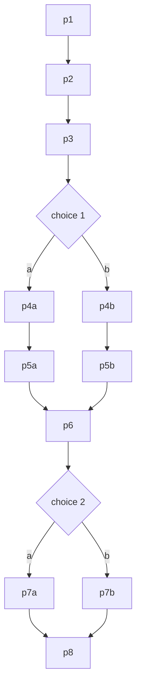

# Cantastorie — Product Spec

Requirements in this document carry short **bold names**. Tests, tasks, and design docs reference those names; implementers never invent behavior that isn't written here. Data formats (the export file, the shelf manifests) are defined in the technical design, not here.

## The problem, in three sentences

Pre-readers cannot use story apps built on text, and screen apps built on taps train the wrong appetite at bedtime. Multilingual families juggle one-language apps with robotic voices in the smaller languages. Parents have no way to fully preview generated content before their child meets it.

## Vision

The Italian cantastorie stood in the piazza, sang a tale, and pointed at painted boards. Cantastorie the app is that craft, industrialized carefully: one warm narrator identity, watercolor boards, and a child's finger choosing the path. The parent is the piazza's gatekeeper: every word, picture, and sound is heard and seen by an adult before any child hears it. Italian and Spanish lead; English, Greek, and German ride along.

## Personas

**Sofia, 4.** Italian-Spanish home in Valencia. Cannot read. Wants the boat story again, then the other ending. Frustration: apps that talk to her in English or demand a grown-up every 30 seconds.

**Luca, 5.** Italian-German home. Replays branches to hear both paths, narrates along by page 3 of a favorite. Frustration: stories that end scary before sleep.

**Elena, parent.** Reviews packs on her phone after bedtime. Wants total certainty about content, zero accounts, and her data portable. Frustration: black-box "kid safe" claims.

## Experience by age band

| Band | Experience |
|---|---|
| 2–3 | Adult starts once; auto page turns carry it; an idle choice gets a spoken nudge at 30 seconds, then auto-continues on the first option after 10 more |
| 4–5 | Child self-serves from the shelf; choices are the main event |
| 6 | Branch replay; 5-minute stories tolerated |

The bands are descriptive personas, not settings. The app behaves identically for every child — the idle nudge and auto-continue apply to everyone — and no age setting exists anywhere.

## Goals

- Shelf to narration in at most 2 taps and 4 seconds.
- Italian and Spanish are flagship: deepest content, first in every quality gate.
- Zero unapproved assets reachable in child mode, verified by an audit script.
- Nothing about the child ever leaves the browser. Operationally: story assets come from a public bucket with access logs disabled, no cookies, no server-side state, and the family token (see the decision log) is a random value that names no one.
- A pack goes request-to-shelf in under 15 minutes including review.

## Non-goals, with reasons

Reading instruction (different product). Accounts and social (the privacy posture forbids the data). Streaks and badges (wrong appetite for bedtime). Ads (never). Offline mode in v1 (playing straight from the bucket is already resilient; revisit after launch). Parent UI localization (parents in the target families read English; cuts localization surface by five).

## Decision log (locked)

| Decision | Value | Why |
|---|---|---|
| Audience | Children 2–6, pre-readers | The unserved group; readers have options |
| Languages | Italian, Spanish (Tier 1); English, Greek, German (Tier 2) | Family need; tiering focuses quality where usage will be |
| Story models | Linear + branching, picture-tap choices | Agency without reading |
| Phasing | 1: bundled stories, 2: parent-requested packs with approval, 3: live generation behind guardrails | Ship the player before the factory, the factory before autonomy |
| Launch content | Tier 1: 3 linear + 2 branching each. Tier 2: 2 linear + 1 branching each. 19 stories | Depth where the users are |
| Visuals | AI watercolor via pipeline, approved, published static | Consistent style, zero live image cost |
| Persistence | IndexedDB + export/import, no accounts | No accounts means no child data to protect |
| Privacy | No tracking, no analytics, no child data | Non-negotiable for this audience |
| Connectivity | Online only (v1) | Bucket-direct playback is already resilient; offline is scope creep now |
| Acceptance | The requirements below are the single acceptance source | One source, three test runners |
| Name | Cantastorie | The craft we are reviving |
| Style | Soft watercolor, warm palette, rounded characters, nothing frightening | Bedtime, not Saturday cartoons |
| Reading mode | Optional story text with karaoke word highlighting and tap-word English glosses; parent-enabled, default off; timings and glosses precomputed at authoring | Serves reading-along parents and emerging readers without breaking the voice-first core |
| Tenancy | One shared deployment; each family sees its own shelf, keyed by a local family token | One instance to run, still no accounts; the token is a random capability stored in the browser, not an identity |

## How the app behaves

### The player

- **Curated shelf.** The shelf shows only the active language's approved stories: the bundled launch set plus this family's published packs.
- **Two-tap start.** At most two taps from opening the app to narration.
- **Story start sound.** After the cover tap, "Here we go!" plays, then page 1 narration begins.
- **Auto page turn.** The page turns within 500 ms of the audio ending, with a gentle crossfade — except on a page that ends in a choice, where the choice overlay opens instead.
- **One control.** A single play-pause control; resuming continues from the exact position.
- **Picture choices.** A choice shows two picture options with spoken labels. Tapping one plays "Well chosen!" and the story branches. After 30 seconds idle, the nudge "Which one do you choose?" plays; after 10 more, the first option is picked automatically.
- **Resume offer.** Reopening an unfinished story asks "Keep going, or start again?" with two pictures.
- **Goodnight sign-off.** On the story-end screen, if nothing is tapped for 20 seconds after the end prompt, "Goodnight, little one" plays once and the screen stays as it is.
- **First-run language.** The app starts in Italian until a parent sets languages.
- **Shelf language chip.** When a parent has enabled two or more languages, the shelf shows a picture chip (96 px minimum) that switches the active language. Switching replays the shelf greeting in the new language, and the choice persists in the browser.

### Reading mode

- **Parent toggle.** A parent-settings toggle, default off, shows the story text in the player.
- **Tappable words.** The text panel renders the current page's text with every word individually tappable (44 px targets — a deliberate exception to the 96 px child rule, because reading-mode users are readers).
- **Word glosses.** Tapping a word shows a 1–3 word English gloss bubble from the story's precomputed gloss map, dismissed by tapping elsewhere. No network call is ever made. English stories have no gloss map: their words are not tappable and show no bubbles, though highlighting still works.
- **Karaoke highlighting.** The word being narrated highlights in sync using the page's precomputed timings. Missing timings downgrade the highlight to sentence level — never to silence or an error.
- Stated plainly as a v1 exclusion: no spoken glosses. A candidate for phase 2 or later.

### Data

- **Local-only progress.** Progress and the family token live only in IndexedDB.
- **Export and import.** Export/import round-trips the export file, family token included. An invalid import changes nothing and names the failing field.

### Resilience

- **Audio retry.** An audio load failure shows the retry state with "Oh! The story is napping…" — never silence.
- **Offline screen.** A manifest failure shows the offline screen with "The clouds took our stories…".

### Parent area

- **Parent gate.** A 3-second hold, then a two-digit addition (two random integers from 10 to 89, answered on an on-screen keypad). Five failures lock the gate for 5 minutes, and the lockout survives reloads.
- **Everything spoken.** Every child-facing prompt has per-language audio (see the spoken prompts table).
- **Pack requests.** A pack takes a theme from the theme list, a language, and a count of 1–3, and is keyed to the family token.
- **Full preview.** Review shows the full text, per-page audio, and every image.
- **Approve and reject.** Approve publishes within 60 seconds; reject deletes the pending assets.
- **Regenerate cap.** Regenerate is capped at 2 per story; at the cap the control disables, leaving approve and reject.
- **Nothing leaks.** Pending content — any family's — is unreachable from child mode.

### Live generation (phase 3)

- **Kill switch.** The kill switch disables the generation endpoints. Whether it is family-level, operator-global, or both is settled in the technical design; in every case it overrides the auto gate.
- **Unanimous gate.** The auto gate publishes only unanimous-pass verdicts.
- **Audit trail.** Every automatic decision is audit-logged.

## Screens

**Shelf.** Cover grid, 2 columns in portrait, a small low-contrast parent corner, and the language chip when two or more languages are enabled. States: loaded; empty (meadow illustration + "No stories here yet…"); error (clouds + the offline prompt).

**Player.** Full-bleed page, 120 px play-pause, progress dots. States: playing; paused; audio-error (sleeping bird + the retry prompt, tap retries). With reading mode on, a text panel occupies the lower third with tappable words and gloss bubbles.

**Choice overlay.** The page dims 30 percent behind two picture cards, each 40 percent of the screen width.

**Story end.** The final scene with replay and shelf pictures and the end prompt; after 20 seconds idle, the goodnight sign-off.

**Parent gate.** A hold circle fills over 3 seconds, then the addition on a keypad. Lockout shows the teapot.

**Parent dashboard.** Language tabs, story rows with unpublish toggles, the kill switch.

**Review queue.** Full text, per-page audio players, an image strip, and approve / reject / regenerate with the cap noted.

**Settings.** Language multi-select, PIN change, reading mode toggle.

**Export-import.** With inline validation errors.

Global UI rules: 96 px minimum tap targets, slow crossfades only, every child prompt spoken, zero required text in child mode.

## Content spec

Linear stories: 8 pages, 30–70 words per page, 250–600 total, a 12-word sentence cap, present tense preferred, gentle repetition and sound words, and a final page that lands on comfort or sleepiness.

Branching stories follow the same per-page word and sentence limits on every node; every heard path is 8 pages and stays within the linear totals. Choice labels count as story text for every limit and for the gloss map.

Branching topology, always exactly:

Themes, only these at launch: animals helping each other, tiny garden adventure, the sleepy sea, rain and puddles, bakery morning, grandparent visit, the lost mitten, gentle forest friends, the moon says goodnight, picnic surprise, the little boat, first snow.

Localization rule: stories are authored natively per language, never translated word-for-word. Names, foods, and small details localize: an Italian story may share koulourakia's role with biscotti della nonna, a Spanish one with magdalenas.

Worked example, Tier 1 (outline only; final text comes from the pipeline):
*La barchetta e la luna* (Italian, the sleepy sea, linear). p1 the little boat Nina rocks in the evening harbor. p2 the water goes shh, shh. p3 a sleepy gull lands on her bow. p4 the lighthouse blinks goodnight, one, two. p5 Nina wants one last little wave. p6 the moon lays a silver path on the sea. p7 Nina rides it, piano piano, back to her post. p8 the gull tucks its head; Nina closes her eyes; the water says shh.

Glosses: at authoring, the pipeline maps every unique content word of a non-English story (lowercased, punctuation stripped), choice labels included, to a contextual English gloss of 1–3 words, so *barchetta* reads "little boat" and *piano piano* reads "gently, gently". English stories carry no gloss map.

## Spoken prompts

Recorded per language at launch. English is the source; the Italian and Spanish strings below are final copy (gender-neutral by rule, native review before recording); Greek and German are produced by the pipeline before launch (a task in the implementation plan).

| Prompt | When it plays | English | Italiano | Español |
|---|---|---|---|---|
| Shelf greeting | Opening the shelf; after a language switch | Hello! Which story shall we hear today? | Ciao! Quale storia ascoltiamo oggi? | ¡Hola! ¿Qué cuento escuchamos hoy? |
| Resume offer | Reopening an unfinished story | Welcome back! Keep going, or start again? | Rieccoci! Continuiamo o ricominciamo? | ¡Hola de nuevo! ¿Seguimos o empezamos otra vez? |
| Choice nudge | 30 seconds idle on a choice | Which one do you choose? Tap a picture! | Quale scegli? Tocca una figura! | ¿Cuál eliges? ¡Toca un dibujo! |
| End prompt | Story-end screen | The end! Again, or another story? | Fine! Ancora, o un'altra storia? | ¡Fin! ¿Otra vez, u otro cuento? |
| Goodnight sign-off | 20 seconds idle after the end prompt | Goodnight, little one. | Buonanotte, tesoro. | Buenas noches, tesoro. |
| Empty shelf | Shelf with no stories | No stories here yet. Ask a grown-up! | Ancora niente storie qui. Chiama un grande! | Aún no hay cuentos aquí. ¡Avisa a un adulto! |
| Audio retry | Audio failed to load | Oh! The story is napping. Tap the bird to wake it. | Oh! La storia fa un pisolino. Tocca l'uccellino per svegliarla. | ¡Oh! El cuento está durmiendo. Toca el pajarito para despertarlo. |
| Offline | Manifest failed to load | The clouds took our stories. Try again soon! | Le nuvole hanno preso le storie. Riprova tra poco! | Las nubes se llevaron los cuentos. ¡Inténtalo pronto! |
| Story start | After the cover tap | Here we go! | Si parte! | ¡Allá vamos! |
| Choice confirmation | After a choice tap | Well chosen! | Ottima scelta! | ¡Buena elección! |

## Safety rules

- **Mildest peril only.** No violence beyond the mildest peril.
- **No fear reinforcement.** No darkness-as-threat, monsters, abandonment, or injury.
- **No brands.** No brands or licensed characters.
- **No romance.**
- **Kindness resolves.** Kind, inclusive characters; resolution through help, never punishment.
- **Within limits.** Vocabulary and sentence limits per the content spec.
- **Right language.** The story language matches the request.
- **Calm pictures.** Images contain no text and nothing frightening.
- **Nothing real.** No real people, real places presented as real, or religious instruction.

Enforcement: the safety node verdicts each story per rule at temperature 0; any fail routes to revise; two fails reject. Until phase 3, a parent additionally approves every asset. Rationale: layered gates mean a model mistake needs a human mistake on top of it to reach a child.

## Glossary

**Pack:** a parent-requested batch of 1–3 stories, one language, one theme, keyed to a family token. **Pending:** generated, unapproved, keyed to the requesting family, unreachable from any child mode. **Published:** approved; launch content is listed in the per-language manifest, pack content in the requesting family's overlay. **Manifest:** the per-language JSON of launch content every shelf reads; each family's shelf additionally reads its own token-keyed overlay of approved packs. **Family token:** a random identifier created on first parent-gate entry, stored in the browser and carried in export/import; it keys a family's packs and names no one. **Tier 1:** Italian and Spanish, the flagship languages. **Gloss:** the per-story word-to-English map that powers reading mode.
