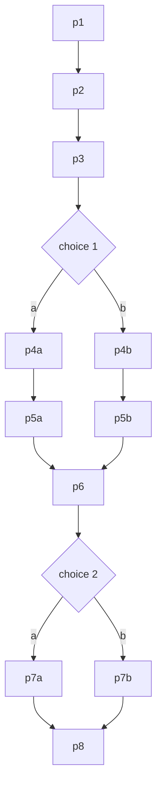
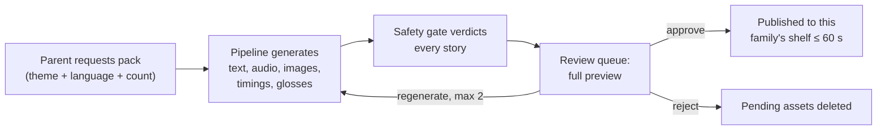

# Cantastorie Product Specification

> Bedtime stories your child steers, in the languages your family speaks. Told aloud, painted in watercolor, and approved by you before a single word reaches little ears.

---

## Table of Contents

- [Vision](#vision)
- [The Storyteller](#the-storyteller)
- [Who It's For](#whos-it-for)
- [What We're Building (Current State)](#what-were-building-current-state)
- [A Story Night, Start to Finish](#a-story-night-start-to-finish)
- [The Picture-Choice Pattern](#the-picture-choice-pattern)
- [Reading Mode](#reading-mode)
- [Spoken Prompts](#spoken-prompts)
- [The Parent Area](#the-parent-area)
- [Languages & Localization](#languages--localization)
- [Content Rules](#content-rules)
- [Safety](#safety)
- [Privacy & Data](#privacy--data)
- [Screens](#screens)
- [Decision Log (Locked)](#decision-log-locked)
- [UX Principles](#ux-principles)
- [Technical Architecture](#technical-architecture)
- [Roadmap](#roadmap)
- [Success Metrics](#success-metrics)
- [What We're NOT Building](#what-were-not-building)
- [Documentation](#documentation)

Behaviors in this document carry **bold names**. Tests, tasks, and design docs reference those names; implementers never invent behavior that isn't written here. Data formats (the export file, the shelf manifests) are defined in the technical design, not here.

---

## Vision

The Italian cantastorie stood in the piazza, sang a tale, and pointed at painted boards. Cantastorie the app is that craft, industrialized carefully: one warm narrator identity, watercolor boards, and a child's finger choosing the path. The parent is the piazza's gatekeeper: every word, picture, and sound is heard and seen by an adult before any child hears it. Italian and Spanish lead; English, Greek, and German ride along.

**The problem, in three sentences.** Pre-readers cannot use story apps built on text, and screen apps built on taps train the wrong appetite at bedtime. Multilingual families juggle one-language apps with robotic voices in the smaller languages. Parents have no way to fully preview generated content before their child meets it.

**Core Belief**: A bedtime app should wind a child *down*. Voice carries the story, pictures carry the choices, and nothing on screen asks a pre-reader to read.

---

## The Storyteller

One warm narrator identity across every story and language, pointing at painted boards like the piazza storyteller of old.

| Element | How It Shows Up |
|---------|-----------------|
| **One voice** | The same warm narrator identity tells every story in every language |
| **Watercolor boards** | Soft watercolor, warm palette, rounded characters, nothing frightening — bedtime, not Saturday cartoons |
| **Everything spoken** | Every prompt a child meets has per-language audio; zero required text in child mode |
| **Gentle pace** | Slow crossfades only; pages turn themselves when the narration ends |
| **Comfort endings** | Every story's final page lands on comfort or sleepiness |

---

## Who It's For

**Sofia, 4.** Italian-Spanish home in Valencia. Cannot read. Wants the boat story again, then the other ending. Frustration: apps that talk to her in English or demand a grown-up every 30 seconds.

**Luca, 5.** Italian-German home. Replays branches to hear both paths, narrates along by page 3 of a favorite. Frustration: stories that end scary before sleep.

**Elena, parent.** Reviews packs on her phone after bedtime. Wants total certainty about content, zero accounts, and her data portable. Frustration: black-box "kid safe" claims.

### Experience by Age Band

| Band | Experience |
|------|------------|
| **2–3** | Adult starts once; auto page turns carry it; an idle choice gets a spoken nudge at 30 seconds, then auto-continues on the first option after 10 more |
| **4–5** | Child self-serves from the shelf; choices are the main event |
| **6** | Branch replay; 5-minute stories tolerated |

The bands are descriptive personas, not settings. The app behaves identically for every child — the idle nudge and auto-continue apply to everyone — and no age setting exists anywhere.

---

## What We're Building (Current State)

| Feature | Status | Description |
|---------|--------|-------------|
| **Curated shelf** | ⏳ Planned | Cover grid showing only the active language's approved stories: the bundled launch set plus this family's published packs |
| **Voice-first player** | ⏳ Planned | Full-bleed watercolor pages, one play-pause control, auto page turns, exact-position resume |
| **Picture choices** | ⏳ Planned | Two picture options with spoken labels at fixed branch points |
| **Reading mode** | ⏳ Planned | Parent-enabled story text with karaoke word highlighting and tap-word English glosses |
| **Launch library** | ⏳ Planned | 19 stories: 3 linear + 2 branching per Tier 1 language, 2 linear + 1 branching per Tier 2 language |
| **5 languages** | ⏳ Planned | Italian and Spanish flagship; English, Greek, German alongside |
| **Parent gate** | ⏳ Planned | Hold-plus-arithmetic gate with persistent lockout |
| **Parent dashboard** | ⏳ Planned | Language tabs, unpublish toggles, kill switch |
| **Pack requests & review** | ⏳ Planned | Parents request 1–3 stories on a theme, preview everything, approve or reject (Phase 2) |
| **Authoring pipeline** | ⏳ Planned | Generates story text, narration, watercolor images, word timings, and glosses for approval |
| **Live generation** | ⏳ Planned | Auto safety gate with unanimous-pass publishing, audit log, kill switch (Phase 3) |
| **Export / import** | ⏳ Planned | The whole family state round-trips through a file; no accounts anywhere |

---

## A Story Night, Start to Finish

1. **Open the app.** The first tap anywhere on the shelf wakes the sound and the shelf greets the child aloud: *"Ciao! Quale storia ascoltiamo oggi?"* (Browsers allow no audio before a touch — the two-tap budget includes this one.)
2. **Tap a cover.** *"Si parte!"* — and page 1 narration begins. At most **two taps** stand between opening the app and hearing a story, and no more than 4 seconds.
3. **Listen.** Pages turn themselves within 500 ms of the audio ending, with a gentle crossfade. One 120 px play-pause button is the only control; pausing and resuming continues from the exact position.
4. **Choose.** On a choice page, the choice overlay opens instead of a page turn (see [The Picture-Choice Pattern](#the-picture-choice-pattern)).
5. **Drift off.** The final page lands on comfort or sleepiness. The end screen offers replay and shelf pictures with *"Fine! Ancora, o un'altra storia?"* — and if nothing is tapped for 20 seconds, a soft *"Buonanotte, tesoro."* plays once and the screen stays as it is.

### Coming Back

**Resume offer.** Reopening an unfinished story asks *"Rieccoci! Continuiamo o ricominciamo?"* with two pictures — keep going, or start again.

### When Things Go Wrong

| Failure | What the Child Sees |
|---------|---------------------|
| **Audio won't load** | A sleeping bird and *"Oh! La storia fa un pisolino. Tocca l'uccellino per svegliarla."* — tapping retries. Never silence. |
| **Shelf won't load** | Soft clouds and *"Le nuvole hanno preso le storie. Riprova tra poco!"* |

### First Run

**First-run language.** The app starts in Italian until a parent sets languages.

---

## The Picture-Choice Pattern

Agency without reading: at each branch point the page dims to 70 percent behind two picture cards, each 40 percent of the screen width, with spoken labels.

```
Narrator: "...the path splits at the old olive tree."
[Choice overlay: two watercolor cards — a lantern / a rowboat]

Sofia taps the rowboat.
Narrator: "Ottima scelta!" → the story branches.

(30 seconds pass with no tap)
Narrator: "Quale scegli? Tocca una figura!"
(10 more seconds)
→ The first option is picked automatically and the story carries on.
```

**Choice behavior, precisely:** a tap plays the confirmation ("Well chosen!") and branches. After 30 seconds idle the spoken nudge plays; after 10 more seconds, the first option auto-continues — so a child who fell asleep mid-choice still gets a complete, gentle story.

### Branching Topology

Every branching story uses exactly this shape — two choice points, all paths reconverge, every heard path is 8 pages:



Replayability comes from the branches: Sofia can have the boat story again, *then the other ending*.

---

## Reading Mode

> **Note**: Reading mode is parent-enabled in Settings and off by default. The core experience never requires reading.

For reading-along parents and emerging readers, a text panel occupies the lower third of the player.

| Behavior | Detail |
|----------|--------|
| **Tappable words** | Every word of the current page is individually tappable (44 px targets — a deliberate exception to the 96 px child rule, because reading-mode users are readers) |
| **Word glosses** | Tapping a word shows a 1–3 word English gloss bubble from the story's precomputed gloss map, dismissed by tapping elsewhere. No network call is ever made. |
| **Karaoke highlighting** | The word being narrated highlights in sync using precomputed timings. Missing timings downgrade the highlight to sentence level — never to silence or an error. |
| **English stories** | Carry no gloss map: words are not tappable and show no bubbles, though highlighting still works |

```
[Player, reading mode on — La barchetta e la luna, p6]

  "la luna posa un sentiero d'argento sul mare"
         ~~~~ ← highlighted as the narrator says it

  (tap "sentiero") → ┌─────────────┐
                     │ little path │
                     └─────────────┘
```

Stated plainly as a v1 exclusion: no spoken glosses. A candidate for Phase 2 or later.

---

## Spoken Prompts

Every child-facing prompt is recorded per language at launch. English is the source; the Italian and Spanish strings below are final copy (gender-neutral by rule, native review before recording); Greek and German are produced by the pipeline before launch.

| Prompt | When It Plays | English | Italiano | Español |
|--------|---------------|---------|----------|---------|
| **Shelf greeting** | First tap on the shelf; after a language switch | Hello! Which story shall we hear today? | Ciao! Quale storia ascoltiamo oggi? | ¡Hola! ¿Qué cuento escuchamos hoy? |
| **Resume offer** | Reopening an unfinished story | Welcome back! Keep going, or start again? | Rieccoci! Continuiamo o ricominciamo? | ¡Hola de nuevo! ¿Seguimos o empezamos otra vez? |
| **Choice nudge** | 30 seconds idle on a choice | Which one do you choose? Tap a picture! | Quale scegli? Tocca una figura! | ¿Cuál eliges? ¡Toca un dibujo! |
| **End prompt** | Story-end screen | The end! Again, or another story? | Fine! Ancora, o un'altra storia? | ¡Fin! ¿Otra vez, u otro cuento? |
| **Goodnight sign-off** | 20 seconds idle after the end prompt | Goodnight, little one. | Buonanotte, tesoro. | Buenas noches, tesoro. |
| **Empty shelf** | Shelf with no stories | No stories here yet. Ask a grown-up! | Ancora niente storie qui. Chiama un grande! | Aún no hay cuentos aquí. ¡Avisa a un adulto! |
| **Audio retry** | Audio failed to load | Oh! The story is napping. Tap the bird to wake it. | Oh! La storia fa un pisolino. Tocca l'uccellino per svegliarla. | ¡Oh! El cuento está durmiendo. Toca el pajarito para despertarlo. |
| **Offline** | Shelf manifest failed to load | The clouds took our stories. Try again soon! | Le nuvole hanno preso le storie. Riprova tra poco! | Las nubes se llevaron los cuentos. ¡Inténtalo pronto! |
| **Story start** | After the cover tap | Here we go! | Si parte! | ¡Allá vamos! |
| **Choice confirmation** | After a choice tap | Well chosen! | Ottima scelta! | ¡Buena elección! |

---

## The Parent Area

A small low-contrast corner of the shelf leads to everything grown-up.

### The Gate

**Parent gate.** A 3-second hold fills a circle, then a two-digit addition (two random integers from 10 to 89, answered on an on-screen keypad). Five failures lock the gate for 5 minutes — the lockout survives reloads. The lockout screen shows a teapot.

### Requesting Stories (Phase 2)

**Pack requests.** A pack takes a theme from the [theme list](#content-rules), a language, and a count of 1–3 stories, and is keyed to the family token.



| Behavior | Detail |
|----------|--------|
| **Full preview** | Review shows the full text, per-page audio players, and every image — nothing reaches a child unseen |
| **Approve** | Publishes to this family's shelf within 60 seconds |
| **Reject** | Deletes the pending assets |
| **Regenerate cap** | Capped at 2 per story; at the cap the control disables, leaving approve and reject |
| **Nothing leaks** | Pending content — any family's — is unreachable from child mode |
| **Request to shelf** | The whole loop, review included, takes under 15 minutes |

### The Dashboard

Language tabs, story rows with unpublish toggles, and the kill switch.

### Live Generation (Phase 3)

| Behavior | Detail |
|----------|--------|
| **Kill switch** | Disables the generation endpoints. Whether it is family-level, operator-global, or both is settled in the technical design; in every case it overrides the auto gate. |
| **Unanimous gate** | The auto gate publishes only unanimous-pass verdicts |
| **Audit trail** | Every automatic decision is audit-logged |

---

## Languages & Localization

| Tier | Languages | Launch Content |
|------|-----------|----------------|
| **Tier 1 (flagship)** | Italian, Spanish | 3 linear + 2 branching stories each; deepest content, first in every quality gate |
| **Tier 2** | English, Greek, German | 2 linear + 1 branching each |

**Native authoring, never translation.** Stories are authored natively per language, never translated word-for-word. Names, foods, and small details localize: an Italian story may share koulourakia's role with biscotti della nonna, a Spanish one with magdalenas.

**Shelf language chip.** When a parent has enabled two or more languages, the shelf shows a picture chip (96 px minimum) that switches the active language — so Sofia moves between Italian and Spanish without a grown-up. Switching replays the shelf greeting in the new language, and the choice persists in the browser.

**Parent UI stays English.** Parents in the target families read English; localizing only the child experience cuts the localization surface by five.

---

## Content Rules

**Linear stories:** 8 pages, 30–70 words per page, 250–600 total, a 12-word sentence cap, present tense preferred, gentle repetition and sound words, and a final page that lands on comfort or sleepiness.

**Branching stories** follow the same per-page word and sentence limits on every node; every heard path is 8 pages and stays within the linear totals. Choice labels count as story text for every limit and for the gloss map.

**Themes, only these at launch:** animals helping each other · tiny garden adventure · the sleepy sea · rain and puddles · bakery morning · grandparent visit · the lost mitten · gentle forest friends · the moon says goodnight · picnic surprise · the little boat · first snow.

**Glosses:** at authoring, the pipeline maps every unique content word of a non-English story (lowercased, punctuation stripped), choice labels included, to a contextual English gloss of 1–3 words — so *barchetta* reads "little boat" and *piano piano* reads "gently, gently". English stories carry no gloss map.

### Worked Example

*La barchetta e la luna* (Italian, the sleepy sea, linear — outline only; final text comes from the pipeline):

> p1 the little boat Nina rocks in the evening harbor. p2 the water goes shh, shh. p3 a sleepy gull lands on her bow. p4 the lighthouse blinks goodnight, one, two. p5 Nina wants one last little wave. p6 the moon lays a silver path on the sea. p7 Nina rides it, piano piano, back to her post. p8 the gull tucks its head; Nina closes her eyes; the water says shh.

---

## Safety

| Rule | Meaning |
|------|---------|
| **Mildest peril only** | No violence beyond the mildest peril |
| **No fear reinforcement** | No darkness-as-threat, monsters, abandonment, or injury |
| **No brands** | No brands or licensed characters |
| **No romance** | — |
| **Kindness resolves** | Kind, inclusive characters; resolution through help, never punishment |
| **Within limits** | Vocabulary and sentence limits per the [content rules](#content-rules) |
| **Right language** | The story language matches the request |
| **Calm pictures** | Images contain no text and nothing frightening |
| **Nothing real** | No real people, real places presented as real, or religious instruction |

**Enforcement:** the safety node verdicts each story per rule at temperature 0; any fail routes to revise; two fails reject. Until Phase 3, a parent additionally approves every asset.

**Rationale:** layered gates mean a model mistake needs a human mistake on top of it to reach a child.

---

## Privacy & Data

**Nothing about the child ever leaves the browser.** Operationally: story assets come from a public bucket with access logs disabled, no cookies, no server-side state.

| Behavior | Detail |
|----------|--------|
| **Local-only progress** | Progress and the family token live only in IndexedDB |
| **Family token** | A random identifier created on first parent-gate entry. It keys this family's packs and names no one — a capability, not an identity. |
| **Per-family shelves** | One shared deployment; each family's shelf shows the bundled launch set plus its own approved packs, via a token-keyed manifest overlay |
| **Export / import** | The whole family state, token included, round-trips through a file. An invalid import changes nothing and names the failing field. |
| **No accounts, ever** | No accounts means no child data to protect |

---

## Screens

| Screen | Contents & States |
|--------|-------------------|
| **Shelf** | Cover grid, 2 columns in portrait, small low-contrast parent corner, language chip when 2+ languages enabled. States: loaded · empty (meadow illustration + empty-shelf prompt) · error (clouds + offline prompt) |
| **Player** | Full-bleed page, 120 px play-pause, progress dots. States: playing · paused · audio-error (sleeping bird + retry prompt). Reading mode adds the text panel in the lower third. |
| **Choice overlay** | Page dims 30 percent behind two picture cards, each 40 percent of screen width |
| **Story end** | Final scene, replay and shelf pictures, end prompt; goodnight sign-off after 20 seconds idle |
| **Parent gate** | Hold circle fills over 3 seconds, then addition on a keypad; lockout shows the teapot |
| **Parent dashboard** | Language tabs, story rows with unpublish toggles, kill switch |
| **Review queue** | Full text, per-page audio players, image strip, approve / reject / regenerate with the cap noted |
| **Settings** | Language multi-select, reading mode toggle |
| **Export-import** | Inline validation errors |

---

## Decision Log (Locked)

| Decision | Value | Why |
|----------|-------|-----|
| Audience | Children 2–6, pre-readers | The unserved group; readers have options |
| Languages | Italian, Spanish (Tier 1); English, Greek, German (Tier 2) | Family need; tiering focuses quality where usage will be |
| Story models | Linear + branching, picture-tap choices | Agency without reading |
| Phasing | 1: bundled stories · 2: packs with approval · 3: live behind guardrails | Ship the player before the factory, the factory before autonomy |
| Launch content | 19 stories (see [Languages](#languages--localization)) | Depth where the users are |
| Visuals | AI watercolor via pipeline, approved, published static | Consistent style, zero live image cost |
| Persistence | IndexedDB + export/import, no accounts | No accounts means no child data to protect |
| Privacy | No tracking, no analytics, no child data | Non-negotiable for this audience |
| Connectivity | Online only (v1) | Bucket-direct playback is already resilient; offline is scope creep now |
| Acceptance | This document is the single acceptance source | One source, three test runners |
| Name | Cantastorie | The craft we are reviving |
| Style | Soft watercolor, warm palette, rounded characters, nothing frightening | Bedtime, not Saturday cartoons |
| Reading mode | Optional text with karaoke highlighting and tap-word glosses; parent-enabled, default off; timings and glosses precomputed at authoring | Serves reading-along parents without breaking the voice-first core |
| Tenancy | One shared deployment; per-family shelves keyed by a local family token | One instance to run, still no accounts; the token is a random capability, not an identity |

---

## UX Principles

1. **Zero required text in child mode** — every prompt is spoken, every choice is a picture
2. **96 px minimum tap targets** — small fingers, sleepy aim (reading mode's 44 px word targets are the one deliberate exception)
3. **Slow crossfades only** — nothing snaps, flashes, or bounces at bedtime
4. **Two taps to a story** — shelf to narration in at most 2 taps and 4 seconds
5. **Never dead air** — failures speak and offer a tap, never silence or a spinner
6. **The parent sees everything first** — zero unapproved assets reachable in child mode, verified by an audit script

---

## Technical Architecture

One FastAPI app on Render with three faces, in the habla-hermano mold:

- **Player**: a lean full-screen page of vanilla ES modules and Web Audio; at story time it talks only to Cloudflare R2 (bucket-direct assets) and IndexedDB — no cookies, no server calls with child data
- **Parent area**: server-rendered Jinja2 + HTMX behind the gate
- **Factory**: a plain-Python authoring pipeline (Pydantic AI over OpenRouter for stories, safety verdicts, glosses, and images; ElevenLabs for one narrator voice across all five languages, timestamps included) — a local CLI in Phase 1, the same functions behind routes in Phase 2
- **State**: IndexedDB only — no server-side state, no accounts
- **Shelves**: a per-language manifest of launch content, plus a token-keyed overlay per family for approved packs

See the [Architecture Documentation](architecture.md) for the pipeline design, storage layout, caching, and risks.

---

## Roadmap

| Phase | Focus | Status |
|-------|-------|--------|
| **Phase 1** | The player: shelf, story playback, choices, resume, parent gate, settings, export/import — with the 19 bundled launch stories from a manual pipeline run | ⏳ Planned |
| **Phase 2** | The factory: pack requests, generation pipeline as a service, review queue, approve/reject/regenerate, per-family publishing | ⏳ Planned |
| **Phase 3** | Autonomy, guarded: the automatic safety gate, unanimous-pass publishing, audit log, kill switch | ⏳ Planned |

Phase 1 ships in seven vertical slices — each ends with a child hearing something new, from "one story plays" through "reading mode" and "portability". The slice-by-slice table lives in the [architecture doc](architecture.md#build-slices).

### Future Ideas

- Offline mode (explicitly deferred from v1)
- Spoken glosses in reading mode
- More themes beyond the launch twelve

---

## Success Metrics

- **Two taps, four seconds**: shelf to narration in at most 2 taps and 4 seconds
- **Flagship quality**: Italian and Spanish are deepest in content and first through every quality gate
- **Provable safety**: zero unapproved assets reachable in child mode, verified by an audit script
- **Provable privacy**: nothing about the child leaves the browser — no cookies, no server state, logs disabled
- **Fast factory**: a pack goes request-to-shelf in under 15 minutes, review included

---

## What We're NOT Building

- **Reading instruction**: different product — reading mode supports readers, it doesn't create them
- **Accounts and social**: the privacy posture forbids the data
- **Streaks and badges**: the wrong appetite for bedtime
- **Ads**: never
- **Offline mode (v1)**: bucket-direct playback is already resilient; revisit after launch
- **Parent UI localization**: parents in the target families read English; cuts the localization surface by five

---

## Documentation

- [Architecture](architecture.md) — Technical design, pipeline, storage layout, and risks
- [Implementation Plan](plans/) — Slice-by-slice tasks *(forthcoming)*

---

## Glossary

**Pack**: a parent-requested batch of 1–3 stories, one language, one theme, keyed to a family token. **Pending**: generated, unapproved, keyed to the requesting family, unreachable from any child mode. **Published**: approved; launch content is listed in the per-language manifest, pack content in the requesting family's overlay. **Manifest**: the per-language JSON of launch content every shelf reads; each family's shelf additionally reads its own token-keyed overlay of approved packs. **Family token**: a random identifier created on first parent-gate entry, stored in the browser and carried in export/import; it keys a family's packs and names no one. **Tier 1**: Italian and Spanish, the flagship languages. **Gloss**: the per-story word-to-English map that powers reading mode.
