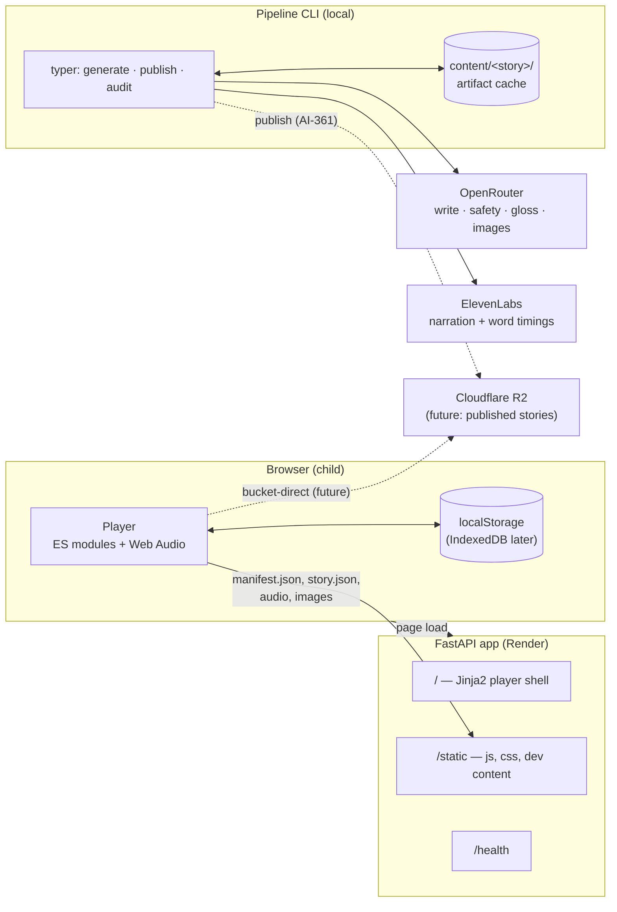
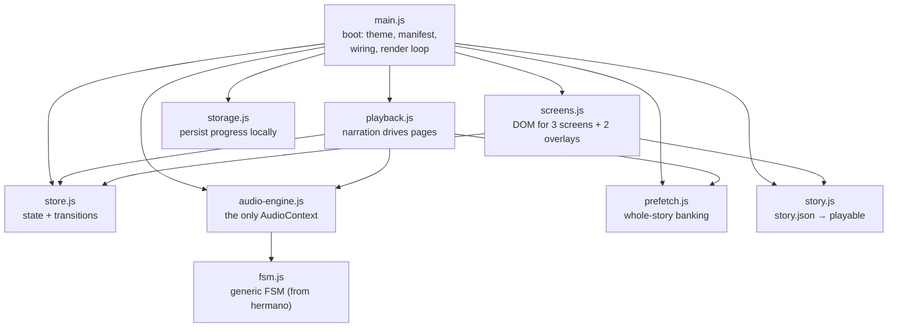
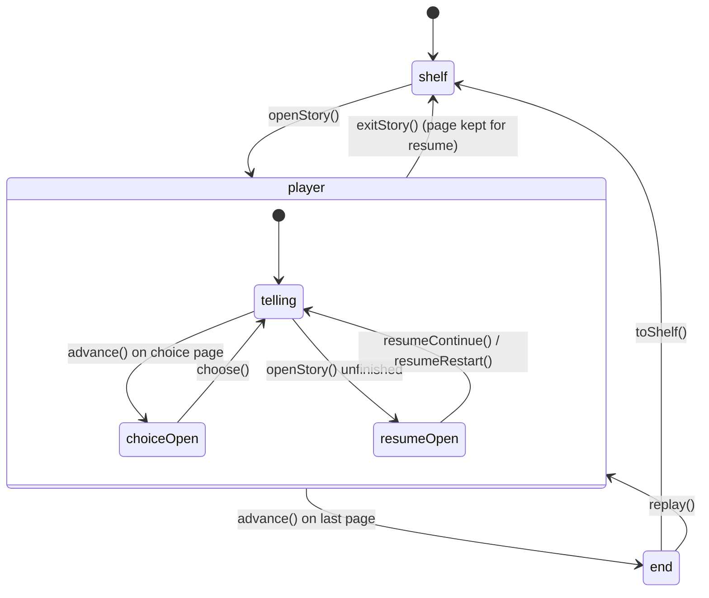
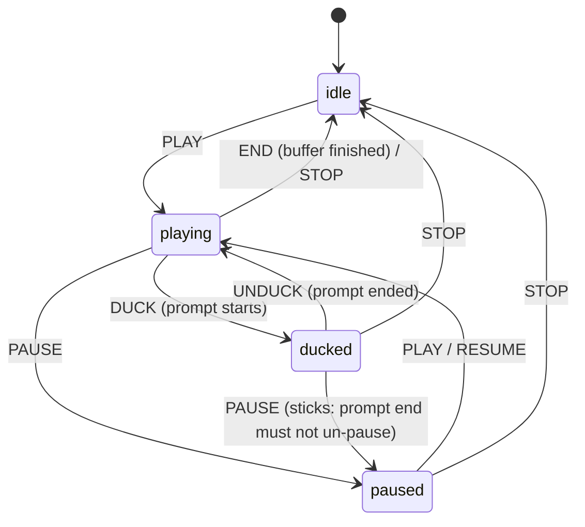
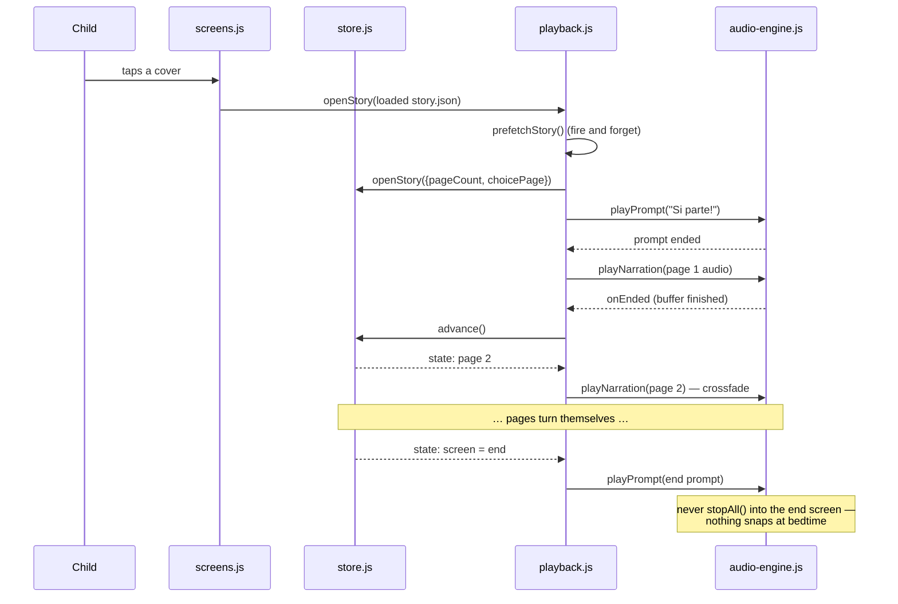
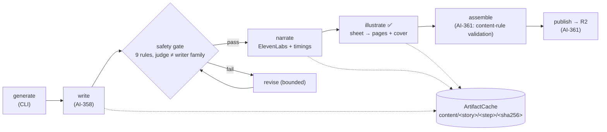

# Cantastorie — System Overview (As Built)

This document explains the system **as it exists in the code today**: what each module does, how they talk to each other, and where the seams are. It is the implementation companion to two other documents:

- [product.md](product.md) — what the product must do (behaviors, content rules, decision log)
- [architecture.md](architecture.md) — the settled design: stack choices and their rationale

Where this document and the code disagree, the code has moved on — fix this document. Where a *design decision* seems wrong, that conversation belongs in architecture.md, not in code.

---

## The System at a Glance

One FastAPI app serves a static shell; everything the child experiences after page load happens in the browser. The authoring pipeline is a separate plain-Python package in the same repo, run as a CLI — the app and the pipeline share only `src/config.py` and the `story.json` contract.

Today the player fetches story assets from the app's own `/static/content/` mount (a dev fixture, an Italian manifest). The settled end state is bucket-direct from R2; the seam is already in place — the shell's `<meta name="asset-base">` tag is the only place the base URL lives.

**Trust boundary:** the two API keys (OpenRouter, ElevenLabs) exist only in the pipeline environment as `SecretStr`, unwrapped at the transport boundary. The web app and browser never see a key; a played story costs zero API calls.

---

## The Player (`src/static/js/`)

Nine ES modules, no framework, no bundler. `main.js` is the composition root; everything else is a factory function with injected dependencies (`fetchFn`, `engine`, `storage`), which is what makes the Vitest + jsdom suites possible.

### Module responsibilities

| Module | Owns | Key exports |
|--------|------|-------------|
| `main.js` | Boot order: theme (light/dusk by hour, `?theme=` override), manifest fetch with built-in fallback shelf, audio unlock on first gesture, spoken greeting, the render loop, the dev page-timer stand-in | `init(root, {fetchFn, engine})` → shell handle |
| `store.js` | All player state and every legal transition; pure, no DOM, no audio | `createStore`, `initialState` |
| `playback.js` | The playback loop: story-start prompt, narrating the current page, auto page turn on audio end, pause/resume at exact position | `createPlayback` |
| `audio-engine.js` | The single `AudioContext`; decoded-buffer cache; narration vs prompt channels; crossfades and ducking via gain ramps | `createAudioEngine`, `CROSSFADE_SECONDS` |
| `fsm.js` | Tiny generic FSM: frozen machine, warn-and-ignore invalid transitions | `createMachine`, `interpret` |
| `prefetch.js` | On cover tap, bank every page's audio (decoded buffers) and image (HTTP cache), both branch arms included; failures counted, never fatal | `createPrefetcher` |
| `story.js` | `loadStory()` validates `schema_version: 1`, orders pages by walking `next_page` links, resolves relative asset URLs; also the mock shelf/story that back unpublished covers | `loadStory`, `orderPages`, `shelf`, `story` |
| `screens.js` | Detached-element builders for shelf, player, end screen, choice + resume overlays; `playerView()` derives captions/beads/images from a loaded story | `buildShelf`, `buildPlayer`, `updatePlayer`, … |
| `storage.js` | Progress persistence under one key; localStorage now, IndexedDB when real stories land; failures are silent by design | `load`, `save` |

### Player state (`store.js`)

The store is a plain object + listeners — five booleans/numbers, not a framework. Screens are one axis; the two overlays are independent flags on top of the `player` screen.

Two details worth knowing:

- **`advance()` is the only forward motion**, and it refuses to act while paused or while an overlay is open. Narration end and the dev timer both funnel through it.
- **Exiting keeps `page`** — that is what makes the resume offer ("Continuiamo o ricominciamo?") work when the same cover is tapped again.

### The audio engine (`audio-engine.js`)

The iOS constraint (media-element volume is read-only) is why this module exists; every fade is a gain-node ramp on Web Audio buffers. Two channels with one hard rule: **narration tells the story, prompts speak the UI, and they never overlap.**

Mechanics that the rest of the system relies on:

- **Crossfade = overlapping ramps.** Starting page N+1's narration while page N is fading out (0.9 s, `CROSSFADE_SECONDS`) is the gentle page turn.
- **Exact-position hold.** Pausing or ducking computes the playhead offset and stores `{url, offset, onEnded}`; resuming restarts the buffer at that offset. This is the number that will land in IndexedDB for exact-position resume.
- **`_manualStop` discipline.** A deliberately silenced source must not fire its natural `onended` chain; a stale voice never turns the page.
- **`load()` is the prefetch bank.** Decoded buffers are cached per URL and deduped by promise, so prefetch and playback share one in-flight fetch.

### One story night through the modules

While no published `story.json` backs a cover, a page timer (3.8 s, `?speed=` override) stands in for narration end — same `store.advance()` path, so the state machine is exercised identically in dev.

---

## The Pipeline (`src/pipeline/`)

Plain Python, typed end to end. The CLI is a scaffold (each command validates inputs against the locked vocabularies, then exits pointing at the issue that delivers it); the real machinery built so far is the models, the cache, the provider layer, and the illustration step.

### Module responsibilities

| Module | Owns | Notable constraints enforced in code |
|--------|------|--------------------------------------|
| `models.py` | The `story.json` contract (`Story`, `Page`, `ChoicePoint`, `WordTiming`) and safety vocabulary | `Language`/`Theme` are `Literal` types locked to the product doc; `ChoicePoint` is exactly two options; `SafetyReport` must contain each of the nine rules exactly once |
| `cache.py` | Content-addressed artifact store; the filesystem **is** the checkpoint | `cache_key()` = sha256 of canonical-JSON inputs; writes are tmp-then-rename atomic; `run_step()` makes unchanged inputs a pure lookup — zero API calls |
| `providers.py` | The only two transports: Pydantic AI over OpenRouter, ElevenLabs over httpx | Keys are `SecretStr`, unwrapped only at the transport boundary; narration always requests `with-timestamps` |
| `cli.py` | `generate` / `publish` / `audit` entry points | Input validation is live; behaviors land with AI-358/361/378 |
| `steps/illustrate.py` | Character sheet first, then every page and the cover generated **against that sheet** — never page-to-page chaining (drift compounds) | `STYLE_PROMPT` is a module constant participating verbatim in every cache key: edit it and every image knowingly regenerates. Uses httpx against OpenRouter chat completions directly because pydantic-ai 2.5.0 can't parse image *outputs*; the ban is on direct vendor SDKs, and OpenRouter remains the only gateway |
| `src/config.py` | Settings for both halves (shared with the API) | A model validator **refuses config where the safety judge and writer share a model family** — the shared-blind-spot failure mode |

### Why the cache shape matters

Every step's inputs — text, style prompt, sheet hash, model ID — hash into the artifact's cache key. The consequences are the pipeline's two core properties:

1. **Crash-safe resume.** A failure at `illustrate` never re-buys `narrate`; artifacts already on disk are simply found.
2. **Precise regeneration.** Editing page 5's text regenerates page 5's audio and image, nothing else. Re-running an unchanged story costs nothing.

---

## The App (`src/api/`)

Deliberately thin: an app factory, a static mount, the player route rendering `templates/index.html`, and `/health` (which the Dockerfile healthcheck and Render both poll). The parent area (gate, settings, export/import) will be its second router; nothing exists for it yet.

The template carries the three things the player boot needs: the design-system stylesheets (`tokens.css`, `player.css`), the `asset-base` meta tag, and the `#app` mount that `main.js` looks for.

---

## Testing Map

| Suite | Runner | What it pins down |
|-------|--------|-------------------|
| `tests/js/*.test.js` | Vitest + jsdom | Store transitions, audio-engine FSM + hold/resume math (mock AudioContext), playback loop ordering, prefetch dedupe/failure counting, `story.json` parsing and page ordering, shell boot |
| `tests/test_app.py`, `test_config.py` | pytest | Routes, static mount, dev manifest fixture, settings (including the judge≠writer refusal) |
| `tests/pipeline/*` | pytest | Model contract (nine-rule completeness, choice arity), cache atomicity and hit/miss, provider transports against mocked httpx, illustration step orchestration |
| `tests/e2e/*.spec.js` | Playwright | The two-tap start and the full playback loop in a real browser |

The provider tests mock at the httpx-transport seam, so pipeline logic is tested without a key in the environment — the same property the runtime has.

---

## Current Stand-ins (deliberate, tracked)

| Stand-in | Real thing | Arrives with |
|----------|-----------|--------------|
| Page timer (3.8 s) for unpublished covers | Narration `onEnded` → `advance()` (already live for published stories) | more published stories |
| `/static/content/` dev fixture | Cloudflare R2 public bucket, bucket-direct | AI-361 (publish) |
| `localStorage` progress | IndexedDB (progress, settings, lockout, family token) | slice 2 |
| Choice pages halt the ordered walk | Choice overlay drives branch following | AI-370 |
| CLI `generate`/`publish`/`audit` exit 2 | Full write→safety→narrate→illustrate→assemble run | AI-358, AI-361, AI-378 |
| Mock shelf covers + captions | Manifest + published `story.json` per cover | pipeline output |
