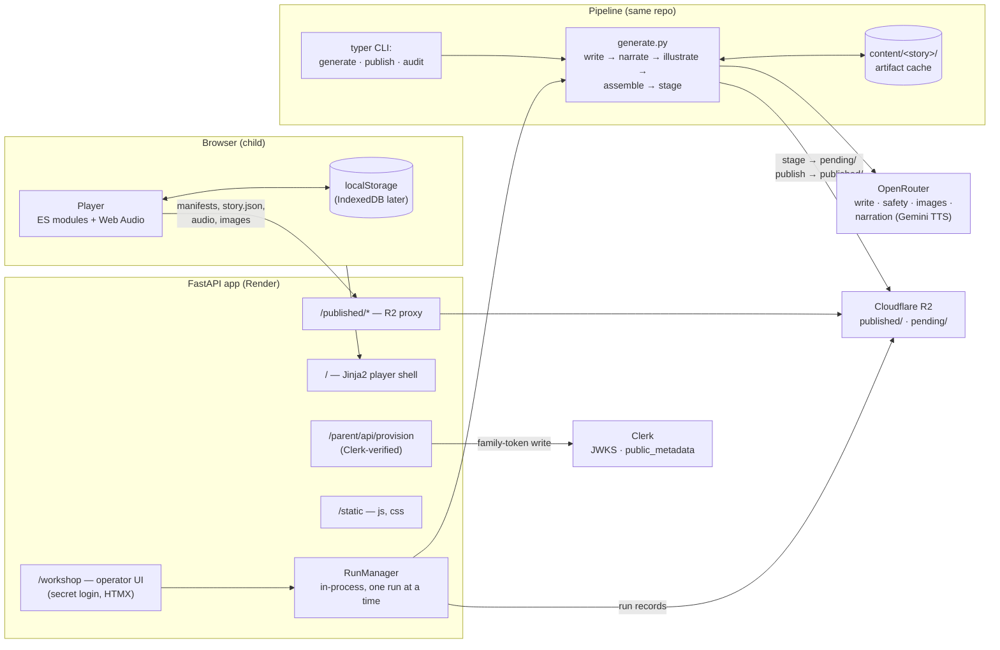
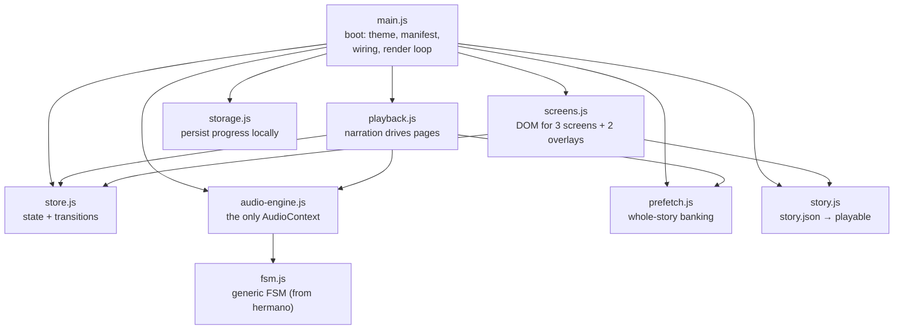
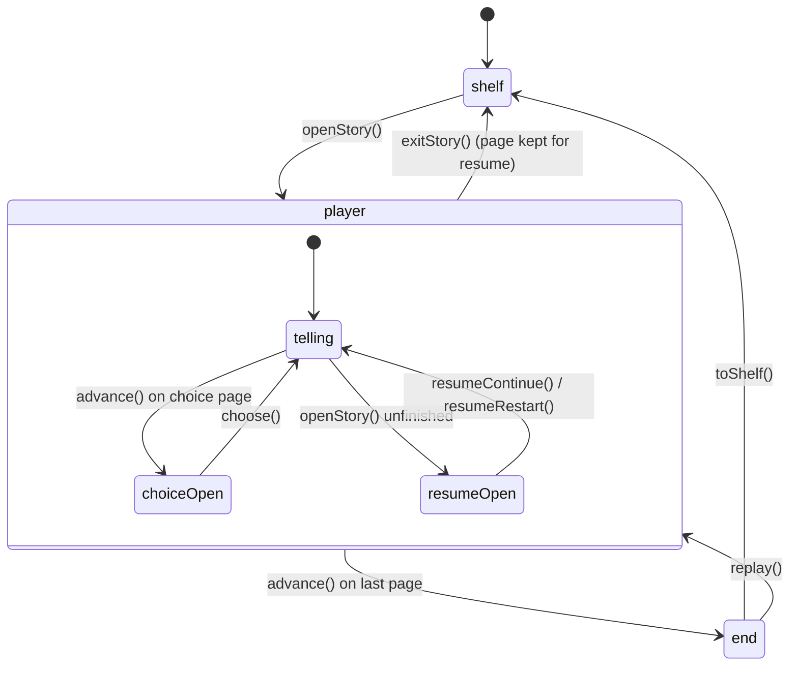
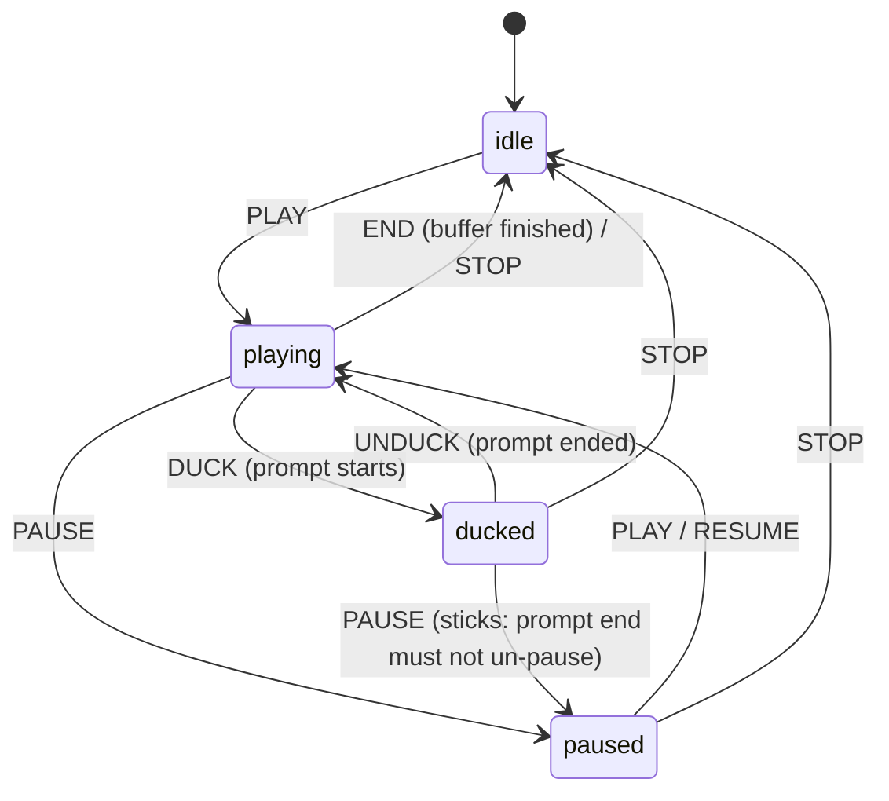
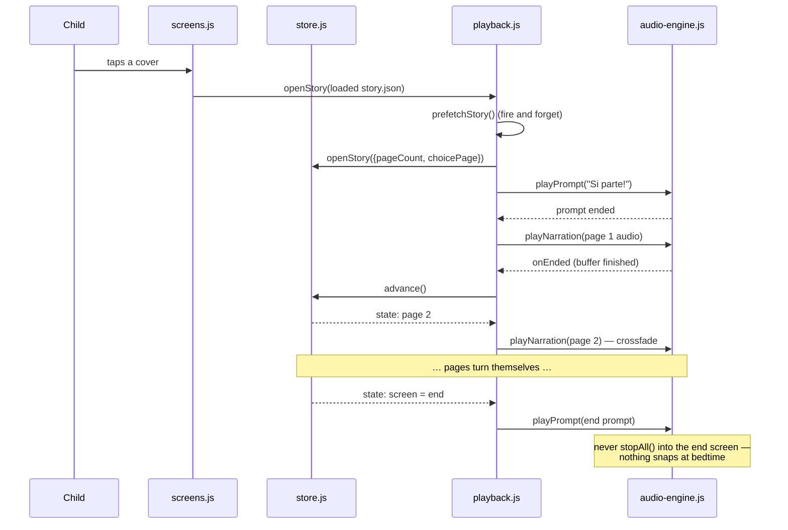
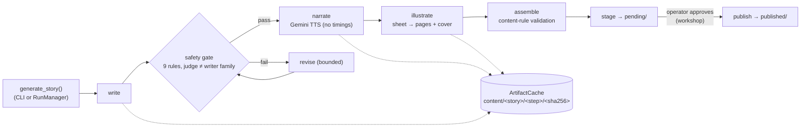
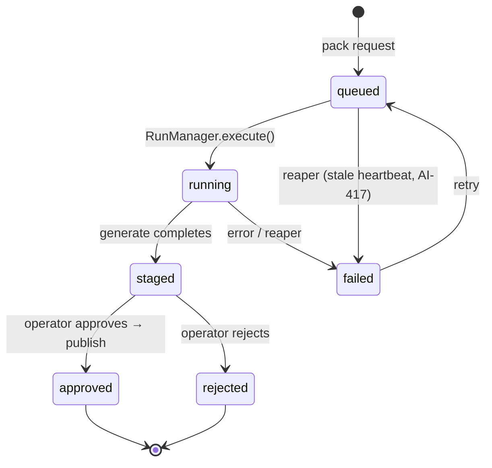

# Cantastorie — System Overview (As Built)

This document explains the system **as it exists in the code today**: what each module does, how they talk to each other, and where the seams are. It is the implementation companion to two other documents:

- [product.md](product.md) — what the product must do (behaviors, content rules, decision log)
- [architecture.md](architecture.md) — the settled design: stack choices and their rationale

Where this document and the code disagree, the code has moved on — fix this document. Where a *design decision* seems wrong, that conversation belongs in architecture.md, not in code.

---

## The System at a Glance

One FastAPI app serves a static shell, proxies published content from R2, and hosts the operator workshop; everything the child experiences after page load happens in the browser. The authoring pipeline is a plain-Python package in the same repo, runnable two ways: as a CLI, and in-process through the workshop's `RunManager`. The app and the pipeline share `src/config.py` and the `story.json` contract.

```mermaid
flowchart LR
    subgraph Browser["Browser (child)"]
        P["Player<br/>ES modules + Web Audio"]
        LS[("localStorage<br/>(IndexedDB later)")]
        P <--> LS
    end

    subgraph App["FastAPI app (Render)"]
        T["/ — Jinja2 player shell"]
        PUB["/published/* — R2 proxy"]
        WS["/workshop — operator UI<br/>(secret login, HTMX)"]
        PA["/parent/api/provision<br/>(Clerk-verified)"]
        S["/static — js, css"]
        RM["RunManager<br/>in-process, one run at a time"]
        WS --> RM
    end

    subgraph Pipeline["Pipeline (same repo)"]
        CLI["typer CLI:<br/>generate · publish · audit"]
        GEN["generate.py<br/>write → narrate → illustrate →<br/>assemble → stage"]
        Cache[("content/&lt;story&gt;/<br/>artifact cache")]
        CLI --> GEN
        GEN <--> Cache
    end

    OR["OpenRouter<br/>write · safety · images ·<br/>narration (Gemini TTS)"]
    CK["Clerk<br/>JWKS · public_metadata"]
    R2["Cloudflare R2<br/>published/ · pending/"]

    Browser -- "page load" --> T
    P -- "manifests, story.json,<br/>audio, images" --> PUB
    PUB --> R2
    PA -- "family-token write" --> CK
    RM --> GEN
    GEN --> OR
    GEN -- "stage → pending/<br/>publish → published/" --> R2
    RM -- "run records" --> R2
```

The shell's `<meta name="asset-base">` tag is the only place the asset base URL lives. Its default is the `/static/content/` dev fixture; deployed configuration points it at `/published`, the app route that proxies the R2 bucket so dev and prod read the same published content ([`src/api/routes/published.py`](../src/api/routes/published.py)).

**Trust boundary:** every provider secret — the OpenRouter key, the Clerk secret key, the workshop secret, the LangSmith key — exists only in the server/pipeline environment as `SecretStr`, unwrapped at its transport boundary. The browser never sees a key; a played story costs zero API calls.

---

## The Player (`src/static/js/`)

Nine ES modules, no framework, no bundler. `main.js` is the composition root; everything else is a factory function with injected dependencies (`fetchFn`, `engine`, `storage`), which is what makes the Vitest + jsdom suites possible. Alongside them live `palette.js` — a synchronous head script (deliberately *not* a module, so it can set `data-palette`/`data-theme` on `<html>` before first paint) — and its testable twin `palette-resolve.js`, which holds the same resolution logic as an importable module. `workshop.js` also lives in this directory but belongs to the workshop UI, not the player.

```mermaid
flowchart TD
    main["main.js<br/>boot: theme, manifest,<br/>wiring, render loop"]
    store["store.js<br/>state + transitions"]
    playback["playback.js<br/>narration drives pages"]
    engine["audio-engine.js<br/>the only AudioContext"]
    fsm["fsm.js<br/>generic FSM (from hermano)"]
    prefetch["prefetch.js<br/>whole-story banking"]
    story["story.js<br/>story.json → playable"]
    screens["screens.js<br/>DOM for 3 screens + 2 overlays"]
    storage["storage.js<br/>persist progress locally"]

    main --> store & playback & engine & prefetch & story & screens & storage
    playback --> store & engine & prefetch
    engine --> fsm
    screens --> story & store
```

### Module responsibilities

| Module | Owns | Key exports |
|--------|------|-------------|
| `main.js` | Boot order: theme (light/dusk by hour, `?theme=` override), manifest fetch with built-in fallback shelf, audio unlock on first gesture, spoken greeting, the render loop, the dev page-timer stand-in | `init(root, {fetchFn, engine})` → shell handle |
| `store.js` | All player state and every legal transition; pure, no DOM, no audio | `createStore`, `initialState` |
| `playback.js` | The playback loop: story-start prompt, narrating the current page, auto page turn on audio end, pause/resume at exact position | `createPlayback` |
| `audio-engine.js` | The single `AudioContext`; decoded-buffer cache; narration vs prompt channels; crossfades and ducking via gain ramps | `createAudioEngine`, `CROSSFADE_SECONDS` |
| `fsm.js` | Tiny generic FSM: frozen machine, warn-and-ignore invalid transitions | `createMachine`, `interpret` |
| `prefetch.js` | On cover tap, bank every page's audio (decoded buffers) and image (HTTP cache), both branch arms included; failures counted, never fatal | `createPrefetcher` |
| `story.js` | `loadStory()` validates `schema_version: 1`, orders pages by walking `next_page` links, resolves relative asset URLs; also the mock shelf/story that back unpublished covers | `loadStory`, `orderPages`, `shelf`, `story` |
| `screens.js` | Detached-element builders for shelf, player, end screen, choice + resume overlays; `playerView()` derives captions/beads/images from a loaded story | `buildShelf`, `buildPlayer`, `updatePlayer`, … |
| `storage.js` | Progress persistence under one key; localStorage now, IndexedDB when real stories land; failures are silent by design | `load`, `save` |

### Player state (`store.js`)

The store is a plain object + listeners — five booleans/numbers, not a framework. Screens are one axis; the two overlays are independent flags on top of the `player` screen.

```mermaid
stateDiagram-v2
    [*] --> shelf
    shelf --> player: openStory()
    state player {
        [*] --> telling
        telling --> choiceOpen: advance() on choice page
        choiceOpen --> telling: choose()
        telling --> resumeOpen: openStory() unfinished
        resumeOpen --> telling: resumeContinue() / resumeRestart()
    }
    player --> end: advance() on last page
    player --> shelf: exitStory() (page kept for resume)
    end --> player: replay()
    end --> shelf: toShelf()
```

Two details worth knowing:

- **`advance()` is the only forward motion**, and it refuses to act while paused or while an overlay is open. Narration end and the dev timer both funnel through it.
- **Exiting keeps `page`** — that is what makes the resume offer ("Continuiamo o ricominciamo?") work when the same cover is tapped again.

### The audio engine (`audio-engine.js`)

The iOS constraint (media-element volume is read-only) is why this module exists; every fade is a gain-node ramp on Web Audio buffers. Two channels with one hard rule: **narration tells the story, prompts speak the UI, and they never overlap.**

```mermaid
stateDiagram-v2
    [*] --> idle
    idle --> playing: PLAY
    playing --> paused: PAUSE
    playing --> ducked: DUCK (prompt starts)
    playing --> idle: END (buffer finished) / STOP
    paused --> playing: PLAY / RESUME
    paused --> idle: STOP
    ducked --> playing: UNDUCK (prompt ended)
    ducked --> paused: PAUSE (sticks: prompt end must not un-pause)
    ducked --> idle: STOP
```

Mechanics that the rest of the system relies on:

- **Crossfade = overlapping ramps.** Starting page N+1's narration while page N is fading out (0.9 s, `CROSSFADE_SECONDS`) is the gentle page turn.
- **Exact-position hold.** Pausing or ducking computes the playhead offset and stores `{url, offset, onEnded}`; resuming restarts the buffer at that offset. This is the number that will land in IndexedDB for exact-position resume.
- **`_manualStop` discipline.** A deliberately silenced source must not fire its natural `onended` chain; a stale voice never turns the page.
- **`load()` is the prefetch bank.** Decoded buffers are cached per URL and deduped by promise, so prefetch and playback share one in-flight fetch.

### One story night through the modules

```mermaid
sequenceDiagram
    participant Child
    participant screens as screens.js
    participant store as store.js
    participant playback as playback.js
    participant engine as audio-engine.js

    Child->>screens: taps a cover
    screens->>playback: openStory(loaded story.json)
    playback->>playback: prefetchStory() (fire and forget)
    playback->>store: openStory({pageCount, choicePage})
    playback->>engine: playPrompt("Si parte!")
    engine-->>playback: prompt ended
    playback->>engine: playNarration(page 1 audio)
    engine-->>playback: onEnded (buffer finished)
    playback->>store: advance()
    store-->>playback: state: page 2
    playback->>engine: playNarration(page 2) — crossfade
    Note over store,engine: … pages turn themselves …
    store-->>playback: state: screen = end
    playback->>engine: playPrompt(end prompt)
    Note over engine: never stopAll() into the end screen —<br/>nothing snaps at bedtime
```

While no published `story.json` backs a cover, a page timer (3.8 s, `?speed=` override) stands in for narration end — same `store.advance()` path, so the state machine is exercised identically in dev.

---

## The Pipeline (`src/pipeline/`)

Plain Python, typed end to end. `generate.py` runs the whole authoring pass — write through stage — against the story's working folder; the CLI and the workshop's `RunManager` are two front doors to the same function. The gloss step is slice 6 and does not run yet; spoken prompts are staged only for Italian until slice 4.

```mermaid
flowchart LR
    G["generate_story()<br/>(CLI or RunManager)"] --> W["write"]
    W --> SG{"safety gate<br/>9 rules, judge ≠ writer family"}
    SG -- pass --> N["narrate<br/>Gemini TTS (no timings)"]
    SG -- fail --> RV["revise (bounded)"]
    RV --> SG
    N --> I["illustrate<br/>sheet → pages + cover"]
    I --> A["assemble<br/>content-rule validation"]
    A --> ST["stage → pending/"]
    ST -- "operator approves<br/>(workshop)" --> PB["publish → published/"]

    Cache[("ArtifactCache<br/>content/&lt;story&gt;/&lt;step&gt;/&lt;sha256&gt;")]
    W -.-> Cache
    N -.-> Cache
    I -.-> Cache
```

### Module responsibilities

| Module | Owns | Notable constraints enforced in code |
|--------|------|--------------------------------------|
| `models.py` | The `story.json` contract (`Story`, `Page`, `ChoicePoint`, `WordTiming`) and safety vocabulary | `Language`/`Theme` are `Literal` types locked to the product doc; `ChoicePoint` is exactly two options; `SafetyReport` must contain each of the nine rules exactly once |
| `cache.py` | Content-addressed artifact store; the filesystem **is** the checkpoint | `cache_key()` = sha256 of canonical-JSON inputs; writes are tmp-then-rename atomic; `run_step()` makes unchanged inputs a pure lookup — zero API calls |
| `providers.py` | The only transport: Pydantic AI over OpenRouter; narration via OpenRouter's `/audio/speech` (Gemini 3.1 Flash TTS) | Keys are `SecretStr`, unwrapped only at the transport boundary; narration returns raw audio bytes with no timestamps (ADR-008; Deepgram STT reconstructs them at slice 6) |
| `generate.py` | The whole authoring run, write through stage, as one function — the seam shared by the CLI and the workshop's `RunManager` | Provider seams (models, narration client, image transport) are injectable, so the full run is exercised with zero network |
| `cli.py` | `generate` / `publish` / `audit` entry points — all live | `audit` verifies every reachable asset in the published bucket via `audit_published_bucket` |
| `steps/illustrate.py` | Character sheet first, then every page and the cover generated **against that sheet** — never page-to-page chaining (drift compounds) | `STYLE_PROMPT` is a module constant participating verbatim in every cache key: edit it and every image knowingly regenerates. Uses httpx against OpenRouter chat completions directly because pydantic-ai 2.5.0 can't parse image *outputs*; the ban is on direct vendor SDKs, and OpenRouter remains the only gateway |
| `src/config.py` | Settings for both halves (shared with the API) | A model validator **refuses config where the safety judge and writer share a model family** — the shared-blind-spot failure mode |

### Why the cache shape matters

Every step's inputs — text, style prompt, sheet hash, model ID — hash into the artifact's cache key. The consequences are the pipeline's two core properties:

1. **Crash-safe resume.** A failure at `illustrate` never re-buys `narrate`; artifacts already on disk are simply found.
2. **Precise regeneration.** Editing page 5's text regenerates page 5's audio and image, nothing else. Re-running an unchanged story costs nothing.

---

## The Workshop (`src/workshop/`, `/workshop`)

The operator face (AI-388, [ADR-005](adr/)): start pack runs, watch progress, review staged stories, publish. Server-rendered Jinja2 + HTMX — the settled non-child pattern — with a vanilla-JS `workshop.js` for widgets.

**Access is one env-var secret, not accounts.** With no `workshop_secret` configured, every `/workshop` route answers 404 — the workshop does not exist. A correct login sets a session cookie holding the secret's SHA-256 (never the secret itself), compared with `secrets.compare_digest`.

**Runs execute in-process.** `RunManager` runs `generate_story` as an asyncio background task in the same FastAPI process — `asyncio.to_thread` for the sync pipeline code, an `asyncio.Lock` for one-run-at-a-time. There is no queue framework.

**Durability lives in R2, not the container.** Every state change persists to the `RunStore` — `pending/{family-token}/runs/{run-id}.json` — *before* anything else happens; in particular the `running` state hits R2 before the first step executes, so a crash mid-generation always leaves a record `resume_on_boot()` can find. Render's disk is ephemeral; the bucket is the source of truth. Records are values (`advance()` returns a copy), transitions are validated against the lifecycle, and a stale record cannot overwrite a newer one (`ConcurrentModificationError`).

```mermaid
stateDiagram-v2
    [*] --> queued: pack request
    queued --> running: RunManager.execute()
    queued --> failed: reaper (stale heartbeat, AI-417)
    running --> staged: generate completes
    running --> failed: error / reaper
    failed --> queued: retry
    staged --> approved: operator approves → publish
    staged --> rejected: operator rejects
    approved --> [*]
    rejected --> [*]
```

Two properties keep the lifecycle honest:

- **The reaper (`reap_stale`, AI-417)** retires `queued`/`running` records whose heartbeat is too old to belong to a live process — a deploy or crash left them stranded — marking them `failed` with a distinct "the workshop restarted" note so the screen can tell an interruption apart from a pipeline error. Terminal and review-waiting states are never swept.
- **Retry re-buys nothing.** `failed → queued` is a legal edge because the step functions run against the content-addressed `ArtifactCache`: completed steps are pure lookups, so a resumed or retried run only pays for what never finished.

Progress shown in the UI is read from the run record plus the working folder's checkpoint dirs — there is no parallel status store. Publish calls the pipeline's `publish_story`, which remains the only writer to `published/`; nothing under `pending/` is ever listed in a manifest.

---

## The App (`src/api/`)

An app factory (`create_app`) that initializes observability, adds LangSmith's `TracingMiddleware`, mounts `/static`, and includes four routers plus `/health` (which the Dockerfile healthcheck and Render both poll):

| Router | Routes | What it does |
|--------|--------|--------------|
| `player.py` | `GET /` | Renders `templates/index.html` with `asset_base` injected |
| `published.py` | `GET /published/*` | Proxies the R2 bucket so dev and prod read the same published content; the player's `ASSET_BASE` points here |
| `workshop.py` | `/workshop/**` | The operator UI (see [The Workshop](#the-workshop-srcworkshop-workshop)) |
| `parent.py` | `POST /parent/api/provision` | Mint-or-link the family token at first parent sign-in (AI-410) |

The template carries the three things the player boot needs: the design-system stylesheets (`tokens.css`, `player.css`), the `asset-base` meta tag, and the `#app` mount that `main.js` looks for.

### Parent identity (Clerk, [ADR-003](adr/ADR-003-parent-authentication-clerk.md))

- **`auth.py`** — two FastAPI dependencies, no vendor SDK: `require_parent_candidate` verifies the Clerk session JWT from the `__session` cookie (PyJWT + JWKS, RS256, issuer check; JWKS cached one hour with stale-if-error so a transient outage never logs every parent out) but tolerates a missing `family_token` claim; `require_parent` additionally requires it. The `disabled` claim is the kill switch (403), checked before any provisioning logic so a disabled account can never mint a token. With no `clerk_jwks_url` configured, `/parent` answers 404.
- **`clerk.py`** — the only module that calls Clerk's REST API, for one operation: a deep-merge `PATCH` writing `family_token` into the user's `public_metadata` at provision time. Everything else verifies locally via JWKS.
- **`parent.py`** — the provision endpoint is idempotent (a provisioned account gets its existing token back; rotation is a manual procedure). It links the browser's existing IndexedDB token when offered, otherwise mints 128 bits. The token pattern `^[0-9a-f]{32}$` is enforced strictly because the token becomes an R2 key prefix (`pending/{family_token}/…`) — posted strings must never smuggle path separators into bucket keys.

The `/parent` pages themselves (sign-in, pack request, my-packs) are not built yet; only the provision API exists.

### Observability (`src/observability.py`)

LangSmith, off by default and inert when off. `init_observability` (called from `create_app` and the CLI) syncs settings into the env vars the SDK reads; `build_traced_openai_client` wraps the OpenRouter client; `typed_traceable` decorates pipeline steps; `TracingMiddleware` traces requests. With tracing disabled, all of these are pass-throughs.

---

## Testing Map

| Suite | Runner | What it pins down |
|-------|--------|-------------------|
| `tests/js/*.test.js` | Vitest + jsdom | Store transitions, audio-engine FSM + hold/resume math (mock AudioContext), playback loop ordering, prefetch dedupe/failure counting, `story.json` parsing and page ordering, palette resolution, shell boot |
| `tests/test_app.py`, `test_config.py`, `test_observability.py` | pytest | Routes, static mount, dev manifest fixture, settings (including the judge≠writer refusal), observability wiring |
| `tests/api/*` | pytest | Clerk JWT verification (`test_auth.py`), the Clerk metadata client against mocked transports (`test_clerk_client.py`), provision mint/link/idempotency (`test_parent_provision.py`) |
| `tests/workshop/*` | pytest | Run-record lifecycle and transitions (`test_records.py`), manager execution/resume/reaper (`test_manager.py`), workshop routes and auth (`test_routes.py`) |
| `tests/pipeline/*` | pytest | Model contract (nine-rule completeness, choice arity), cache atomicity and hit/miss, provider transports against mocked httpx, authoring/narrate/illustrate/assemble steps, content rules, generate end to end, publish and audit |
| `tests/e2e/*.spec.js` | Playwright | The two-tap start, the full playback loop, failure states, and shelf-layout regressions in a real browser |

The provider and Clerk tests mock at the httpx-transport seam, so logic is tested without a key in the environment — the same property the runtime has.

---

## Current Stand-ins (deliberate, tracked)

| Stand-in | Real thing | Arrives with |
|----------|-----------|--------------|
| Page timer (3.8 s) for unpublished covers | Narration `onEnded` → `advance()` (already live for published stories) | more published stories |
| `/static/content/` as the *default* `asset_base` | The `/published` R2 proxy (live) — deployed config points there; the fixture remains the dev default | dev config catching up |
| `localStorage` progress | IndexedDB (progress, settings, lockout, family token) | slice 2 |
| Choice pages halt the ordered walk | Choice overlay drives branch following | AI-370 |
| No gloss step in `generate_story` | Word-to-English gloss maps + Deepgram word timings | slice 6 |
| Spoken prompts staged for Italian only | All ten prompts per enabled language | slice 4 |
| Provision API without `/parent` pages | Sign-in, pack request form, my-packs UI | next parent-area step |
| Mock shelf covers + captions | Manifest + published `story.json` per cover | pipeline output |
