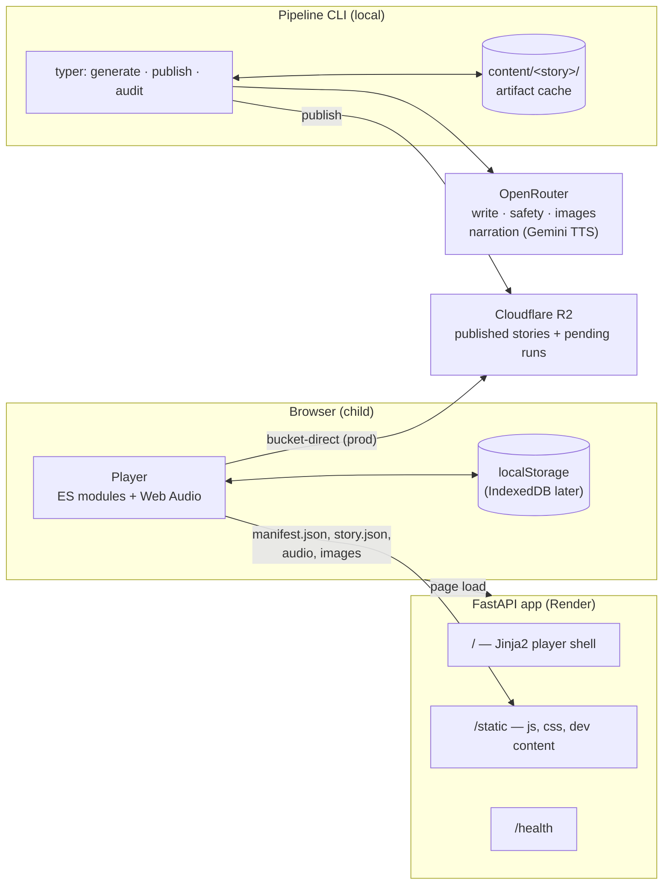
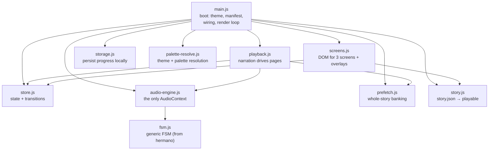
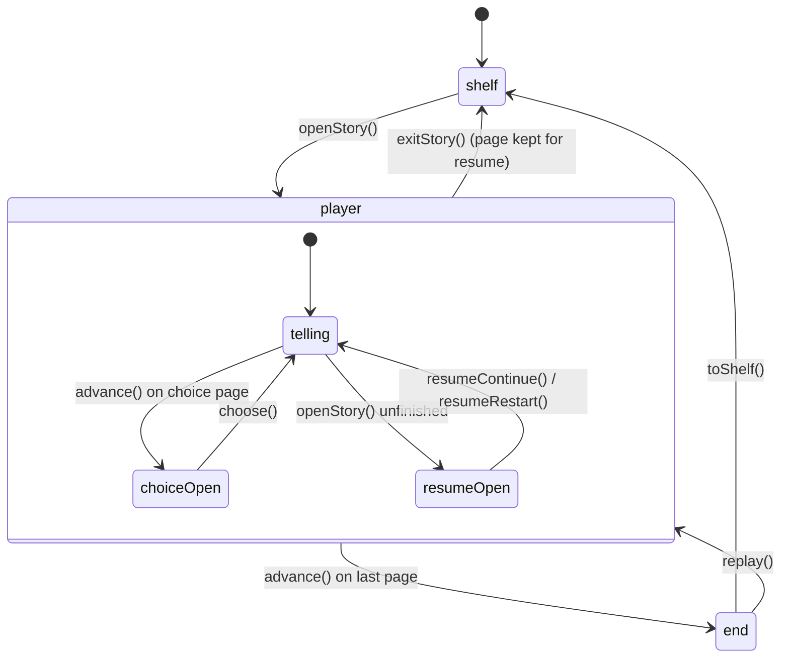
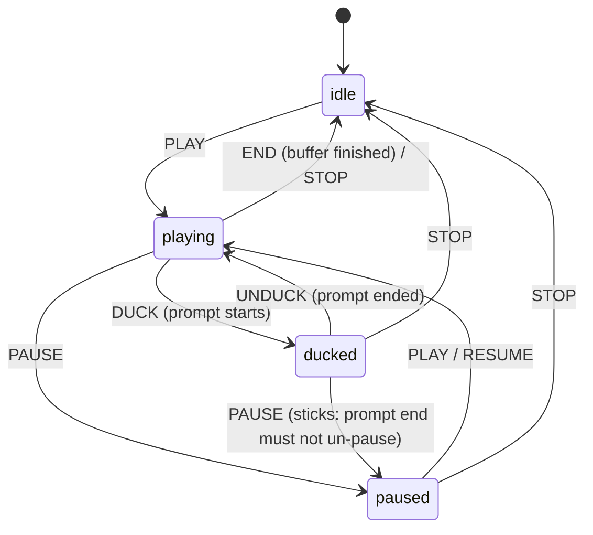
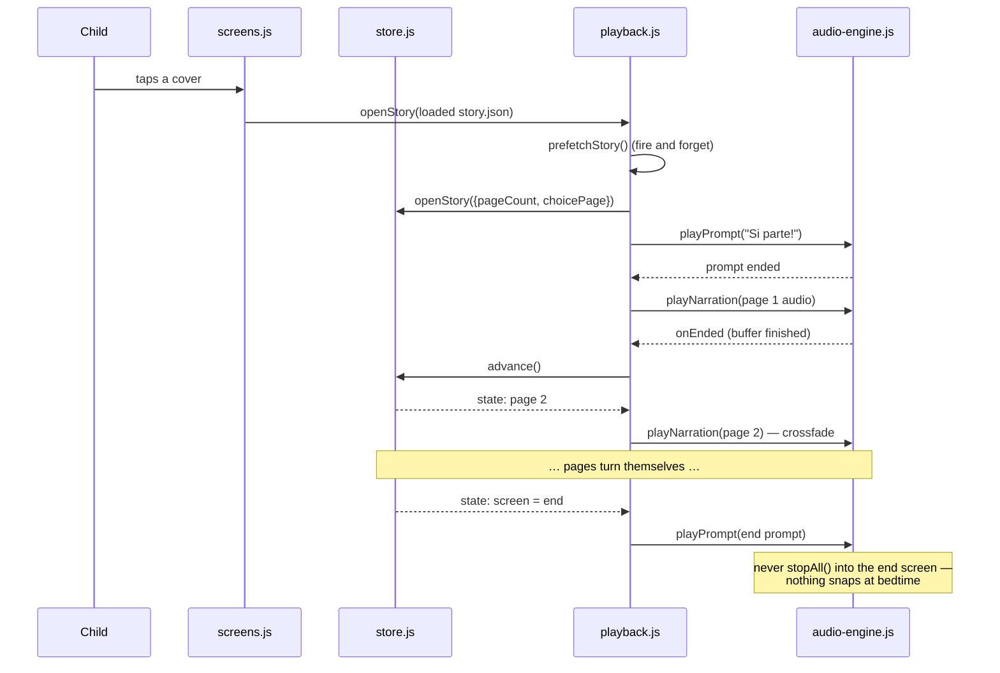
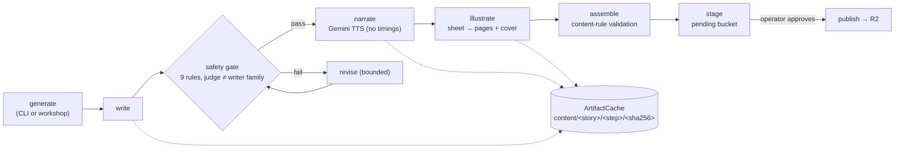

# Cantastorie — System Overview (As Built)

This document explains the system **as it exists in the code today**: what each module does, how they talk to each other, and where the seams are. It is the implementation companion to two other documents:

- [product.md](product.md) — what the product must do (behaviors, content rules, decision log)
- [architecture.md](architecture.md) — the settled design: stack choices and their rationale

Where this document and the code disagree, the code has moved on — fix this document. Where a *design decision* seems wrong, that conversation belongs in architecture.md, not in code.

---

## The System at a Glance

One FastAPI app serves a static shell; everything the child experiences after page load happens in the browser. The authoring pipeline is a separate plain-Python package in the same repo, run as a CLI — the app and the pipeline share only `src/config.py` and the `story.json` contract.

```mermaid
flowchart LR
    subgraph Browser["Browser (child)"]
        P["Player<br/>ES modules + Web Audio"]
        LS[("localStorage<br/>(IndexedDB later)")]
        P <--> LS
    end

    subgraph App["FastAPI app (Render)"]
        T["/ — Jinja2 player shell"]
        S["/static — js, css, dev content"]
        H["/health"]
    end

    subgraph Factory["Pipeline CLI (local)"]
        CLI["typer: generate · publish · audit"]
        Cache[("content/&lt;story&gt;/<br/>artifact cache")]
        CLI <--> Cache
    end

    OR["OpenRouter<br/>write · safety · images<br/>narration (Gemini TTS)"]
    R2["Cloudflare R2<br/>published stories + pending runs"]

    Browser -- "page load" --> App
    P -- "manifest.json, story.json,<br/>audio, images" --> S
    CLI --> OR
    CLI -- "publish" --> R2
    P -- "bucket-direct (prod)" --> R2
```

In development the player fetches story assets from the app's own `/static/content/` mount; in production `ASSET_BASE` points at the R2 public bucket and playback is bucket-direct. The shell's `<meta name="asset-base">` tag is the only place the base URL lives. The workshop runs the same pipeline in-process on the server, staging artifacts to the pending bucket for review before publish.

**Trust boundary:** the single generation key (OpenRouter) exists only in the pipeline environment as `SecretStr`, unwrapped at the transport boundary. The browser never sees a key; a played story costs zero API calls. Server-side secrets beyond it: the workshop operator secret, the Clerk keys (parent identity), and the R2 access keys — all `SecretStr`, none child-facing.

---

## The Player (`src/static/js/`)

Ten ES modules, no framework, no bundler. `main.js` is the composition root; everything else is a factory function with injected dependencies (`fetchFn`, `engine`, `storage`), which is what makes the Vitest + jsdom suites possible. (`workshop.js` and the `palette.js` head script serve the operator screens and the pre-paint theme respectively — they are not part of the player graph.)

```mermaid
flowchart TD
    main["main.js<br/>boot: theme, manifest,<br/>wiring, render loop"]
    store["store.js<br/>state + transitions"]
    playback["playback.js<br/>narration drives pages"]
    engine["audio-engine.js<br/>the only AudioContext"]
    fsm["fsm.js<br/>generic FSM (from hermano)"]
    prefetch["prefetch.js<br/>whole-story banking"]
    story["story.js<br/>story.json → playable"]
    screens["screens.js<br/>DOM for 3 screens + overlays"]
    storage["storage.js<br/>persist progress locally"]
    palette["palette-resolve.js<br/>theme + palette resolution"]

    main --> store & playback & engine & prefetch & story & screens & storage & palette
    playback --> store & engine & prefetch
    engine --> fsm
    screens --> story & store
```

### Module responsibilities

| Module | Owns | Key exports |
|--------|------|-------------|
| `main.js` | Boot order: theme (light/dusk by hour, `?theme=` override), manifest fetch with built-in fallback shelf, audio unlock on first gesture, spoken greeting, the render loop, the dev page-timer stand-in | `init(root, {fetchFn, engine})` → shell handle |
| `store.js` | All player state and every legal transition; pure, no DOM, no audio | `createStore`, `initialState` |
| `playback.js` | The playback loop: story-start prompt, narrating the current page, auto page turn on audio end, pause/resume at exact position | `createPlayback` |
| `audio-engine.js` | The single `AudioContext`; decoded-buffer cache; narration vs prompt channels; crossfades and ducking via gain ramps | `createAudioEngine`, `CROSSFADE_SECONDS` |
| `fsm.js` | Tiny generic FSM: frozen machine, warn-and-ignore invalid transitions | `createMachine`, `interpret` |
| `prefetch.js` | On cover tap, bank every page's audio (decoded buffers) and image (HTTP cache), both branch arms included; failures counted, never fatal | `createPrefetcher` |
| `story.js` | `loadStory()` validates `schema_version: 1`, orders pages by walking `next_page` links, resolves relative asset URLs; also the mock shelf/story that back unpublished covers | `loadStory`, `orderPages`, `shelf`, `story` |
| `screens.js` | Detached-element builders for shelf, player, end screen, the choice/resume/settings overlays, and the failure states (audio-retry bird, offline clouds); `playerView()` derives captions/beads/images from a loaded story | `buildShelf`, `buildPlayer`, `updatePlayer`, … |
| `storage.js` | Progress persistence under one key; localStorage now, IndexedDB when real stories land; failures are silent by design | `load`, `save` |
| `palette-resolve.js` | Theme (light/dusk by hour, `?theme=` override) and palette resolution; pure logic shared with the `palette.js` head script and the test suites | `VALID_PALETTES`, `resolvePalette`, `resolveTheme` |

### Player state (`store.js`)

The store is a plain object + listeners — five booleans/numbers, not a framework. Screens are one axis; the two overlays are independent flags on top of the `player` screen.

```mermaid
stateDiagram-v2
    [*] --> shelf
    shelf --> player: openStory()
    state player {
        [*] --> telling
        telling --> choiceOpen: advance() on choice page
        choiceOpen --> telling: choose()
        telling --> resumeOpen: openStory() unfinished
        resumeOpen --> telling: resumeContinue() / resumeRestart()
    }
    player --> end: advance() on last page
    player --> shelf: exitStory() (page kept for resume)
    end --> player: replay()
    end --> shelf: toShelf()
```

Two details worth knowing:

- **`advance()` is the only forward motion**, and it refuses to act while paused or while an overlay is open. Narration end and the dev timer both funnel through it.
- **Exiting keeps `page`** — that is what makes the resume offer ("Continuiamo o ricominciamo?") work when the same cover is tapped again.

### The audio engine (`audio-engine.js`)

The iOS constraint (media-element volume is read-only) is why this module exists; every fade is a gain-node ramp on Web Audio buffers. Two channels with one hard rule: **narration tells the story, prompts speak the UI, and they never overlap.**

```mermaid
stateDiagram-v2
    [*] --> idle
    idle --> playing: PLAY
    playing --> paused: PAUSE
    playing --> ducked: DUCK (prompt starts)
    playing --> idle: END (buffer finished) / STOP
    paused --> playing: PLAY / RESUME
    paused --> idle: STOP
    ducked --> playing: UNDUCK (prompt ended)
    ducked --> paused: PAUSE (sticks: prompt end must not un-pause)
    ducked --> idle: STOP
```

Mechanics that the rest of the system relies on:

- **Crossfade = overlapping ramps.** Starting page N+1's narration while page N is fading out (0.9 s, `CROSSFADE_SECONDS`) is the gentle page turn.
- **Exact-position hold.** Pausing or ducking computes the playhead offset and stores `{url, offset, onEnded}`; resuming restarts the buffer at that offset. This is the number that will land in IndexedDB for exact-position resume.
- **`_manualStop` discipline.** A deliberately silenced source must not fire its natural `onended` chain; a stale voice never turns the page.
- **`load()` is the prefetch bank.** Decoded buffers are cached per URL and deduped by promise, so prefetch and playback share one in-flight fetch.

### One story night through the modules

```mermaid
sequenceDiagram
    participant Child
    participant screens as screens.js
    participant store as store.js
    participant playback as playback.js
    participant engine as audio-engine.js

    Child->>screens: taps a cover
    screens->>playback: openStory(loaded story.json)
    playback->>playback: prefetchStory() (fire and forget)
    playback->>store: openStory({pageCount, choicePage})
    playback->>engine: playPrompt("Si parte!")
    engine-->>playback: prompt ended
    playback->>engine: playNarration(page 1 audio)
    engine-->>playback: onEnded (buffer finished)
    playback->>store: advance()
    store-->>playback: state: page 2
    playback->>engine: playNarration(page 2) — crossfade
    Note over store,engine: … pages turn themselves …
    store-->>playback: state: screen = end
    playback->>engine: playPrompt(end prompt)
    Note over engine: never stopAll() into the end screen —<br/>nothing snaps at bedtime
```

While no published `story.json` backs a cover, a page timer (3.8 s, `?speed=` override) stands in for narration end — same `store.advance()` path, so the state machine is exercised identically in dev.

---

## The Pipeline (`src/pipeline/`)

Plain Python, typed end to end. The full run is live: `generate` walks write → safety (→ revise, bounded) → narrate → illustrate → assemble and stages the result; `publish` promotes a staged story to the public bucket and updates the manifest. Glosses and word timings are the two steps that do not exist yet (slice 6).

```mermaid
flowchart LR
    G["generate<br/>(CLI or workshop)"] --> W["write"]
    W --> SG{"safety gate<br/>9 rules, judge ≠ writer family"}
    SG -- pass --> N["narrate<br/>Gemini TTS (no timings)"]
    SG -- fail --> RV["revise (bounded)"]
    RV --> SG
    N --> I["illustrate<br/>sheet → pages + cover"]
    I --> A["assemble<br/>content-rule validation"]
    A --> ST["stage<br/>pending bucket"]
    ST -- "operator approves" --> PB["publish → R2"]

    Cache[("ArtifactCache<br/>content/&lt;story&gt;/&lt;step&gt;/&lt;sha256&gt;")]
    W -.-> Cache
    N -.-> Cache
    I -.-> Cache
```

### Module responsibilities

| Module | Owns | Notable constraints enforced in code |
|--------|------|--------------------------------------|
| `models.py` | The `story.json` contract (`Story`, `Page`, `ChoicePoint`, `WordTiming`) and safety vocabulary | `Language`/`Theme` are `Literal` types locked to the product doc; `ChoicePoint` is exactly two options; `SafetyReport` must contain each of the nine rules exactly once |
| `cache.py` | Content-addressed artifact store; the filesystem **is** the checkpoint | `cache_key()` = sha256 of canonical-JSON inputs; writes are tmp-then-rename atomic; `run_step()` makes unchanged inputs a pure lookup — zero API calls |
| `providers.py` | The only transport: Pydantic AI over OpenRouter; narration via OpenRouter's `/audio/speech` (Gemini 3.1 Flash TTS) | Keys are `SecretStr`, unwrapped only at the transport boundary; narration requests `pcm` (Gemini rejects `mp3`) and wraps it into a WAV container, with no timestamps (ADR-008; Deepgram STT reconstructs them at slice 6) |
| `cli.py` | `generate` / `publish` / `audit` entry points | All three run the real machinery; `audit` also runs in CI (AI-378) |
| `steps/illustrate.py` | Character sheet first, then every page and the cover generated **against that sheet** — never page-to-page chaining (drift compounds) | `STYLE_PROMPT` is a module constant participating verbatim in every cache key: edit it and every image knowingly regenerates. Uses httpx against OpenRouter chat completions directly because pydantic-ai 2.5.0 can't parse image *outputs*; the ban is on direct vendor SDKs, and OpenRouter remains the only gateway |
| `src/config.py` | Settings for both halves (shared with the API) | A model validator **refuses config where the safety judge and writer share a model family** — the shared-blind-spot failure mode |

### Why the cache shape matters

Every step's inputs — text, style prompt, sheet hash, model ID — hash into the artifact's cache key. The consequences are the pipeline's two core properties:

1. **Crash-safe resume.** A failure at `illustrate` never re-buys `narrate`; artifacts already on disk are simply found.
2. **Precise regeneration.** Editing page 5's text regenerates page 5's audio and image, nothing else. Re-running an unchanged story costs nothing.

---

## The App (`src/api/`)

An app factory with LangSmith tracing middleware (`src/observability.py`), a static mount, `/health` (which the Dockerfile healthcheck and Render both poll), and four routers:

| Router | Path | What it does |
|--------|------|--------------|
| `player.py` | `/` | Deliberately thin: renders `templates/index.html`, injecting the `asset-base` meta tag |
| `published.py` | `/published` | R2 content proxy for dev/prod parity |
| `parent.py` | `/parent/api/provision` | Clerk-gated family-token mint-or-link at first sign-in; `auth.py` verifies session JWTs via JWKS (async fetch, PyJWT), `clerk.py` writes the token to Clerk `public_metadata`. The parent *pages* (sign-in, pack requests, my-packs) are not built yet |
| `workshop.py` | `/workshop` | Secret-gated operator screens (Jinja2 + HTMX): start a run, watch step progress, review the staged story, publish. `src/workshop/manager.py` orchestrates runs in-process and reaps stale ones; `records.py` persists run records to the R2 pending bucket, surviving Render's ephemeral disk |

Empty `workshop_secret` or Clerk config means those routers answer 404 — each area simply does not exist until configured.

The player template carries the three things the player boot needs: the design-system stylesheets (`tokens.css`, `player.css`), the `asset-base` meta tag, and the `#app` mount that `main.js` looks for.

---

## Testing Map

| Suite | Runner | What it pins down |
|-------|--------|-------------------|
| `tests/js/*.test.js` | Vitest + jsdom | Store transitions, audio-engine FSM + hold/resume math (mock AudioContext), playback loop ordering, prefetch dedupe/failure counting, `story.json` parsing and page ordering, shell boot |
| `tests/test_app.py`, `test_config.py` | pytest | Routes, static mount, dev manifest fixture, settings (including the judge≠writer refusal) |
| `tests/pipeline/*` | pytest | Model contract (nine-rule completeness, choice arity), cache atomicity and hit/miss, provider transports against mocked httpx, illustration step orchestration |
| `tests/e2e/*.spec.js` | Playwright | The two-tap start and the full playback loop in a real browser |

The provider tests mock at the httpx-transport seam, so pipeline logic is tested without a key in the environment — the same property the runtime has.

---

## Current Stand-ins (deliberate, tracked)

| Stand-in | Real thing | Arrives with |
|----------|-----------|--------------|
| Page timer (3.8 s) for unpublished covers | Narration `onEnded` → `advance()` (already live for published stories) | more published stories |
| `/static/content/` dev fixture (dev only — production is bucket-direct from R2) | Published launch library replacing trial stories | the launch library |
| `localStorage` progress | IndexedDB (progress, settings, lockout, family token) | slice 2 |
| Empty word timings in `story.json` | Deepgram STT transcription pass | slice 6 (reading mode) |
| No gloss step in the pipeline | Word-to-English gloss maps (cheap model) | slice 6 (reading mode) |
| Mock shelf covers + captions | Manifest + published `story.json` per cover | pipeline output |
