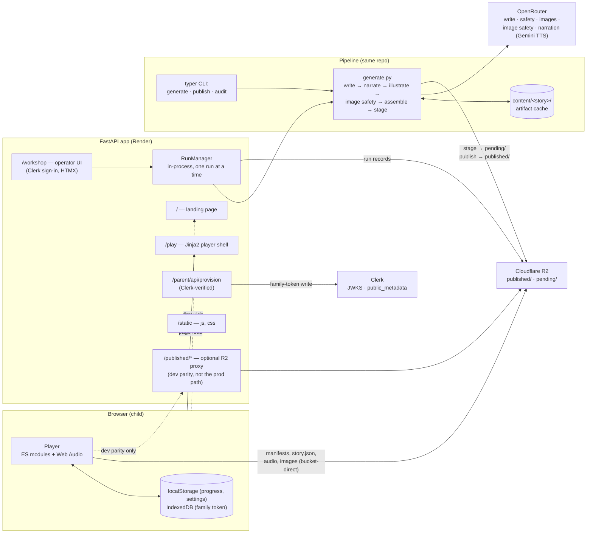
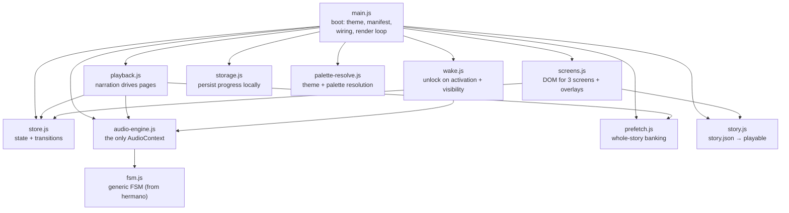
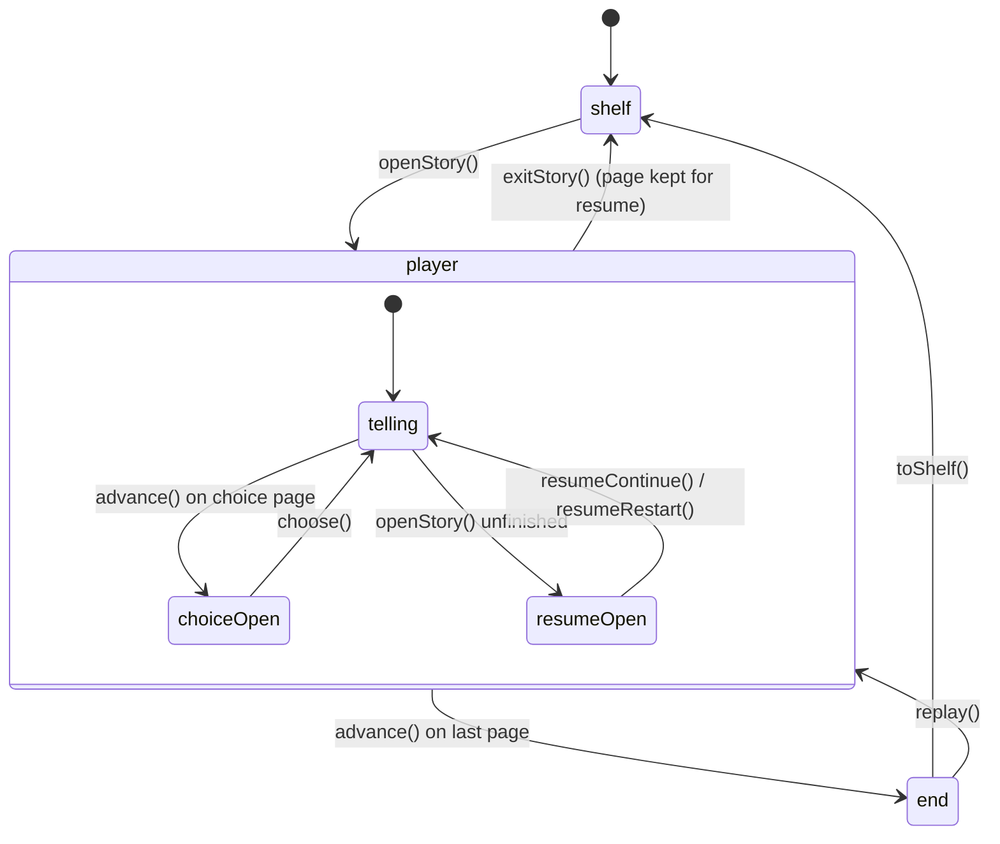
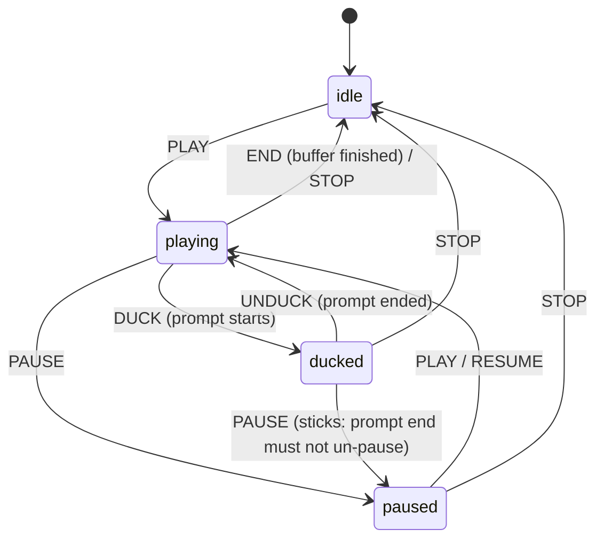
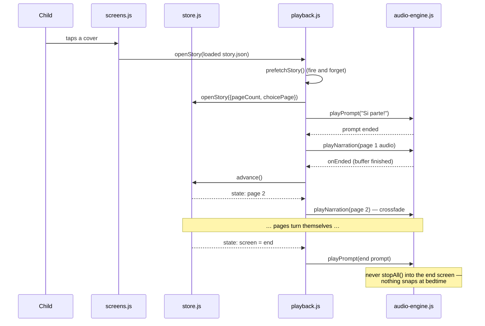
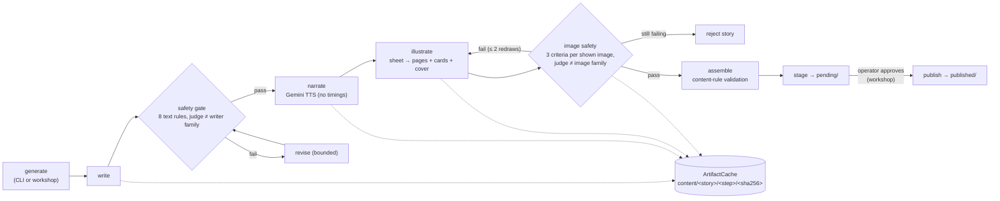
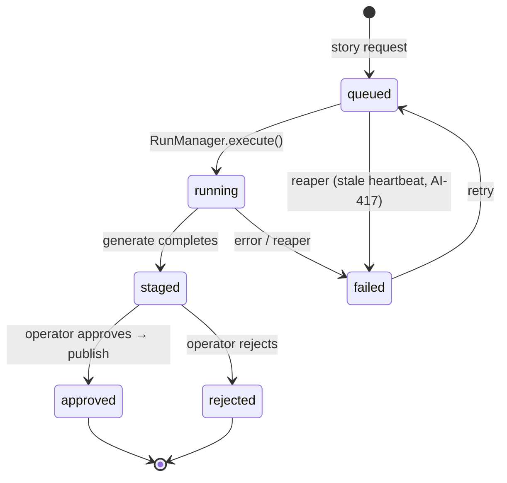

# Cantastorie — System Overview (As Built)

This document explains the system **as it exists in the code today**: what each module does, how they talk to each other, and where the seams are. It is the implementation companion to two other documents:

- [product.md](product.md) — what the product must do (behaviors, content rules, decision log)
- [architecture.md](architecture.md) — the settled design: stack choices and their rationale

Where this document and the code disagree, the code has moved on — fix this document. Where a *design decision* seems wrong, that conversation belongs in architecture.md, not in code.

---

## The System at a Glance

One FastAPI app serves a public landing page at `/` and the player shell at `/play`, offers an optional same-origin proxy onto the R2 bucket for dev parity, and hosts the operator workshop; everything the child experiences after page load happens in the browser. The authoring pipeline is a plain-Python package in the same repo, runnable two ways: as a CLI, and in-process through the workshop's `RunManager`. The app and the pipeline share `src/config.py` and the `story.json` contract.

```mermaid
flowchart LR
    subgraph Browser["Browser (child)"]
        P["Player<br/>ES modules + Web Audio"]
        LS[("localStorage (progress, settings)<br/>IndexedDB (family token)")]
        P <--> LS
    end

    subgraph App["FastAPI app (Render)"]
        L["/ — landing page"]
        T["/play — Jinja2 player shell"]
        PUB["/published/* — optional R2 proxy<br/>(dev parity, not the prod path)"]
        WS["/workshop — operator UI<br/>(Clerk sign-in, HTMX)"]
        PA["/parent/api/provision<br/>(Clerk-verified)"]
        S["/static — js, css"]
        RM["RunManager<br/>in-process, one run at a time"]
        WS --> RM
    end

    subgraph Pipeline["Pipeline (same repo)"]
        CLI["typer CLI:<br/>generate · publish · audit"]
        GEN["generate.py<br/>write → narrate → illustrate →<br/>image safety → assemble → stage"]
        Cache[("content/&lt;story&gt;/<br/>artifact cache")]
        CLI --> GEN
        GEN <--> Cache
    end

    OR["OpenRouter<br/>write · safety · images ·<br/>image safety · narration (Gemini TTS)"]
    CK["Clerk<br/>JWKS · public_metadata"]
    R2["Cloudflare R2<br/>published/ · pending/"]

    Browser -- "page load" --> T
    Browser -. "first visit" .-> L
    P -- "manifests, story.json,<br/>audio, images (bucket-direct)" --> R2
    P -. "dev parity only" .-> PUB
    PUB --> R2
    PA -- "family-token write" --> CK
    RM --> GEN
    GEN --> OR
    GEN -- "stage → pending/<br/>publish → published/" --> R2
    RM -- "run records" --> R2
```

The shell's `<meta name="asset-base">` tag is the only place the asset base URL lives. Its default is the `/static/content/` dev fixture. Production sets `ASSET_BASE` to the R2 bucket's public URL plus `/published` (e.g. `https://pub-<hash>.r2.dev/published`), so playback is bucket-direct and never touches the app ([`src/config.py`](../src/config.py), [`setup.md`](setup.md)). Setting `ASSET_BASE=/published` instead routes playback through [`src/api/routes/published.py`](../src/api/routes/published.py), an optional same-origin proxy for local or dev parity against a real bucket — not the production path.

**Trust boundary:** every provider secret — the OpenRouter key, the Clerk secret key, the LangSmith key, the R2 access keys — exists only in the server/pipeline environment as `SecretStr`, unwrapped at its transport boundary. The browser never sees a key; a played story costs zero API calls.

---

## The Player (`src/static/js/`)

Eleven ES modules, no framework, no bundler. `main.js` is the composition root; everything else is a factory function with injected dependencies (`fetchFn`, `engine`, `storage`), which is what makes the Vitest + jsdom suites possible. The last in the list below, `palette-resolve.js`, holds theme/palette resolution as the importable twin of `palette.js` — a synchronous head script (deliberately *not* a module, so it can set `data-palette`/`data-theme` on `<html>` before first paint). `workshop.js` also lives in this directory but belongs to the workshop UI, not the player.

```mermaid
flowchart TD
    main["main.js<br/>boot: theme, manifest,<br/>wiring, render loop"]
    store["store.js<br/>state + transitions"]
    playback["playback.js<br/>narration drives pages"]
    engine["audio-engine.js<br/>the only AudioContext"]
    wake["wake.js<br/>unlock on activation + visibility"]
    fsm["fsm.js<br/>generic FSM (from hermano)"]
    prefetch["prefetch.js<br/>whole-story banking"]
    story["story.js<br/>story.json → playable"]
    screens["screens.js<br/>DOM for 3 screens + overlays"]
    storage["storage.js<br/>persist progress locally"]
    palette["palette-resolve.js<br/>theme + palette resolution"]

    main --> store & playback & engine & wake & prefetch & story & screens & storage & palette
    playback --> store & engine & prefetch
    wake --> engine
    engine --> fsm
    screens --> story & store
```

### Module responsibilities

| Module | Owns | Key exports |
|--------|------|-------------|
| `main.js` | Boot order: theme (light/dusk by hour, `?theme=` override), manifest fetch with built-in fallback shelf, **family-overlay merge** (when a `family_token` is in IndexedDB, fetch `families/{token}/{lang}/manifest.json` and append its stories — dedupe by id, shared wins; a token-less boot makes zero overlay requests; an overlay fetch failure falls back to the shared shelf and never throws), wires `wake.js` for audio unlock and the shelf greeting (skipped on `.cover`/`.settings-gear` targets, and spoken only if its buffer lands while the child is still on the shelf), the render loop, the dev page-timer stand-in. Every manifest fetch carries `AbortSignal.timeout(MANIFEST_FETCH_TIMEOUT_MS)` (8 s), and the overlay is fetched in parallel with the shared manifest: a hung shared manifest falls into the offline clouds, a hung overlay into the shared shelf alone. A cover tap sets `.cover.loading` until its `story.json` settles. A published cover whose load fails or times out never plays the mock: the child stays on the shelf, the offline clouds show and speak, the failed promise is evicted, and a tap on the clouds retries that story, the clouds shimmering (`.offline.loading`) while the retry is pending. Only a cover with no `story` URL runs on the page timer. A sequence token drops a superseded open (a double tap, a second cover, a language switch mid-load). Loaded stories are cached per session (cleared on a language switch), but the cache holds the pristine story: every open plays its own copy of `pages`, so a resume replay or a branch extension never leaks into the next open and a reopened story can follow the other arm | `init(root, {fetchFn, engine, readFamilyToken, manifestTimeoutMs, storyTimeoutMs})` → shell handle, `MANIFEST_FETCH_TIMEOUT_MS` |
| `store.js` | All player state and every legal transition; pure, no DOM, no audio; `choose(i)` records the tapped option in a `choices` array | `createStore`, `initialState` |
| `playback.js` | The playback loop: story-start prompt, narrating the current page, auto page turn on audio end, pause/resume at exact position; `extendPath()` appends a tapped arm to the played path and recomputes the next choice page; a stall watchdog (visible + playing only) pauses at the frozen offset and shows the sleeping bird if narration position stops advancing for `STALL_TIMEOUT_MS` | `createPlayback` |
| `audio-engine.js` | The single `AudioContext`; decoded-buffer cache; narration vs prompt channels; crossfades and ducking via gain ramps; `unlock()` resumes from any state that isn't `running`/`closed` (covers Safari's `interrupted`), and sets `navigator.audioSession.type = "playback"` where supported; `load()` aborts a fetch whose headers haven't arrived within `AUDIO_LOAD_TIMEOUT_MS` (8 s, injectable as `audioLoadTimeoutMs`; the body download is not timed, so a large WAV sharing bandwidth with prefetch is never cut off), and the rejection evicts the cache entry so the bird appears and the retry tap refetches | `createAudioEngine`, `CROSSFADE_SECONDS`, `AUDIO_LOAD_TIMEOUT_MS` |
| `wake.js` | `createWaker({ engine, root, doc, onFirstUnlock })`: capture-phase unlock listeners on every activation-triggering event (no `once`), plus unlock on a visible `visibilitychange`; fires `onFirstUnlock` exactly once, after the first successful unlock | `createWaker` |
| `fsm.js` | Tiny generic FSM: frozen machine, warn-and-ignore invalid transitions | `createMachine`, `interpret` |
| `prefetch.js` | On cover tap, bank every page's audio (decoded buffers) and image (HTTP cache), both branch arms included, plus each choice option's card image and spoken label; failures counted, never fatal | `createPrefetcher` |
| `story.js` | `loadStory()` validates `schema_version: 1`, orders pages by walking `next_page` links, resolves relative asset URLs (choice-card images and label audio included); the fetch is bounded by `AbortSignal.timeout(STORY_FETCH_TIMEOUT_MS)` (10 s); `pagesFrom(pageId)` walks one arm for branch following; also the mock shelf/story that back unpublished covers | `loadStory`, `orderPages`, `STORY_FETCH_TIMEOUT_MS`, `shelf`, `story` |
| `screens.js` | Detached-element builders for shelf, player, end screen, the choice/resume/settings overlays, and the failure states (audio-retry bird, offline clouds); the choice overlay shows each option's card image (a wash fallback when absent) behind its spoken label; `playerView()` derives captions/beads/images from a loaded story | `buildShelf`, `buildPlayer`, `updatePlayer`, … |
| `storage.js` | Progress persistence under one key (only `page` and the recorded `choices` are trusted from a saved payload; `load()` always normalizes `screen` back to `shelf` and drops the rest, so a reload never resumes mid-story on the mock view — AI-468); kept in localStorage under `cantastorie-shell` (the family token is the only thing in IndexedDB, read by `main.js`); failures are silent by design | `load`, `save` |
| `palette-resolve.js` | Theme (light/dusk by hour, `?theme=` override) and palette resolution; pure logic shared with the `palette.js` head script and the test suites | `VALID_PALETTES`, `resolvePalette`, `resolveTheme` |

### Player state (`store.js`)

The store is a plain object + listeners — a handful of booleans/numbers plus a `choices` array, not a framework. Screens are one axis; the two overlays are independent flags on top of the `player` screen.

```mermaid
stateDiagram-v2
    [*] --> shelf
    shelf --> player: openStory()
    state player {
        [*] --> telling
        telling --> choiceOpen: advance() on choice page
        choiceOpen --> telling: choose()
        telling --> resumeOpen: openStory() unfinished
        resumeOpen --> telling: resumeContinue() / resumeRestart()
    }
    player --> end: advance() on last page
    player --> shelf: exitStory() (page kept for resume)
    end --> player: replay()
    end --> shelf: toShelf()
```

Three details worth knowing:

- **`advance()` is the only forward motion**, and it refuses to act while paused or while an overlay is open. Narration end and the dev timer both funnel through it.
- **`choose(i)` follows the branch** — the player extends the played path with the tapped arm (`playback.extendPath`) *before* `choose()` advances the index, so the store never needs to know the story graph; the picked index is kept in `choices` and replayed on resume.
- **Exiting keeps `page`** — that is what makes the resume offer ("Continuiamo o ricominciamo?") work when the same cover is tapped again.

### The audio engine (`audio-engine.js`)

The iOS constraint (media-element volume is read-only) is why this module exists; every fade is a gain-node ramp on Web Audio buffers. Two channels with one hard rule: **narration tells the story, prompts speak the UI, and they never overlap.**

```mermaid
stateDiagram-v2
    [*] --> idle
    idle --> playing: PLAY
    playing --> paused: PAUSE
    playing --> ducked: DUCK (prompt starts)
    playing --> idle: END (buffer finished) / STOP
    paused --> playing: PLAY / RESUME
    paused --> idle: STOP
    ducked --> playing: UNDUCK (prompt ended)
    ducked --> paused: PAUSE (sticks: prompt end must not un-pause)
    ducked --> idle: STOP
```

Mechanics that the rest of the system relies on:

- **Crossfade = overlapping ramps.** Starting page N+1's narration while page N is fading out (0.9 s, `CROSSFADE_SECONDS`) is the gentle page turn.
- **Exact-position hold.** Pausing or ducking computes the playhead offset and stores `{url, offset, onEnded}`; resuming restarts the buffer at that offset. It lives in memory only: across a reload, `storage.js` keeps the page and branch choices, not the offset.
- **`_manualStop` discipline.** A deliberately silenced source must not fire its natural `onended` chain; a stale voice never turns the page.
- **`load()` is the prefetch bank.** Decoded buffers are cached per URL and deduped by promise, so prefetch and playback share one in-flight fetch.

### One story night through the modules

```mermaid
sequenceDiagram
    participant Child
    participant screens as screens.js
    participant store as store.js
    participant playback as playback.js
    participant engine as audio-engine.js

    Child->>screens: taps a cover
    screens->>playback: openStory(loaded story.json)
    playback->>playback: prefetchStory() (fire and forget)
    playback->>store: openStory({pageCount, choicePage})
    playback->>engine: playPrompt("Si parte!")
    engine-->>playback: prompt ended
    playback->>engine: playNarration(page 1 audio)
    engine-->>playback: onEnded (buffer finished)
    playback->>store: advance()
    store-->>playback: state: page 2
    playback->>engine: playNarration(page 2) — crossfade
    Note over store,engine: … pages turn themselves …
    store-->>playback: state: screen = end
    playback->>engine: playPrompt(end prompt)
    Note over engine: never stopAll() into the end screen —<br/>nothing snaps at bedtime
```

While a cover has no `story` URL at all (a published story that fails to load shows the offline clouds instead), a page timer (3.8 s, `?speed=` override) stands in for narration end — same `store.advance()` path, so the state machine is exercised identically in dev.

---

## The Pipeline (`src/pipeline/`)

Plain Python, typed end to end. The full run is live: `generate` walks write → safety (→ revise, bounded) → narrate → illustrate → image safety (→ redraw, bounded) → assemble and stages the result; `publish` promotes a staged story to the public bucket and updates the manifest. `generate.py` is the one authoring function — the CLI and the workshop's `RunManager` are two front doors to it. Glosses and word timings are the two steps that do not exist yet (slice 6).

```mermaid
flowchart LR
    G["generate<br/>(CLI or workshop)"] --> W["write"]
    W --> SG{"safety gate<br/>8 text rules, judge ≠ writer family"}
    SG -- pass --> N["narrate<br/>Gemini TTS (no timings)"]
    SG -- fail --> RV["revise (bounded)"]
    RV --> SG
    N --> I["illustrate<br/>sheet → pages + cards + cover"]
    I --> IS{"image safety<br/>3 criteria per shown image,<br/>judge ≠ image family"}
    IS -- "fail (≤ 2 redraws)" --> I
    IS -- "still failing" --> RJ["reject story"]
    IS -- pass --> A["assemble<br/>content-rule validation"]
    A --> ST["stage → pending/"]
    ST -- "operator approves<br/>(workshop)" --> PB["publish → published/"]

    Cache[("ArtifactCache<br/>content/&lt;story&gt;/&lt;step&gt;/&lt;sha256&gt;")]
    W -.-> Cache
    N -.-> Cache
    I -.-> Cache
    IS -.-> Cache
```

### Module responsibilities

| Module | Owns | Notable constraints enforced in code |
|--------|------|--------------------------------------|
| `models.py` | The `story.json` contract (`Story`, `Page`, `ChoicePoint`, `ChoiceOption`, `WordTiming`) and safety vocabulary | `Language`/`Theme` are `Literal` types locked to the product doc; `Story.shape` is `linear`/`branching`; `ChoicePoint` is exactly two options, each `ChoiceOption` carrying an optional `card_image` and spoken `audio`; `SafetyReport` must contain each of the eight text rules exactly once; `ImageSafetyReport` each of `no_text` / `nothing_frightening` / `calm` exactly once |
| `cache.py` | Content-addressed artifact store; the filesystem **is** the checkpoint | `cache_key()` = sha256 of canonical-JSON inputs; writes are tmp-then-rename atomic; `run_step()` makes unchanged inputs a pure lookup — zero API calls |
| `providers.py` | The only transport: Pydantic AI over OpenRouter; narration via OpenRouter's `/audio/speech` (Gemini 3.1 Flash TTS) | Keys are `SecretStr`, unwrapped only at the transport boundary; `build_model` wraps every chat model in Pydantic AI's `OpenRouterProvider`, so the judges' temperature 0 is really sent (a bare `OpenAIProvider` strips it from `openai/...` ids; `tests/pipeline/test_judge_temperature.py` asserts it on the wire); narration requests `pcm` (Gemini rejects `mp3`) and wraps it into a WAV container, with no timestamps (ADR-008; Deepgram STT reconstructs them at slice 6) |
| `generate.py` | The whole authoring run, write through stage, as one function — the seam shared by the CLI and the workshop's `RunManager` | Provider seams (models, narration client, image transport) are injectable, so the full run is exercised with zero network |
| `cli.py` | `generate` / `publish` / `publish-prompts` / `audit` entry points — all live | All run the real machinery; `audit` verifies every reachable published asset (`audit_published_bucket`) and also runs in CI (AI-378); `publish-prompts` refuses to write the shared bucket without `--yes` |
| `prompts.py` | The operator's spoken-prompt step (H6, AI-481): `publish_prompts` narrates a language's five lines, uploads them to `published/prompts/{lang}/`, and merges them into the live manifest; `write_dev_prompts` writes the same audio as the same-origin dev fixtures | Audio comes from the narrate step's cache (`content/_prompts/`), so reruns are free; the manifest write goes through `_write_manifest` (IfMatch + retry), never a bare PUT; `dry_run` makes no TTS call and no write |
| `steps/narrate.py` | Page, choice-label and spoken-prompt narration; the prompt lines for every `Language` are `UTTERANCE_TEXTS` in `steps/utterance_texts.py` | Each language synthesizes its own lines; a test fails CI if any `Language` lacks any prompt, and another if `main.js` `LANGS` drifts from `Language` |
| `steps/illustrate.py` | Character sheet first, then every page and the cover generated **against that sheet** — never page-to-page chaining (drift compounds) | `STYLE_PROMPT` is a module constant participating verbatim in every cache key: edit it and every image knowingly regenerates. Uses httpx against OpenRouter chat completions directly because pydantic-ai 2.5.0 can't parse image *outputs*; the ban is on direct vendor SDKs, and OpenRouter remains the only gateway |
| `steps/image_safety.py` | **Calm pictures** on the rendered images ([ADR-011](adr/ADR-011-image-safety-vision-judge.md)): `illustrate_safely` judges every page, choice card and cover (not the character sheet, which never ships) with a vision model over OpenRouter, redraws a failing image, and rejects the story past the bound | Pydantic AI with a typed `ImageSafetyReport`, temperature 0, the PNG sent as a base64 data URL; verdicts cached on the image's SHA-256; a redraw bumps a per-slot `regeneration` cache input so only that image is re-bought; `IMAGE_SAFETY_MAX_REGENERATIONS = 2`, then `ImageSafetyRejectedError` (its message lands on the failed run record) |
| `src/observability.py` (logging) | Application logging for both halves (B6, AI-485): `configure_logging` installs one stdout handler with key=value lines; `timed_step` logs `step_finished` with `duration_ms` per pipeline step; `run_context` tags step logs with the run's `run_id` | stdlib only; idempotent; `src.*` at `LOG_LEVEL` (default `INFO`), third-party at `WARNING`; uvicorn keeps its own handlers, and `uvicorn.access` gains an `AccessLogRedactor` filter that hashes family tokens in request paths. A family token is only ever logged as `family_hash()` (12 hex of a salted sha256); no story text, premise, keys or request bodies |
| `src/config.py` | Settings for both halves (shared with the API) | Model validators **refuse config where the safety judge and writer share a model family**, and where the image safety judge (`image_safety_model`) and `image_model` do — the shared-blind-spot failure mode |

### Why the cache shape matters

Every step's inputs — text, style prompt, sheet hash, model ID — hash into the artifact's cache key. The consequences are the pipeline's two core properties:

1. **Crash-safe resume.** A failure at `illustrate` never re-buys `narrate`; artifacts already on disk are simply found.
2. **Precise regeneration.** Editing page 5's text regenerates page 5's audio and image, nothing else. Re-running an unchanged story costs nothing.

---

## The Workshop (`src/workshop/`, `/workshop`)

The operator face (AI-388, [ADR-005](adr/)): start runs, watch progress, review staged stories, publish. Server-rendered Jinja2 + HTMX — the settled non-child pattern — with a vanilla-JS `workshop.js` for widgets.

**Access is Clerk sign-in, not a shared secret (AI-426, [ADR-005](adr/)).** With Clerk unconfigured, every `/workshop` route answers 404 — the workshop does not exist. Each request resolves a `WorkshopScope` from the verified Clerk session JWT (`src/workshop/scope.py`): an **operator** (`public_metadata.role == "operator"`) works globally across all families; any other signed-in user is a **parent** scoped to their own `family_token`. Post-sign-in navigation is role-dispatched (AI-430): every authed entry point serves its own role and 303-redirects the other (`_nav.py` → `home_path`) — operators land on `/workshop`, parents on their own `/parent` surface — so neither role meets a dead end or a redirect loop. ClerkJS loads on every workshop and parent page to keep the short-lived `__session` JWT refreshed so HTMX polling does not 401 a minute after sign-in.

**One run, one story (AI-480).** A run takes a `StoryRequest` (theme, language, optional premise, shape) and makes exactly one story: the manager's `generate` seam (default `_generate_staged_story`) calls `generate_story` once and the staged prefix becomes the record's `story_id`. There is no count and no batch.

**Runs execute in-process.** `RunManager` runs `generate_story` as an asyncio background task in the same FastAPI process — `asyncio.to_thread` for the sync pipeline code, an `asyncio.Lock` for one-run-at-a-time. There is no queue framework.

**Durability lives in R2, not the container.** Every state change persists to the `RunStore` — `pending/{family-token}/runs/{run-id}.json` — *before* anything else happens; in particular the `running` state hits R2 before the first step executes, so a crash mid-generation always leaves a record `resume_on_boot()` can find. Render's disk is ephemeral; the bucket is the source of truth. Records are values (`advance()` returns a copy), transitions are validated against the lifecycle, and a stale record cannot overwrite a newer one (`ConcurrentModificationError`). A record is `schema_version` 2: one `story_id` (None until staged), a `reviewed` flag, and `reviewed_digest`, the digest of the staged bytes the review page showed (H1). Records saved as schema 1 held a list of story ids and a list of reviewed ids; a read-time shim (`RunRecord._upgrade_v1`) maps the list to its first id — logging a warning naming any ids it drops — and sets `reviewed` when that id was in the reviewed list. The next save writes schema 2; approved and rejected records are never saved again, so the shim stays. In short: run records are schema 2 (`story_id`, `reviewed`), and v1 records (`story_ids`, `reviewed_story_ids`, `count`) upgrade on read.

`resume_on_boot()` is actually invoked (B5, AI-477): a FastAPI `lifespan` in `src/api/main.py`, gated on R2 being configured, schedules `reap_stale()` then `resume_on_boot()` as a background `asyncio.Task` on startup — never awaited, so `/health` (and Render's deploy gate) stays responsive while a resumed run is still generating — and cancels it cleanly on shutdown. Exceptions inside that task are logged and reported to Sentry rather than vanishing silently. During a Render rolling deploy, the outgoing and incoming instance can briefly both resume the same record — see `docs/setup.md` for the accepted cost. (A parent-reachable self-heal path, so a family isn't stuck waiting on an operator, ships separately under AI-483.)

```mermaid
stateDiagram-v2
    [*] --> queued: story request
    queued --> running: RunManager.execute()
    queued --> failed: reaper (stale heartbeat, AI-417)
    running --> staged: generate completes
    running --> failed: error / reaper
    failed --> queued: retry
    staged --> approved: operator approves → publish
    staged --> rejected: operator rejects
    approved --> [*]
    rejected --> [*]
```

Two properties keep the lifecycle honest:

- **The reaper (`reap_stale`, AI-417)** retires `queued`/`running` records whose heartbeat is too old to belong to a live process — a deploy or crash left them stranded — marking them `failed` with a distinct "the workshop restarted" note so the screen can tell an interruption apart from a pipeline error. Terminal and review-waiting states are never swept.
- **Retry re-buys nothing.** `failed → queued` is a legal edge because the step functions run against the content-addressed `ArtifactCache`: completed steps are pure lookups, so a resumed or retried run only pays for what never finished.

Progress shown in the UI is read from the run record plus the working folder's checkpoint dirs — there is no parallel status store. Publish calls the pipeline's `publish_story`, which remains the only writer to `published/`; nothing under `pending/` is ever listed in a manifest. `publish_story(..., family_token=…)` selects the lane: an operator approve publishes to the **shared shelf** (`published/stories/…` + `published/{lang}/manifest.json`); a parent approve (`POST /parent/runs/{id}/approve`) publishes to that family's **private overlay** (`published/families/{token}/…`). A parent approve is gated on review (B2): opening the run's story on its review page (`GET /parent/staged/{story_id}`, which renders every page) sets the record's `reviewed` flag and `reviewed_digest` (`staged_digest`: the story.json bytes plus every staged asset's name and ETag), and approve answers 409 when the run has no story, when it is unreviewed, when the staged story is gone from the pending bucket, or when the staged story no longer matches the reviewed digest (H1). Approve passes the digest to `publish_story(expected_digest=…)`, which checks again before copying anything. Re-staging clears both; records saved before review tracking, or reviewed before digests existed, count as unreviewed. Each workshop run stages under its own story id: `derive_story_id` folds in the run id as a nonce, so no two runs share a staged key. An operator approve of a run with no story is also a 409. The family-token prefix is validated (`^[0-9a-f]{32}$`) before it becomes a key; the lanes never cross and private is never promoted to global. Per-language content is plain per-language manifests and prompts, with no pack or registry layer.

---

## The App (`src/api/`)

An app factory (`create_app`) that initializes observability, adds LangSmith's `TracingMiddleware` (`src/observability.py`), mounts `/static`, and includes `/health` (which the Dockerfile healthcheck and Render both poll) plus five routers:

| Router | Path | What it does |
|--------|------|--------------|
| `landing.py` | `/` | The public landing page (`templates/landing.html`, AI-433): what the product is, with links to `/play` and `/parent`. Static, Clerk-free, no child data, no server calls |
| `player.py` | `/play` | Deliberately thin: renders `templates/index.html`, injecting the `asset-base` meta tag |
| `published.py` | `/published` | Optional same-origin R2 proxy for local/dev parity against a real bucket (production playback is bucket-direct). Unauthenticated, so it serves only the key shapes `publish_story` writes (`{lang}/manifest.json`, `stories/{id}/…`, `prompts/{lang}/…`, optionally under `families/{token}/`); anything else, including encoded dot segments, is a 404 before R2 is asked. Streams the body and passes through R2's `Cache-Control`/`ETag` |
| `parent.py` | `/parent` | Clerk-gated parent surface (Jinja2 + HTMX): sign-in, the story request form (`POST /parent/runs`), the Being made list with progress polling (`GET /parent/runs/{id}/progress`), reviewing the run's staged story (`/parent/staged/{id}`), and **approving a reviewed story to the family's private overlay** (`POST /parent/runs/{id}/approve` → `publish_story(..., family_token=…)`; 409 until the story is reviewed) or rejecting it (`POST /parent/runs/{id}/reject`) — all scoped to the session's `family_token`, with per-family run caps (AI-411). `/parent/api/provision` mints-or-links the family token at first sign-in; `auth.py` verifies session JWTs via JWKS (async fetch, PyJWT), `clerk.py` writes the token to Clerk `public_metadata` |
| `workshop.py` | `/workshop` | Clerk-gated operator screens, operator role (Jinja2 + HTMX): start a run, watch step progress, review the staged story, publish. `src/workshop/manager.py` orchestrates runs in-process and reaps stale ones; `records.py` persists run records to the R2 pending bucket, surviving Render's ephemeral disk |

Unset Clerk config means the `/workshop` and `/parent` routers answer 404 — each area simply does not exist until configured.

The player template carries the three things the player boot needs: the design-system stylesheets (`tokens.css`, `player.css`), the `asset-base` meta tag, and the `#app` mount that `main.js` looks for.

### Parent identity (Clerk, [ADR-003](adr/ADR-003-parent-authentication-clerk.md))

- **`auth.py`** — two FastAPI dependencies, no vendor SDK: `require_parent_candidate` verifies the Clerk session JWT from the `__session` cookie (PyJWT + JWKS, RS256, issuer check; JWKS cached one hour with stale-if-error so a transient outage never logs every parent out) but tolerates a missing `family_token` claim; `require_parent` additionally requires it. The `disabled` claim is the kill switch (403), checked before any provisioning logic so a disabled account can never mint a token. With no `clerk_jwks_url` configured, `/parent` answers 404.
- **`clerk.py`** — the only module that calls Clerk's REST API, for one operation: a deep-merge `PATCH` writing `family_token` into the user's `public_metadata` at provision time. Everything else verifies locally via JWKS.
- **`parent.py`** — the provision endpoint is idempotent (a provisioned account gets its existing token back; rotation is a manual procedure). It links the browser's existing IndexedDB token when offered, otherwise mints 128 bits. The token pattern `^[0-9a-f]{32}$` is enforced strictly because the token becomes an R2 key prefix (`pending/{family_token}/…`) — posted strings must never smuggle path separators into bucket keys.

The `/parent` pages — sign-in, the story request form, and the Being made list with HTMX progress polling and per-family run caps — ship in AI-411 (one story per run since AI-480); the provision API mints the family token at first sign-in.

### Published-story CRUD

The operator library (`GET /workshop/library`, `POST /workshop/stories/{id}/delete`) lists everything published across **every lane** — the shared shelf and every family overlay — tagging each row with its owning family, flagging orphan story directories, and hard-deleting any story (launch content or a family's private story, via `?family_token=`). This is moderation, not promotion — there is no affordance to elevate a private story to the shared shelf. Parents get the same single destructive delete scoped to their **own overlay lane** (`GET /parent/stories`, `POST /parent/stories/{id}/delete`), with the token taken from the session. Both faces call `unpublish_story()` (lane-scoped by `family_token`); listing comes from `list_published_stories()` (each row tagged with its `family_token`, `None` for shared) and `list_orphan_story_dirs()`, all in [`src/pipeline/publish.py`](../src/pipeline/publish.py).

### Observability (`src/observability.py`)

LangSmith, off by default and inert when off. `init_observability` (called from `create_app` and the CLI) syncs settings into the env vars the SDK reads; `build_traced_openai_client` wraps the OpenRouter client; `typed_traceable` decorates pipeline steps; `TracingMiddleware` traces requests. With tracing disabled, all of these are pass-throughs.

Logging (B6, AI-485): `configure_logging` runs first in `create_app` and in the CLI callback. Events, one line each with their fields: `run_submitted`, `run_started`, `step_finished` (`step` = write / safety / revise / narrate / illustrate / image_safety / assemble / narrate_prompts / stage, with `duration_ms`; illustrate and image_safety once per redraw round), `image_redraw` (`slot`, `attempt`, failed `criteria`), `image_safety_rejected` and `story_safety_rejected` (criterion names and counts), `run_staged`, `run_failed` (`logger.exception` with traceback for unexpected errors; a safety rejection logs `outcome=safety_rejected`, `criteria` and `failure_count` at WARNING with no traceback, so no judge free text reaches stdout), `run_reaped`, `run_cap_rejected` (`reason` = `active_run` or `daily_cap`), `story_published` / `story_unpublished` (`story_id`, `lane` = `shared` or `family`), `boot_reap` and `boot_resume` (counts). A handler-level `RunIdFilter` stamps `run_id` from the run context on every record inside a run. Tracebacks on stdout render frames and exception type names only, never messages. `uvicorn.access` gets an `AccessLogRedactor` filter that hashes family tokens in request paths; the `/published` proxy logs `published_proxy_error` with the token segment stripped (`families/<family>/…`) and `family=<hash>`; the library's overlay delete sends `family_token` in the form body (`hx-vals`), not the URL. The CLI configures logging in a Typer callback for every command. Sentry's `LoggingIntegration` is set to breadcrumbs only (`event_level=None`), so a `logger.exception` beside an explicit `capture_exception` never files a second event, and a third-party `ERROR` log is no longer a Sentry event by itself.

---

## Testing Map

| Suite | Runner | What it pins down |
|-------|--------|-------------------|
| `tests/js/*.test.js` | Vitest + jsdom | Store transitions, audio-engine FSM + hold/resume math (mock AudioContext), playback loop ordering, prefetch dedupe/failure counting, `story.json` parsing and page ordering, palette resolution, shell boot |
| `tests/test_app.py`, `test_config.py`, `test_observability.py` | pytest | Routes, static mount, dev manifest fixture, settings (including the judge≠writer refusal), observability wiring |
| `tests/test_logging.py` | pytest | Structured logging (B6): idempotent configuration, the key=value format, per-step durations under `run_id`, failure tracebacks, cap rejections, publish/unpublish lanes, Sentry breadcrumbs-only, a full run whose every captured record is scanned for the raw family token, access-log and `/published` proxy token redaction, message-free tracebacks (type names and frames only), `run_id` stamping from the run context, and sentinel tests proving no judge free text or model output reaches any record from the text gate, the image gate, content-limit violations or a chained `ValidationError` |
| `tests/api/*` | pytest | Clerk JWT verification (`test_auth.py`), the Clerk metadata client against mocked transports (`test_clerk_client.py`), provision mint/link/idempotency (`test_parent_provision.py`), and the `/parent` pages, tenancy scoping, and Clerk-containment guard (`test_parent_pages.py`) |
| `tests/workshop/*` | pytest | Run-record lifecycle and transitions (`test_records.py`), manager execution/resume/reaper and per-family run caps (`test_manager.py`), workshop routes and Clerk auth (`test_routes.py`), `WorkshopScope` resolution (`test_scope.py`) |
| `tests/pipeline/*` | pytest | Model contract (eight-rule and three-criterion completeness, choice arity), cache atomicity and hit/miss, provider transports against mocked httpx, authoring/narrate/illustrate/image-safety/assemble steps, content rules, generate end to end, publish and audit |
| `tests/e2e/*.spec.js` | Playwright | The two-tap start, the full playback loop, failure states, and shelf-layout regressions in a real browser |

The provider and Clerk tests mock at the httpx-transport seam, so logic is tested without a key in the environment — the same property the runtime has.

---

## Current Stand-ins (deliberate, tracked)

| Stand-in | Real thing | Arrives with |
|----------|-----------|--------------|
| Page timer (3.8 s) for unpublished covers | Narration `onEnded` → `advance()` (already live for published stories) | more published stories |
| `/static/content/` as the *default* `asset_base` | Production sets `ASSET_BASE` to the R2 public URL + `/published` (bucket-direct); `ASSET_BASE=/published` (the app proxy) is an optional dev-parity setting; the fixture remains the dev default | per-deploy `ASSET_BASE` |
| `localStorage` progress and settings | IndexedDB (progress, settings, lockout), beside the family token already stored there | slice 2 |
| Empty word timings in `story.json` | Deepgram STT transcription pass | slice 6 (reading mode) |
| No gloss step in the pipeline | Word-to-English gloss maps (cheap model) | slice 6 (reading mode) |
| Five spoken prompts per language, published by `publish-prompts` (only `it` is live in production as of 2026-10-03; Spanish and English are final copy; the other lines are machine-drafted, pending native review) | All ten prompts per enabled language, reviewed | slice 4 |
| Mock shelf covers + captions | Manifest + published `story.json` per cover | pipeline output |
