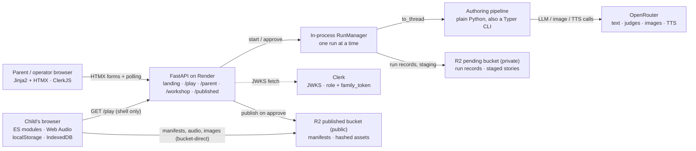
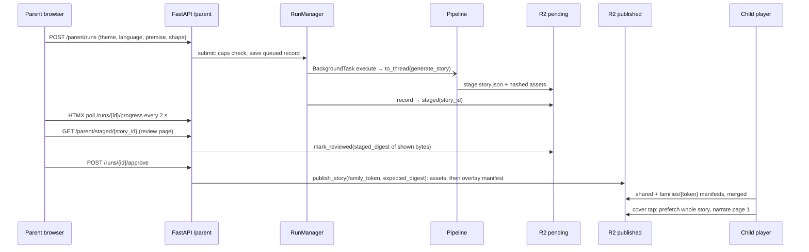
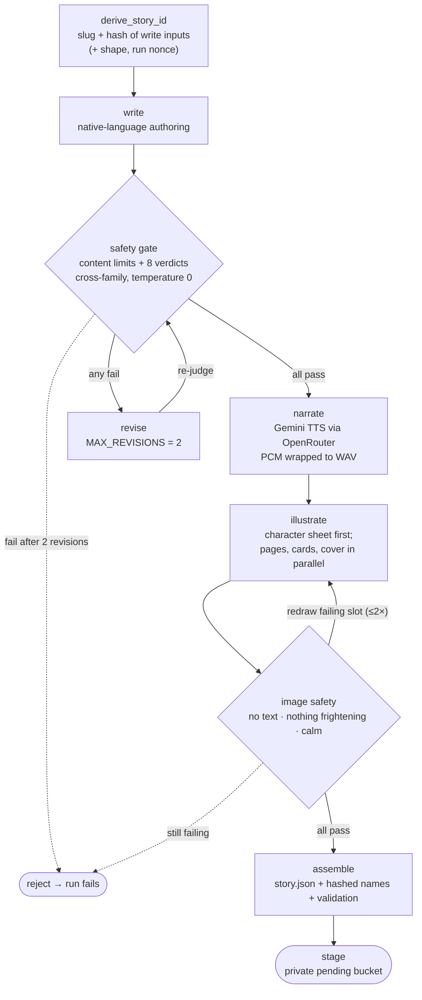
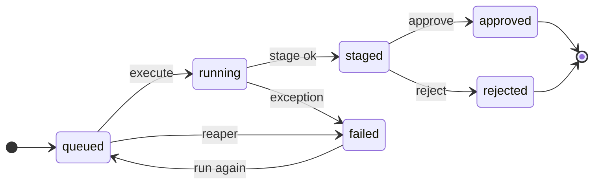
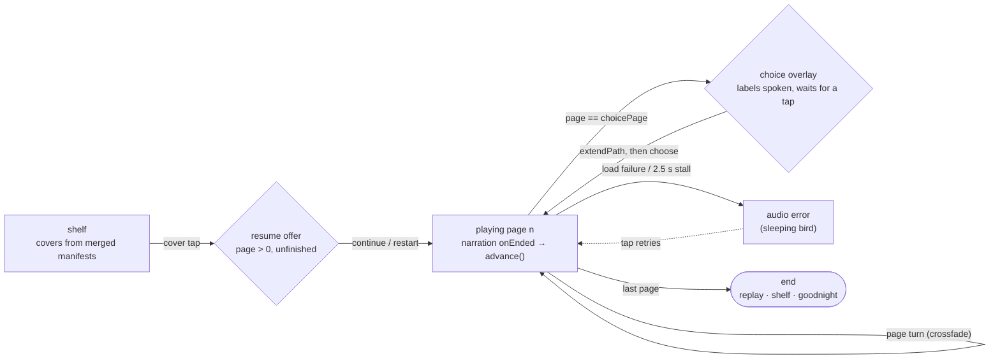

# Cantastorie — Architecture Whiteboard

> A modular walkthrough of the code as built, exported from the Whiteboard review "Cantastorie architecture" (version 21).

**Pinned to**: commit [`35f3b29`](https://github.com/darth-dodo/cantastorie/commit/35f3b2999825817fcb7588264037213a42d8e86c), 2026-10-10. Every code link below is a permalink to that commit, so line numbers stay exact as the code moves on. The settled design and its rationale live in [architecture.md](../architecture.md). The as-built module map lives in [system-overview.md](../system-overview.md). Where this page and the code disagree, the code wins: refresh this page rather than trusting it.

---

## Table of Contents

- [What It Is](#what-it-is)
- [Salient Features](#salient-features)
- [System Context](#system-context)
- [End to End: A Parent's Story Reaches Their Child](#end-to-end-a-parents-story-reaches-their-child)
- [Module 1: Web App](#module-1-web-app-srcapi)
- [Module 2: Authoring Pipeline](#module-2-authoring-pipeline-srcpipeline)
- [Module 3: Workshop Runs](#module-3-workshop-runs-srcworkshop)
- [Module 4: Content Storage and Publish](#module-4-content-storage-and-publish-srcpipelinepublishpy)
- [Module 5: Child Player](#module-5-child-player-srcstaticjs)
- [Module 6: Cross-Cutting](#module-6-cross-cutting-config-providers-observability)

---

## What It Is

Cantastorie is a bedtime-story app for children. Parents or an operator request stories, an AI pipeline writes, safety-checks, narrates and illustrates them, and a child plays them in a full-screen, audio-driven player.

The whole system is **one FastAPI app plus a plain-Python pipeline in the same codebase**, with Cloudflare R2 holding the content. It splits into six modules:

1. **Web app**: the FastAPI factory, routes and Clerk auth
2. **Authoring pipeline**: write, safety, revise, narrate, illustrate, image safety, assemble
3. **Workshop runs**: running the pipeline in-process and saving durable run records
4. **Content storage and publish**: staging, review binding, the two publish lanes, the audit
5. **Child player**: vanilla ES modules, an FSM and the Web Audio engine
6. **Cross-cutting**: config, provider transport and retries, observability

Three rules hold across all six: **story bytes never pass through the app server** (the player reads R2 directly), **everything is generated in advance** (playing a story makes no API calls), and **nothing about the child leaves the browser**.

---

## Salient Features

### For the child

- **Two taps to a story.** The first tap wakes the audio and plays the greeting; tapping a cover starts narration. Pages turn on their own when the narration ends, with slow gain-node crossfades ([`advance`](https://github.com/darth-dodo/cantastorie/blob/35f3b2999825817fcb7588264037213a42d8e86c/src/static/js/store.js#L75-L86), [`startNarration`](https://github.com/darth-dodo/cantastorie/blob/35f3b2999825817fcb7588264037213a42d8e86c/src/static/js/audio-engine.js#L102-L126)).
- **Branching stories.** A shared opening leads to a choice of two illustrated cards, each with a spoken label. The child's pick is remembered and replayed on resume ([`ChoicePoint`](https://github.com/darth-dodo/cantastorie/blob/35f3b2999825817fcb7588264037213a42d8e86c/src/pipeline/models.py#L83-L100), [`extendPath`](https://github.com/darth-dodo/cantastorie/blob/35f3b2999825817fcb7588264037213a42d8e86c/src/static/js/playback.js#L264-L275)). The overlay waits for a tap; the idle nudge and auto-continue are not built (AI-370).
- **Eight languages, each written natively.** it, es, en, el, de, bg, ru, mr ([`Language`](https://github.com/darth-dodo/cantastorie/blob/35f3b2999825817fcb7588264037213a42d8e86c/src/pipeline/models.py#L10)). Stories are authored directly in each language rather than translated, and every language has its own spoken prompts: greeting, story start, end, retry, offline ([`UtteranceName`](https://github.com/darth-dodo/cantastorie/blob/35f3b2999825817fcb7588264037213a42d8e86c/src/pipeline/steps/utterance_texts.py#L17)).
- **Survives real life.** Progress resumes on the right page and branch. The whole story is prefetched when the cover is tapped. A narration stall or load failure shows a sleeping bird that retries on tap, and losing the network shows a clouds screen that speaks a same-origin offline line ([`pollWatchdog`](https://github.com/darth-dodo/cantastorie/blob/35f3b2999825817fcb7588264037213a42d8e86c/src/static/js/playback.js#L80-L103), [offline loop](https://github.com/darth-dodo/cantastorie/blob/35f3b2999825817fcb7588264037213a42d8e86c/src/static/js/main.js#L261-L282)).
- **Bedtime light.** Light, dusk (the default), or auto, which is dusk from 19:00 to 07:00 ([`THEME_MODES`](https://github.com/darth-dodo/cantastorie/blob/35f3b2999825817fcb7588264037213a42d8e86c/src/static/js/palette-resolve.js#L20-L27)).
- **Private by design.** No account, no cookies, no analytics. Only the family token is stored, in IndexedDB, plus progress and settings in localStorage. The player fetches content directly from R2.

### For parents

- **Request a story.** Pick one of 12 gentle [themes](https://github.com/darth-dodo/cantastorie/blob/35f3b2999825817fcb7588264037213a42d8e86c/src/pipeline/models.py#L17-L30), a language, an optional premise of up to 300 characters, and linear or branching ([`parent_request_story`](https://github.com/darth-dodo/cantastorie/blob/35f3b2999825817fcb7588264037213a42d8e86c/src/api/routes/parent.py#L340-L385)).
- **Live progress.** An HTMX poll shows each pipeline step as it is checkpointed.
- **Review before it reaches the child.** The parent sees every page, picture and sound on one screen. Approval is tied to those exact bytes, and publishes only to that family's **private shelf** ([`parent_approve_run`](https://github.com/darth-dodo/cantastorie/blob/35f3b2999825817fcb7588264037213a42d8e86c/src/api/routes/parent.py#L423-L468)).
- **Fair use.** One active run per family plus a daily cap ([`blocking_cap`](https://github.com/darth-dodo/cantastorie/blob/35f3b2999825817fcb7588264037213a42d8e86c/src/workshop/manager.py#L90-L113)).
- **Same-device linking.** Signing in mints or links the family token, which is then adopted into the child's IndexedDB so the private shelf appears ([`provision`](https://github.com/darth-dodo/cantastorie/blob/35f3b2999825817fcb7588264037213a42d8e86c/src/api/routes/parent.py#L635-L664)).

### For the operator

- **Workshop bench.** Start runs, watch them, review staged stories, approve to the **shared shelf**, reject, run again, or delete ([workshop routes](https://github.com/darth-dodo/cantastorie/blob/35f3b2999825817fcb7588264037213a42d8e86c/src/api/routes/workshop.py#L293-L404)).
- **Moderation.** `/workshop/library` lists every published story across all lanes, including families' private ones, and the operator can delete them. Private stories are never promoted to the shared shelf ([`library`](https://github.com/darth-dodo/cantastorie/blob/35f3b2999825817fcb7588264037213a42d8e86c/src/api/routes/workshop.py#L246-L269)).
- **CLI.** `cantastorie generate | publish | publish-prompts | audit` calls the same step functions ([`cli.py`](https://github.com/darth-dodo/cantastorie/blob/35f3b2999825817fcb7588264037213a42d8e86c/src/pipeline/cli.py#L38-L185)).

### Safety and trust

- **Eight text rules** checked by a judge from a different model family at temperature 0: mildest peril only, no fear reinforcement, no brands, no romance, kindness resolves, within limits, right language, nothing real ([`SafetyRule`](https://github.com/darth-dodo/cantastorie/blob/35f3b2999825817fcb7588264037213a42d8e86c/src/pipeline/models.py#L32-L41)). A failing story gets at most two revisions, then it is rejected.
- **Three image checks** on every page, card and cover: no text, nothing frightening, calm. A failing image is redrawn at most twice, then the story is rejected.
- **Nothing unapproved can be reached.** Staged content lives in a separate private bucket (config refuses to start otherwise), and the audit checks every lane for leaks between families.

### Cost and operations

- **Pay once per asset.** Content-addressed caching means a re-run or a resumed run calls no provider for finished steps, and playing a story calls no provider at all.
- **One provider key** (OpenRouter) covers the whole default pipeline. Retries are limited to errors where the provider never served the request, so a retry can't bill twice.
- **One app to deploy.** A single FastAPI service on Render, always on. It reaps and resumes runs at boot without delaying `/health`.

---

## System Context



During story time the child's browser contacts the app only once, to load the `/play` shell ([`create_app`](https://github.com/darth-dodo/cantastorie/blob/35f3b2999825817fcb7588264037213a42d8e86c/src/api/main.py#L89-L131)). Everything after that is a bucket-direct fetch from R2. All provider keys (OpenRouter, R2, Clerk) stay on the server, and playing a story makes no provider calls.

---

## End to End: A Parent's Story Reaches Their Child



| Step | Code |
|------|------|
| Request | [`parent_request_story`](https://github.com/darth-dodo/cantastorie/blob/35f3b2999825817fcb7588264037213a42d8e86c/src/api/routes/parent.py#L340-L385) |
| Submit | [`RunManager.submit`](https://github.com/darth-dodo/cantastorie/blob/35f3b2999825817fcb7588264037213a42d8e86c/src/workshop/manager.py#L156-L189) |
| Execute | [`RunManager.execute`](https://github.com/darth-dodo/cantastorie/blob/35f3b2999825817fcb7588264037213a42d8e86c/src/workshop/manager.py#L191-L236) |
| Stage | [`stage_story`](https://github.com/darth-dodo/cantastorie/blob/35f3b2999825817fcb7588264037213a42d8e86c/src/pipeline/publish.py#L458-L486) |
| Progress poll | [`parent_run_progress`](https://github.com/darth-dodo/cantastorie/blob/35f3b2999825817fcb7588264037213a42d8e86c/src/api/routes/parent.py#L388-L420) |
| Review | [`parent_staged_story`](https://github.com/darth-dodo/cantastorie/blob/35f3b2999825817fcb7588264037213a42d8e86c/src/api/routes/parent.py#L503-L545), [`_record_review`](https://github.com/darth-dodo/cantastorie/blob/35f3b2999825817fcb7588264037213a42d8e86c/src/api/routes/parent.py#L482-L500) |
| Approve | [`parent_approve_run`](https://github.com/darth-dodo/cantastorie/blob/35f3b2999825817fcb7588264037213a42d8e86c/src/api/routes/parent.py#L423-L468) |
| Publish | [`publish_story`](https://github.com/darth-dodo/cantastorie/blob/35f3b2999825817fcb7588264037213a42d8e86c/src/pipeline/publish.py#L489-L612) |
| Shelf merge | [`fetchShelf`](https://github.com/darth-dodo/cantastorie/blob/35f3b2999825817fcb7588264037213a42d8e86c/src/static/js/main.js#L246-L257) |
| Prefetch | [`prefetchStory`](https://github.com/darth-dodo/cantastorie/blob/35f3b2999825817fcb7588264037213a42d8e86c/src/static/js/prefetch.js#L41-L62) |

The operator path is the same except that it uses `/workshop/runs`, publishes to the shared shelf ([`approve_run`](https://github.com/darth-dodo/cantastorie/blob/35f3b2999825817fcb7588264037213a42d8e86c/src/api/routes/workshop.py#L381-L404)), and calls `publish_story` **without** `expected_digest`. The digest binding therefore covers the family lane only; an operator approval publishes whatever is staged at that moment.

---

## Module 1: Web App (`src/api`)

[`create_app`](https://github.com/darth-dodo/cantastorie/blob/35f3b2999825817fcb7588264037213a42d8e86c/src/api/main.py#L89-L131) sets up logging, LangSmith and Sentry, then mounts `/static` and five routers:

| Router | Surface | Auth |
|--------|---------|------|
| [`landing`](https://github.com/darth-dodo/cantastorie/blob/35f3b2999825817fcb7588264037213a42d8e86c/src/api/routes/landing.py#L19-L21) | `GET /`: the public marketing page | none |
| [`player`](https://github.com/darth-dodo/cantastorie/blob/35f3b2999825817fcb7588264037213a42d8e86c/src/api/routes/player.py#L18-L25) | `GET /play`: the child shell, with `asset_base` injected | none, ever |
| [`published`](https://github.com/darth-dodo/cantastorie/blob/35f3b2999825817fcb7588264037213a42d8e86c/src/api/routes/published.py#L65-L97) | `GET /published/{path}`: streams R2 objects for dev/prod parity; the [path regex](https://github.com/darth-dodo/cantastorie/blob/35f3b2999825817fcb7588264037213a42d8e86c/src/api/routes/published.py#L37-L42) whitelists manifests, story assets and prompts | none |
| [`parent`](https://github.com/darth-dodo/cantastorie/blob/35f3b2999825817fcb7588264037213a42d8e86c/src/api/routes/parent.py#L66) | `/parent`: request, track, review and approve stories; provision a family token | Clerk, `require_parent` |
| [`workshop`](https://github.com/darth-dodo/cantastorie/blob/35f3b2999825817fcb7588264037213a42d8e86c/src/api/routes/workshop.py#L60) | `/workshop`: the operator dashboard, runs, staged review, library moderation | Clerk, operator role |

The lifespan hook [schedules (never awaits)](https://github.com/darth-dodo/cantastorie/blob/35f3b2999825817fcb7588264037213a42d8e86c/src/api/main.py#L61-L86) a boot task that reaps stale runs and resumes queued ones. Because it isn't awaited, `/health` answers right away and Render doesn't roll back the deploy.

### Auth and tenancy

The app uses no Clerk SDK. [`verify_clerk_session`](https://github.com/darth-dodo/cantastorie/blob/35f3b2999825817fcb7588264037213a42d8e86c/src/api/auth.py#L156-L196) reads the `__session` cookie, checks the RS256 signature against cached JWKS keys, and runs the **kill switch** (`disabled` → 403) before anything else looks at the claims. Two dependencies sit on top of it:

- [`require_parent_candidate`](https://github.com/darth-dodo/cantastorie/blob/35f3b2999825817fcb7588264037213a42d8e86c/src/api/auth.py#L204-L226) returns 404 when Clerk is unconfigured (so the feature doesn't exist) and 401 when there's no session. It lets through a parent who has no `family_token` yet, so [`/parent/api/provision`](https://github.com/darth-dodo/cantastorie/blob/35f3b2999825817fcb7588264037213a42d8e86c/src/api/routes/parent.py#L635-L664) can mint one or link an existing one.
- [`require_parent`](https://github.com/darth-dodo/cantastorie/blob/35f3b2999825817fcb7588264037213a42d8e86c/src/api/auth.py#L229-L243) also requires the token.

The workshop maps the same claims to a [`WorkshopScope`](https://github.com/darth-dodo/cantastorie/blob/35f3b2999825817fcb7588264037213a42d8e86c/src/workshop/scope.py#L19-L42). An operator gets `store_token="operator"` and publishes to the shared shelf. Everyone else is confined to their `family_token` partition and publishes to their own overlay. **The family token is the tenancy boundary.** It must match [`^[0-9a-f]{32}$`](https://github.com/darth-dodo/cantastorie/blob/35f3b2999825817fcb7588264037213a42d8e86c/src/api/routes/parent.py#L146-L155) because it becomes an R2 key prefix, and every run load is scoped to it (`manager.store.load(ctx.family_token, run_id)`), so another family's run returns 404.

---

## Module 2: Authoring Pipeline (`src/pipeline`)

The pipeline is a batch job, not an agent. [`generate_story`](https://github.com/darth-dodo/cantastorie/blob/35f3b2999825817fcb7588264037213a42d8e86c/src/pipeline/generate.py#L48-L110) is one linear function with **two bounded loops**: text revision and image redraw. Every step is a typed function that calls OpenRouter through Pydantic AI and validates the structured output. The CLI and the web `RunManager` both call this same function.



| Node | Code |
|------|------|
| derive_story_id | [`write.py#L175-L200`](https://github.com/darth-dodo/cantastorie/blob/35f3b2999825817fcb7588264037213a42d8e86c/src/pipeline/steps/write.py#L175-L200) |
| write | [`write_story`](https://github.com/darth-dodo/cantastorie/blob/35f3b2999825817fcb7588264037213a42d8e86c/src/pipeline/steps/write.py#L201-L245) |
| safety gate | [`safety_gate`](https://github.com/darth-dodo/cantastorie/blob/35f3b2999825817fcb7588264037213a42d8e86c/src/pipeline/steps/safety.py#L66-L86), [`_gate_failures`](https://github.com/darth-dodo/cantastorie/blob/35f3b2999825817fcb7588264037213a42d8e86c/src/pipeline/steps/revise.py#L112-L122) |
| revise loop | [`author_story`](https://github.com/darth-dodo/cantastorie/blob/35f3b2999825817fcb7588264037213a42d8e86c/src/pipeline/steps/revise.py#L160-L181) |
| narrate | [`narrate_pages`](https://github.com/darth-dodo/cantastorie/blob/35f3b2999825817fcb7588264037213a42d8e86c/src/pipeline/steps/narrate.py#L107-L129), [`narrate_choice_labels`](https://github.com/darth-dodo/cantastorie/blob/35f3b2999825817fcb7588264037213a42d8e86c/src/pipeline/steps/narrate.py#L130-L171) |
| illustrate | [`illustrate_story`](https://github.com/darth-dodo/cantastorie/blob/35f3b2999825817fcb7588264037213a42d8e86c/src/pipeline/steps/illustrate.py#L197-L320) |
| image safety | [`illustrate_safely`](https://github.com/darth-dodo/cantastorie/blob/35f3b2999825817fcb7588264037213a42d8e86c/src/pipeline/steps/image_safety.py#L152-L223) |
| assemble | [`assemble_story`](https://github.com/darth-dodo/cantastorie/blob/35f3b2999825817fcb7588264037213a42d8e86c/src/pipeline/steps/assemble.py#L127-L186) |
| stage | [`generate.py#L109-L110`](https://github.com/darth-dodo/cantastorie/blob/35f3b2999825817fcb7588264037213a42d8e86c/src/pipeline/generate.py#L109-L110) |

### Checkpointing = content-addressed cache

There is no graph framework. Each step's output is written to `content/{story-id}/{step}/{sha256(inputs)}` the moment it's produced, via [`run_step`](https://github.com/darth-dodo/cantastorie/blob/35f3b2999825817fcb7588264037213a42d8e86c/src/pipeline/cache.py#L40-L53), and the write is atomic: tmp file, then rename ([`ArtifactCache.store`](https://github.com/darth-dodo/cantastorie/blob/35f3b2999825817fcb7588264037213a42d8e86c/src/pipeline/cache.py#L31-L37)). Re-running an unchanged story costs zero API calls, and a crash during *illustrate* never re-pays for *narrate*.

The cache keys are chosen so a change regenerates as little as possible:

- A page image is keyed on page text + **character-sheet hash** + style prompt + model ([`_render_page`](https://github.com/darth-dodo/cantastorie/blob/35f3b2999825817fcb7588264037213a42d8e86c/src/pipeline/steps/illustrate.py#L238-L255)), so editing page 5 redraws only page 5.
- A safety redraw adds a `regeneration` count to *that one slot's* inputs ([`_regenerated`](https://github.com/darth-dodo/cantastorie/blob/35f3b2999825817fcb7588264037213a42d8e86c/src/pipeline/steps/illustrate.py#L75-L81)), so passing images stay cache hits.

### Safety by construction

- **Cross-family judges, enforced at config load.** `Settings` refuses to start if the text judge shares a family with the writer ([validator](https://github.com/darth-dodo/cantastorie/blob/35f3b2999825817fcb7588264037213a42d8e86c/src/config.py#L210-L215)), or the vision judge shares one with the image model ([validator](https://github.com/darth-dodo/cantastorie/blob/35f3b2999825817fcb7588264037213a42d8e86c/src/config.py#L217-L225)). It also refuses router aliases that could resolve to either family ([`_require_cross_family`](https://github.com/darth-dodo/cantastorie/blob/35f3b2999825817fcb7588264037213a42d8e86c/src/config.py#L24-L39)).
- **Complete verdicts.** [`SafetyReport`](https://github.com/darth-dodo/cantastorie/blob/35f3b2999825817fcb7588264037213a42d8e86c/src/pipeline/models.py#L121-L133) must contain each of the eight rules exactly once, so a judge that skips a rule fails validation rather than passing silently.
- **Bounded loops.** Two revisions for text, two redraws per image slot. Past that the story is rejected and never staged.

### The `story.json` contract

[`models.py#L83-L112`](https://github.com/darth-dodo/cantastorie/blob/35f3b2999825817fcb7588264037213a42d8e86c/src/pipeline/models.py#L83-L112) is shared by the pipeline and the player. A branching page carries a `ChoicePoint` instead of `next_page`; each option has its own card image, spoken label, and continuation. Timings stay empty until reading mode adds a Deepgram pass.

---

## Module 3: Workshop Runs (`src/workshop`)

A **run** is one story request: theme, language, optional premise, and shape. Its durable state is a [`RunRecord`](https://github.com/darth-dodo/cantastorie/blob/35f3b2999825817fcb7588264037213a42d8e86c/src/workshop/records.py#L108-L190) stored as JSON at `pending/{family_token}/runs/{run_id}.json` in the **private** pending bucket. Records are immutable values: [`advance`](https://github.com/darth-dodo/cantastorie/blob/35f3b2999825817fcb7588264037213a42d8e86c/src/workshop/records.py#L158-L178) returns a copy and rejects any transition not in the [lifecycle table](https://github.com/darth-dodo/cantastorie/blob/35f3b2999825817fcb7588264037213a42d8e86c/src/workshop/records.py#L44-L57). [`RunStore.save`](https://github.com/darth-dodo/cantastorie/blob/35f3b2999825817fcb7588264037213a42d8e86c/src/workshop/records.py#L229-L251) writes with `IfMatch=etag`, so if two tabs race, one gets a `ConcurrentModificationError` instead of a silently lost update.



[`RunManager`](https://github.com/darth-dodo/cantastorie/blob/35f3b2999825817fcb7588264037213a42d8e86c/src/workshop/manager.py#L133-L299) handles orchestration:

- **Submit** ([`submit`](https://github.com/darth-dodo/cantastorie/blob/35f3b2999825817fcb7588264037213a42d8e86c/src/workshop/manager.py#L156-L173)) applies the family caps through [`blocking_cap`](https://github.com/darth-dodo/cantastorie/blob/35f3b2999825817fcb7588264037213a42d8e86c/src/workshop/manager.py#L90-L113): one queued or running run per family, then a daily cap. The operator is exempt.
- **Execute** ([`execute`](https://github.com/darth-dodo/cantastorie/blob/35f3b2999825817fcb7588264037213a42d8e86c/src/workshop/manager.py#L191-L236)) runs as a FastAPI `BackgroundTask`. It calls `generate_story` through `asyncio.to_thread` under a single `asyncio.Lock`, so **one generation runs at a time per process**. The run id is passed as the story-id nonce, so no other run can stage over this run's story, and a resumed run finds its own cache again.
- **Crash recovery has no queue system.** A restart is not a state: at boot, [`reap_stale`](https://github.com/darth-dodo/cantastorie/blob/35f3b2999825817fcb7588264037213a42d8e86c/src/workshop/manager.py#L238-L282) first retires live runs whose `updated_at` is older than a generous threshold, then [`resume_on_boot`](https://github.com/darth-dodo/cantastorie/blob/35f3b2999825817fcb7588264037213a42d8e86c/src/workshop/manager.py#L284-L299) re-enters the queued and running runs that are left. `reap_stale` is throttled and also runs from the 2-second HTMX progress poll, so a stranded run's own poll fixes it.

The content cache makes resume cheap, because a re-entered run re-pays only for steps that hadn't finished.

---

## Module 4: Content Storage and Publish (`src/pipeline/publish.py`)

Content lives in two R2 buckets. The **pending** bucket is private and holds run records plus staged stories. The **published** bucket is public-read with access logs off, and holds manifests plus content-hashed assets. Publishing is a *copy* from pending to published; it never regenerates anything. Two lanes share the published bucket: the operator's **shared shelf** and each family's **private overlay** under `families/{token}/`. [`_publish_root`](https://github.com/darth-dodo/cantastorie/blob/35f3b2999825817fcb7588264037213a42d8e86c/src/pipeline/publish.py#L66-L77) chooses the lane and validates the token before it becomes part of a key. Nothing moves from the private overlay to the shared shelf.

### R2 layout and who reads or writes it

```
R2 pending bucket (private)
├── pending/{family_token|operator}/runs/{run_id}.json   RunRecord: id, state, story_id, reviewed_digest
└── pending/staged/{story_id}/                           story.json + hashed wav/webp assets

R2 published bucket (public)
├── published/{lang}/manifest.json                       shared shelf: stories[], prompts{}
├── published/stories/{story_id}/                        story.json + immutable hashed assets
└── published/families/{token}/…                         the same layout, per family overlay
```

| Use case | Actor | Operation | Code |
|----------|-------|-----------|------|
| Generate | RunStore | write run record with IfMatch | [`RunStore.save`](https://github.com/darth-dodo/cantastorie/blob/35f3b2999825817fcb7588264037213a42d8e86c/src/workshop/records.py#L229-L251) |
| Generate | Pipeline | write staged story | [`stage_story`](https://github.com/darth-dodo/cantastorie/blob/35f3b2999825817fcb7588264037213a42d8e86c/src/pipeline/publish.py#L458-L486) |
| Review | Review page | read staged bytes → digest | [`staged_digest`](https://github.com/darth-dodo/cantastorie/blob/35f3b2999825817fcb7588264037213a42d8e86c/src/pipeline/publish.py#L141-L182) |
| Review | Review page | write `reviewed_digest` | [`_record_review`](https://github.com/darth-dodo/cantastorie/blob/35f3b2999825817fcb7588264037213a42d8e86c/src/api/routes/parent.py#L482-L500) |
| Approve | `publish_story` | re-check digest | [`publish.py#L526-L537`](https://github.com/darth-dodo/cantastorie/blob/35f3b2999825817fcb7588264037213a42d8e86c/src/pipeline/publish.py#L526-L537) |
| Approve | `publish_story` | copy assets if new, immutable cache | [`publish.py#L555-L576`](https://github.com/darth-dodo/cantastorie/blob/35f3b2999825817fcb7588264037213a42d8e86c/src/pipeline/publish.py#L555-L576) |
| Approve | `publish_story` | manifest last, IfMatch retry | [`_write_manifest`](https://github.com/darth-dodo/cantastorie/blob/35f3b2999825817fcb7588264037213a42d8e86c/src/pipeline/publish.py#L366-L426) |
| Play | Child player | read shared + overlay manifests, merged | [`mergeOverlay`](https://github.com/darth-dodo/cantastorie/blob/35f3b2999825817fcb7588264037213a42d8e86c/src/static/js/main.js#L104-L113) |
| Play | Child player | whole-story prefetch | [`prefetchStory`](https://github.com/darth-dodo/cantastorie/blob/35f3b2999825817fcb7588264037213a42d8e86c/src/static/js/prefetch.js#L41-L62) |

### Publish invariants

- **No approval without a review of the exact bytes (B2/H1).** Opening the review page records a [`staged_digest`](https://github.com/darth-dodo/cantastorie/blob/35f3b2999825817fcb7588264037213a42d8e86c/src/pipeline/publish.py#L141-L148): the SHA-256 of `story.json` plus each asset's name and ETag. A parent's approve is refused unless the run is [`fully_reviewed`](https://github.com/darth-dodo/cantastorie/blob/35f3b2999825817fcb7588264037213a42d8e86c/src/workshop/records.py#L180-L184) and the current digest still matches ([parent approve](https://github.com/darth-dodo/cantastorie/blob/35f3b2999825817fcb7588264037213a42d8e86c/src/api/routes/parent.py#L446-L464)). `publish_story` then checks the digest *again* before copying anything, which closes the gap between the route's check and the write.
- **Immutable assets, one volatile file.** Asset names carry a content hash and are served with `max-age=31536000, immutable`. Only the manifest is short-lived (`max-age=60`) and it is written **last**, so a manifest never lists an asset that hasn't arrived yet ([`publish.py#L542-L576`](https://github.com/darth-dodo/cantastorie/blob/35f3b2999825817fcb7588264037213a42d8e86c/src/pipeline/publish.py#L542-L576)).
- **Idempotent and race-safe.** Every upload is skipped if unchanged (ETag vs MD5, [`_upload_if_new`](https://github.com/darth-dodo/cantastorie/blob/35f3b2999825817fcb7588264037213a42d8e86c/src/pipeline/publish.py#L259-L285)). Manifest writes use load–mutate–write with `IfMatch` and up to 3 attempts ([`_write_manifest`](https://github.com/darth-dodo/cantastorie/blob/35f3b2999825817fcb7588264037213a42d8e86c/src/pipeline/publish.py#L366-L426)), so two families approving at once can't drop each other's entry.
- **The audit is the backstop.** [`audit_published_bucket`](https://github.com/darth-dodo/cantastorie/blob/35f3b2999825817fcb7588264037213a42d8e86c/src/pipeline/publish.py#L777-L792) walks every lane. It flags any manifest URL that points into `pending/`, outside `published/`, or into *another lane* (a cross-tenant leak), plus missing assets and unlisted orphan story directories.

---

## Module 5: Child Player (`src/static/js`)

The player is vanilla ES modules with no bundler, no framework, no auth SDK and no cookies. The server's only job is to render [`index.html`](https://github.com/darth-dodo/cantastorie/blob/35f3b2999825817fcb7588264037213a42d8e86c/src/api/routes/player.py#L18-L25) with an `asset-base` meta tag. [`init`](https://github.com/darth-dodo/cantastorie/blob/35f3b2999825817fcb7588264037213a42d8e86c/src/static/js/main.js#L213-L286) in `main.js` is the composition root. It reads the theme and language, loads saved progress into the store, reads the **family token from IndexedDB**, fetches the shared manifest and the family overlay manifest *in parallel*, merges them ([`fetchShelf`](https://github.com/darth-dodo/cantastorie/blob/35f3b2999825817fcb7588264037213a42d8e86c/src/static/js/main.js#L246-L257); shared entries win on duplicate ids), and wires up the playback controller.

| Module | Responsibility |
|--------|----------------|
| [`store.js`](https://github.com/darth-dodo/cantastorie/blob/35f3b2999825817fcb7588264037213a42d8e86c/src/static/js/store.js#L23-L135) | Pure state over a plain object: `screen`, `page`, `playing`, overlays, `choices[]`. It is an index machine and never sees the story graph |
| [`playback.js`](https://github.com/darth-dodo/cantastorie/blob/35f3b2999825817fcb7588264037213a42d8e86c/src/static/js/playback.js#L27-L42) | Subscribes to the store and turns state changes into audio commands; runs the stall watchdog; follows branches |
| [`audio-engine.js`](https://github.com/darth-dodo/cantastorie/blob/35f3b2999825817fcb7588264037213a42d8e86c/src/static/js/audio-engine.js#L30-L50) | The only owner of the `AudioContext`: buffer cache, narration and prompt channels, gain-node crossfades, its own small FSM |
| `wake.js` | Re-unlocks audio on *every* gesture and on `visibilitychange` (ADR-010) |
| `prefetch.js` | Fetches the whole story, both branch arms included, when the cover is tapped |
| `screens.js` | DOM for the shelf, player, end screen and overlays |
| `storage.js` / `family-adopt.js` | Progress in localStorage; the family token in IndexedDB |



Code: [`openStory`](https://github.com/darth-dodo/cantastorie/blob/35f3b2999825817fcb7588264037213a42d8e86c/src/static/js/store.js#L46-L72), [`advance`](https://github.com/darth-dodo/cantastorie/blob/35f3b2999825817fcb7588264037213a42d8e86c/src/static/js/store.js#L75-L86), [`choose`](https://github.com/darth-dodo/cantastorie/blob/35f3b2999825817fcb7588264037213a42d8e86c/src/static/js/store.js#L115-L125), [`extendPath`](https://github.com/darth-dodo/cantastorie/blob/35f3b2999825817fcb7588264037213a42d8e86c/src/static/js/playback.js#L264-L275), [`pollWatchdog`](https://github.com/darth-dodo/cantastorie/blob/35f3b2999825817fcb7588264037213a42d8e86c/src/static/js/playback.js#L80-L103). The idle choice nudge and auto-continue are specified in [product.md](../product.md#the-picture-choice-pattern) but not built (AI-370).

### Design choices in the audio path

- **Web Audio, not `<audio>`.** iOS makes media-element volume read-only, which would rule out the gentle crossfades. [`startNarration`](https://github.com/darth-dodo/cantastorie/blob/35f3b2999825817fcb7588264037213a42d8e86c/src/static/js/audio-engine.js#L102-L126) ramps a new gain node up over `CROSSFADE_SECONDS` while the old voice fades out.
- **Epochs instead of cancellation.** Every narration command bumps `playEpoch`. A start whose decode comes back under a stale epoch stays silent ([`audio-engine.js#L103-L106`](https://github.com/darth-dodo/cantastorie/blob/35f3b2999825817fcb7588264037213a42d8e86c/src/static/js/audio-engine.js#L103-L106)). `main.js` uses the same idea for cover taps (`openSeq`, [`main.js#L291-L294`](https://github.com/darth-dodo/cantastorie/blob/35f3b2999825817fcb7588264037213a42d8e86c/src/static/js/main.js#L291-L294)), so a double tap or a language switch can't start two stories.
- **Failures self-heal.** [`load`](https://github.com/darth-dodo/cantastorie/blob/35f3b2999825817fcb7588264037213a42d8e86c/src/static/js/audio-engine.js#L152-L176) times out on headers rather than on the full body, and evicts a failed promise from the buffer cache so the retry tap refetches. The overlay manifest fetch failing falls back to the shared shelf, and an offline manifest shows the clouds screen with a *same-origin* offline prompt ([`main.js#L261-L282`](https://github.com/darth-dodo/cantastorie/blob/35f3b2999825817fcb7588264037213a42d8e86c/src/static/js/main.js#L261-L282)).
- **Branching without a graph in the store.** When a card is tapped, `playback.extendPath` appends the chosen arm's pages *before* `store.choose` advances the page, so the store stays a pure index machine. `choices[]` is saved with progress and replayed on resume.

---

## Module 6: Cross-Cutting (config, providers, observability)

**Config** comes from [`Settings`](https://github.com/darth-dodo/cantastorie/blob/35f3b2999825817fcb7588264037213a42d8e86c/src/config.py#L42-L56) (pydantic-settings, env-driven). Its model validators turn architectural rules into startup failures. A live R2 endpoint must have a pending bucket that is set *and* different from the public one ([validator](https://github.com/darth-dodo/cantastorie/blob/35f3b2999825817fcb7588264037213a42d8e86c/src/config.py#L189-L208)), and both judges must be cross-family. Every model id is a string, so swapping a provider means changing config, not code.

**Provider transport.** There is one gateway, OpenRouter, for chat, images, image judging and TTS. [`build_model`](https://github.com/darth-dodo/cantastorie/blob/35f3b2999825817fcb7588264037213a42d8e86c/src/pipeline/providers.py#L29-L56) wraps every LLM step in `OpenRouterProvider`, so the judges' `temperature=0` actually reaches the API (the plain provider silently drops it). [`NarrationClient`](https://github.com/darth-dodo/cantastorie/blob/35f3b2999825817fcb7588264037213a42d8e86c/src/pipeline/providers.py#L85-L122) calls `/audio/speech` and wraps the PCM it gets back into WAV.

**Retries live in one place.** [`RetryTransport`](https://github.com/darth-dodo/cantastorie/blob/35f3b2999825817fcb7588264037213a42d8e86c/src/pipeline/retry.py#L79-L108) sits under every provider client and the SDK's own retries are turned off, so the two layers can't multiply. It retries only 429/502/503/504 and connect-phase errors, at most 3 sends, honouring `Retry-After`. It never retries a 500 or a read timeout, because the provider may already be generating (and billing for) an image or audio clip ([policy](https://github.com/darth-dodo/cantastorie/blob/35f3b2999825817fcb7588264037213a42d8e86c/src/pipeline/retry.py#L1-L17)).

**Observability is server-only and privacy-filtered.** [`observability.py`](https://github.com/darth-dodo/cantastorie/blob/35f3b2999825817fcb7588264037213a42d8e86c/src/observability.py#L176-L258) handles three things:

- **Logging:** key=value logs on stdout. Family tokens appear only as a hash (`family_hash`) and are redacted from access logs.
- **Traces:** LangSmith traces of each step (`typed_traceable`, `timed_step`).
- **Errors:** Sentry with `send_default_pii=False`. There is no browser SDK, so nothing from the child's device is reported. Safety rejections are logged with criterion names and counts only, never the judge's free text.
